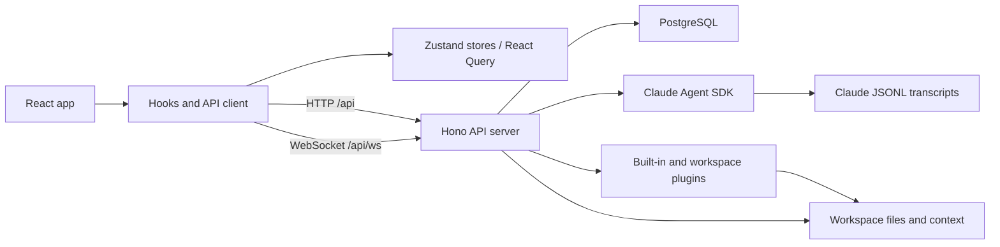
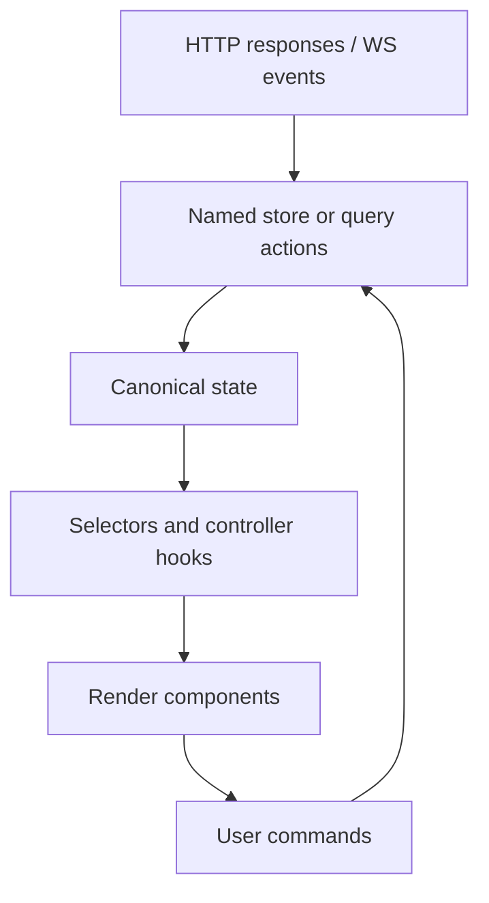

# Architecture

This is the top-level architecture index for the Inbox app. It defines the principles every implementation should follow, shows how the major domains fit together, and points to the domain specs that own the details.

## Context

Inbox is a React 19 + Vite app with a Hono API server. It manages plugin-backed sources, workspace context, and Claude Code-compatible agent sessions. The highest-risk parts of the app are long-lived session streams, plugin isolation, credentials, workspace file writes, and UI state that can drift from server state.

The architecture should optimize for agentic development: small ownership boundaries, documented contracts, deterministic tests, and code paths that make unintended side effects hard to introduce.

## Spec

### Principles

1. **Spec first.** Every feature/domain change starts by creating or updating the relevant domain spec in `docs/`. Implementation follows the approved spec.
2. **Unidirectional dataflow.** Server state flows through API/WebSocket boundaries into client stores/hooks, then into render-only components. UI components should not write back into caches or stores except through named actions.
3. **Derived state over duplicated state.** Store canonical state once. Derive phases, filters, labels, and presentation groupings in hooks or pure selectors.
4. **Effects at the edges.** File I/O, database access, network calls, browser APIs, and Agent SDK calls belong in server libs/routes, API clients, hooks, or explicit effect modules. Reducers and schema transforms stay pure.
5. **Contracts at boundaries.** API payloads, plugin interfaces, session events, credential envelopes, and workspace file formats should have typed schemas or documented wire formats.
6. **Domain ownership.** A file should have one primary owning domain spec. Shared utilities can be owned by an app shell, UI, API, or CI spec, but ownership must be explicit in `docs/documentation-coverage.md`.
7. **Fast checks first, expensive checks intentionally.** Typecheck and unit tests are mandatory for every change. Browser verification is mandatory for user-facing changes. Full e2e is targeted by risk, not run reflexively for every text-only edit.

### Domain Map

| Domain | Owns | Spec |
|--------|------|------|
| App shell and architecture | app boot, layout shell, project rules, docs index | This file |
| API and persistence | Hono routes, API client, database schema, migrations | [`api.md`](api.md) |
| Sessions | Agent SDK lifecycle, transcript state, WebSocket recovery, session UI | [`session-architecture.md`](session-architecture.md) |
| Plugins | built-in/workspace plugin loading, plugin app iframes, plugin skills | [`plugin-system.md`](plugin-system.md) |
| Workspace | workspace scanning, workspace settings, workspace-scoped context paths | [`workspace.md`](workspace.md) |
| Context system | raw backfill, body extraction, entity extraction, entity curation | [`context-system.md`](context-system.md) |
| Integrations and credentials | OAuth, credential vault, connection cards | [`integrations.md`](integrations.md) |
| Navigation | panels, slots, tabs, spatial grid behavior | [`spatial-grid-navigation.md`](spatial-grid-navigation.md) |
| UI components | shared components, compact visual conventions, editor surfaces | [`ui-components.md`](ui-components.md) |
| Rendering | markdown, rich output, artifacts, iframe rendering, performance | [`custom-xml-and-rich-output.md`](custom-xml-and-rich-output.md), [`rendering-performance.md`](rendering-performance.md), [`virtual-scrolling.md`](virtual-scrolling.md) |
| Preferences and caching | persisted user preferences, React Query persistence | [`user-preferences.md`](user-preferences.md), [`caching-architecture.md`](caching-architecture.md) |
| Verification | local checklist, CI tiers, e2e/browser policy | [`ci-and-verification.md`](ci-and-verification.md), [`e2e-test-plan.md`](e2e-test-plan.md) |
| Documentation coverage | docs ownership map and coverage gate | [`documentation-coverage.md`](documentation-coverage.md) |
| Engineering governance | spec workflow, change safety, code review standards | [`engineering-governance.md`](engineering-governance.md) |

### Runtime Shape

### Client Dataflow

Components should issue commands, not mutate canonical state directly. Controllers/hooks own command orchestration. Reducers own pure state transitions.

## History

| Date | Commit | Change |
|------|--------|--------|
| 2026-04-29 | `5e413d6` | Created top-level architecture index and project-wide architecture principles. |
