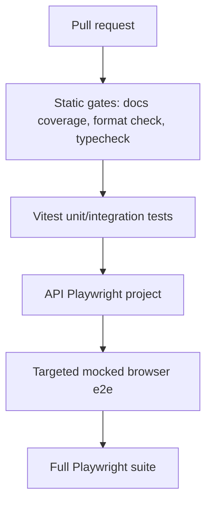

# CI And Verification

This doc defines the verification pipeline for local work and CI.

## Context

The repo already has strict TypeScript, Vitest, and Playwright coverage. The gap is not tool availability; it is deciding which checks are mandatory, which checks are risk-based, and how browser UX review fits into a fast workflow.

The goal is a pipeline that catches regressions early without making every small change wait for heavyweight browser suites.

## Spec

### Local Completion Checklist

Every implementation change must complete:

1. Update the owning spec and history section when behavior, architecture, or contracts change.
2. Add or update tests close to the changed behavior.
3. Run `npm run test:ci`.
4. Run `npm run docs:coverage`.
5. For visible UI changes, run browser verification against the changed flow and check for console errors.
6. For risky user journeys, run the targeted Playwright project or spec.

The `/simplfy` Claude Code review command remains a manual quality pass. It should not be treated as a CI substitute because it depends on an interactive agent environment.

### CI Tiers

| Tier | Command | Required When | Notes |
|------|---------|---------------|-------|
| Static | `npm run docs:coverage`, `npm run format:check`, `tsc -b` | every PR | Fastest feedback. |
| Unit/integration | `npm run test:run` | every PR | Covers pure logic, hooks, server libs, routes. |
| API e2e | `npm run test:e2e:api` | server routes, DB, auth, sessions, workspace changes | No browser/Vite; safe from worktrees. |
| Mocked browser e2e | `npm run test:e2e` or a targeted spec | visible UI, navigation, session surface, plugin UI | Uses mocked API for deterministic UX checks. |
| Full e2e | `npm run test:e2e:all` | release, high-risk refactors, session transport changes | Slowest; run intentionally. |

### E2E Policy

E2E tests are appropriate when a user-visible workflow can regress across component/hook/API boundaries. They are not the first tool for pure transforms, schema validation, or reducer behavior.

Add or update e2e coverage for:

- session lifecycle and resume flows,
- navigation and panel placement,
- integration connection states,
- auth/session redirects,
- plugin list/detail interactions,
- regressions that unit tests cannot observe.

Prefer Vitest for:

- reducers and state machines,
- schema validation,
- API helper functions,
- plugin data transforms,
- sanitizers and formatters.

### Browser UX Verification

For visible UI changes, the human or agent must verify:

- the changed flow renders at desktop dimensions,
- no obvious overlap, clipping, or broken compact text sizing,
- loading, empty, and error states still make sense,
- the browser console has no new errors,
- interactions do not require a full page reload unless that is the intended behavior.

Automated e2e is a backstop. It does not replace visual inspection for UI polish.

### CI Workflow Location

GitHub Actions workflows belong at the repository root `.github/workflows/`. This package currently has no package-local workflow file. When the root workflow is added, it should run package commands from `packages/inbox`.

## History

| Date | Commit | Change |
|------|--------|--------|
| 2026-04-29 | `5e413d6` | Formalized verification tiers and e2e/browser policy. |
