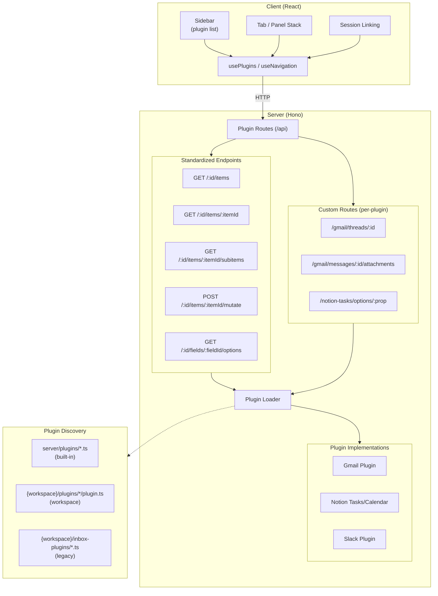
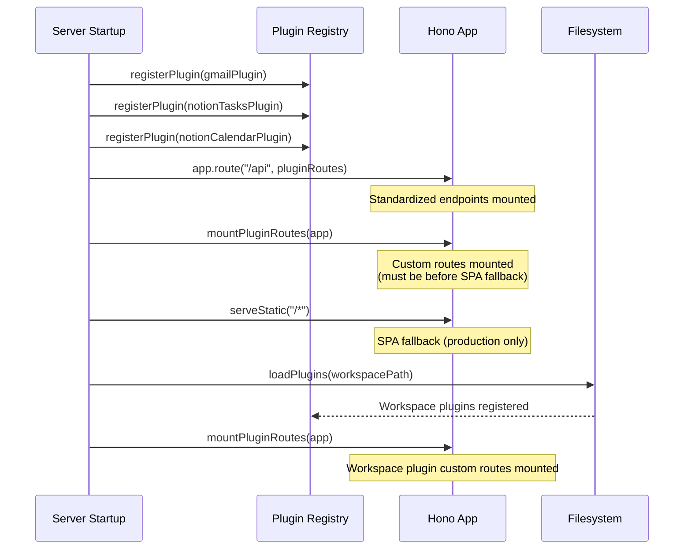
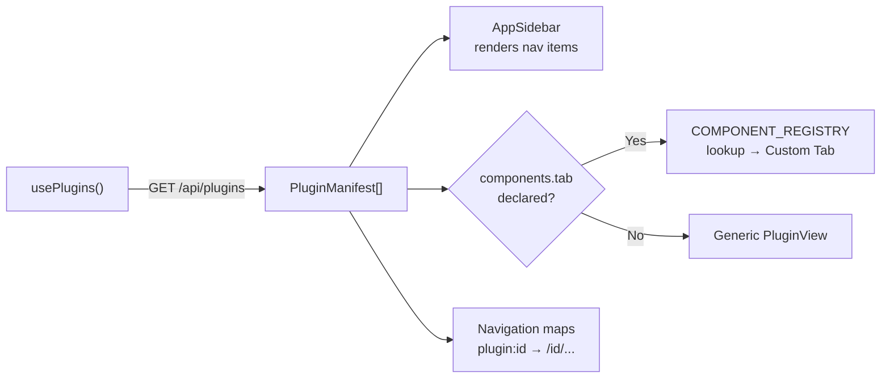
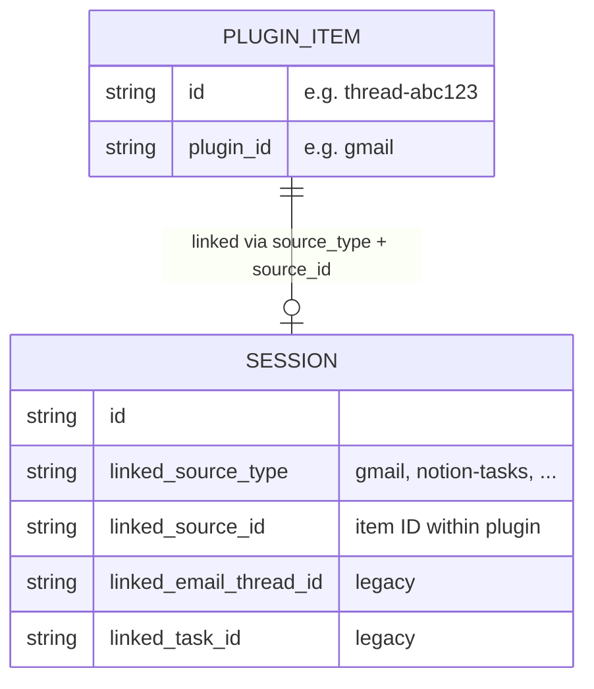

# Plugin System

The Inbox app uses a unified plugin architecture for all data sources. Gmail, Notion Tasks, Notion Calendar, and external integrations like Slack all implement the same `Plugin` interface. The server auto-generates REST endpoints, the client renders a sidebar entry and list/detail views, and sessions can link to any plugin's items.

## Architecture Overview



## Plugin Interface

Every plugin implements `Plugin` from `src/types/plugin.ts`:

```typescript
interface Plugin {
  // Identity
  id: string                    // "gmail", "slack", "notion-tasks"
  name: string                  // "Emails", "Slack", "Tasks"
  icon: string                  // Lucide icon name
  emoji?: string                // Sidebar emoji (falls back to icon)

  // Rendering
  components?: PluginComponents // Custom React components (optional)
  fieldSchema: FieldDef[]       // Drives list, filters, badges, detail
  detailSchema?: WidgetDef[]    // Custom detail layout (auto-generated if omitted)

  // Auth
  auth?: {
    integrationId: string       // Maps to integration registry
    scope: "user" | "workspace" // Per-user OAuth vs workspace API key
  }

  // Data methods
  query(filters, cursor?, ctx?): Promise<QueryResult>
  mutate(id, action, payload?, ctx?): Promise<unknown>
  getItem?(id, ctx?): Promise<PluginItem | null>
  querySubItems?(itemId, filters, cursor?, ctx?): Promise<QueryResult>

  // Configuration
  actionSchemas?: Record<string, ZodType>
  filterOptions?: Record<string, (ctx?) => Promise<string[]>>
  routes?(hono, helpers): void
}
```

### PluginContext

Every data method receives an optional `PluginContext`:

```typescript
interface PluginContext {
  userEmail: string
  getCredential(integration: string): Promise<string | null>
}
```

Simple plugins (Slack) ignore the context and read from `process.env`. Plugins needing per-user OAuth (Gmail) use `ctx.getCredential("google")` to get a refreshed access token.

### FieldDef

Each field in `fieldSchema` controls multiple UI behaviors:

```typescript
interface FieldDef {
  id: string            // Dot-path into item: "status", "author.name"
  label: string         // Display label
  type: FieldType       // "text" | "html" | "date" | "select" | "multiselect" | ...

  listRole?: "title" | "subtitle" | "timestamp" | "hidden"
  filter?: { filterable: true; filterOptions?: string[]; filterType?: "select" | "multiselect" | "text" }
  badge?: { show: "always" | "if-set"; variant?: string; labelFn?: (v) => string; colorFn?: (v) => string }
  detailWidget?: WidgetDef
}
```

If `listRole` is omitted, it's inferred: first text field = title, second = subtitle, first date = timestamp.

## Plugin Lifecycle

### Server Startup



### Plugin Discovery

The loader scans three locations:

| Location | Convention | Priority |
|----------|-----------|----------|
| `server/plugins/*.ts` | Built-in (registered via `registerPlugin`) | Highest — never overwritten |
| `{workspace}/plugins/{id}/plugin.ts` | Workspace plugin directory | Normal |
| `{workspace}/inbox-plugins/*.ts` | Legacy flat files | Lowest — won't overwrite existing |

Each file must `export default` an object with at least `id` (string) and `query` (function).

## Server Routes

### Standardized Endpoints

All plugins automatically get these routes at `/api/{pluginId}/*`:

| Method | Path | Handler |
|--------|------|---------|
| `GET` | `/plugins` | List all plugin manifests |
| `GET` | `/{id}/items` | `plugin.query(filters, cursor, ctx)` |
| `GET` | `/{id}/items/{itemId}` | `plugin.getItem(itemId, ctx)` |
| `GET` | `/{id}/items/{itemId}/subitems` | `plugin.querySubItems(itemId, filters, cursor, ctx)` |
| `POST` | `/{id}/items/{itemId}/mutate` | `plugin.mutate(itemId, action, payload, ctx)` |
| `GET` | `/{id}/fields/{fieldId}/options` | `plugin.filterOptions[fieldId](ctx)` |

### Custom Routes

Plugins register additional routes via `routes(hono, { getContext })`:

**Gmail** (`/api/gmail/`):
- `GET /threads/:id` — Full thread with messages
- `GET /messages` — List with incremental sync
- `GET /messages/:id/attachments/:attachmentId` — Binary attachment proxy
- `GET /labels` — User labels
- `GET /signature` — Email signature
- `POST /send` — Send message
- `POST /drafts` — Create draft
- `POST /threads/:id/trash` — Delete thread
- `PATCH /threads/:id/labels` — Modify labels

**Notion Tasks** (`/api/notion-tasks/`):
- `GET /options/:property` — Select/status option values from cached DB schema
- `GET /assignees` — Unique assignee names
- `POST /` — Create task

**Notion Calendar** (`/api/notion-calendar/`):
- `GET /options/:property` — Calendar property options
- `GET /calendar-assignees` — Calendar assignees
- `GET /calendar/:id` — Calendar item detail

## Client Architecture

### Data Flow



### Component Registry

Built-in plugins declare a `components.tab` key. The client maps these to React components:

```typescript
// src/App.tsx
const COMPONENT_REGISTRY = {
  "gmail:tab": EmailTab,
  "notion-tasks:tab": TaskTab,
  "notion-calendar:tab": CalendarTab,
}
```

When rendering a `plugin:*` tab:
1. Extract plugin ID from tab ID
2. Look up `${pluginId}:tab` in registry
3. If found → render custom component (full control over list + detail)
4. If not found → render `PluginView` (generic list + detail from fieldSchema)

### Generic Rendering

Plugins without custom components get automatic rendering:

- **PluginList**: Virtual-scrolled item list with filter popover, badge rendering from fieldSchema
- **PluginDetail**: Two modes:
  - Sub-items mode (if `hasSubItems`): scrollable message list
  - Widget tree mode: renders `detailSchema` or auto-generated widgets from fieldSchema

Auto-generated detail schema:
- `html`/`markdown` fields → `prose` widget
- All other fields → `kv-table` widget

### Navigation

Tab IDs use the `plugin:${id}` format:

```
plugin:gmail          → /gmail
plugin:notion-tasks   → /notion-tasks
plugin:slack          → /slack
sessions              → /sessions
settings              → /settings/integrations
```

Backward-compatible URL parsing maps legacy paths:

| Legacy URL | New Tab ID |
|-----------|------------|
| `/emails` | `plugin:gmail` |
| `/tasks` | `plugin:notion-tasks` |
| `/calendar` | `plugin:notion-calendar` |

## Session Linking

Any plugin's items can link to sessions:



### Database Schema

```sql
sessions (
  ...
  linked_source_type TEXT,  -- "gmail", "notion-tasks", etc.
  linked_source_id TEXT,    -- The item ID within that plugin
  -- Legacy columns (kept for backward compat):
  linked_email_thread_id TEXT,
  linked_task_id TEXT,
)
```

### Attaching Sources

The `SessionActionMenu` component attaches a source to a session:

```typescript
<SessionActionMenu
  source={{
    type: "gmail",        // Plugin ID
    id: threadId,         // Item ID
    title: thread.subject,
    content: "...",       // Context injected into session
  }}
/>
```

This writes both `linked_source_type`/`linked_source_id` and the legacy columns for backward compat.

## Creating a Plugin

### Minimal Example (workspace plugin)

Create `{workspace}/plugins/github/plugin.ts`:

```typescript
import type { Plugin } from "path/to/inbox/src/types/plugin.js"

export default {
  id: "github",
  name: "GitHub",
  icon: "Github",
  emoji: "🐙",

  fieldSchema: [
    { id: "title", label: "Title", type: "text", listRole: "title" },
    { id: "state", label: "State", type: "select",
      badge: { show: "always", variant: "outline" },
      filter: { filterable: true, filterOptions: ["open", "closed"] } },
    { id: "updatedAt", label: "Updated", type: "date", listRole: "timestamp" },
    { id: "body", label: "Body", type: "markdown", listRole: "hidden" },
  ],

  async query(filters, cursor) {
    const token = process.env.GITHUB_TOKEN
    const res = await fetch("https://api.github.com/repos/owner/repo/issues?state=" +
      (filters.state || "open"), { headers: { Authorization: `Bearer ${token}` } })
    const issues = await res.json()
    return { items: issues.map(i => ({ id: String(i.number), ...i })) }
  },

  async mutate(id, action) {
    // Handle close, reopen, etc.
  },
} satisfies Plugin
```

The plugin gets:
- Sidebar entry with 🐙 emoji
- List view with virtual scrolling, state filter, badges
- Detail view with markdown body rendering
- All at `/api/github/*` endpoints

### Adding Custom Routes

```typescript
routes(app, { getContext }) {
  app.get("/raw/:number", async (c) => {
    const ctx = getContext(c)
    const token = await ctx.getCredential("github")
    // ... custom endpoint logic
    return c.json(result)
  })
}
```

### Adding Custom Components

For rich detail views that fieldSchema can't express (e.g., interactive editors, complex layouts):

1. Set `components: { tab: "github:tab" }` in the plugin definition
2. Add to the client registry in `App.tsx`:
   ```typescript
   COMPONENT_REGISTRY["github:tab"] = GithubTab
   ```
3. Create `GithubTab` component with full control over list + detail rendering

## Built-in Plugin Details

### Gmail Plugin

- **ID**: `gmail`
- **Auth**: Per-user Google OAuth (`ctx.getCredential("google")`)
- **Incremental sync**: Uses Gmail History API with 24h TTL cache. First-page requests check for changes since last historyId; only fetches updated threads.
- **Custom component**: `EmailTab` → `EmailListView` + `EmailThread` (sandboxed HTML iframes, accordion messages, draft reply editor, attachment table)
- **10 mutations**: archive, trash, star, unstar, mark-important, mark-not-important, modify-labels, send, save-draft
- **9 custom routes**: threads, messages, attachments, labels, signature, send, drafts, trash, label modification

### Notion Tasks Plugin

- **ID**: `notion-tasks`
- **Auth**: Workspace Notion API key
- **Custom component**: `TaskTab` → `TaskListView` + `TaskDetail` (property editor popover, NotionBlockRenderer for page content)
- **5 mutations**: update-status, update-priority, update-tags, update-assignee, update-properties (generic)
- **Filter options**: Dynamic from Notion DB schema (cached in SQLite `notion_options` table)

### Notion Calendar Plugin

- **ID**: `notion-calendar`
- **Auth**: Workspace Notion API key
- **Custom component**: `CalendarTab` → `CalendarListView` + `CalendarDetail` (date picker, property editor)
- **Mutations**: Shared via `handleNotionMutation()` — update-status, update-tags, update-assignee, update-date, update-properties
