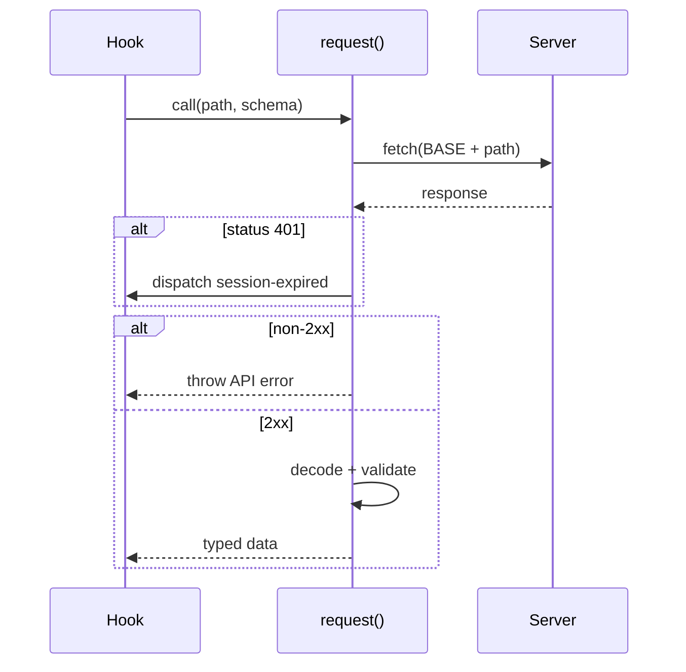

# API Client

The API client is a single `request()` helper in `src/api/client.ts` that wraps every `fetch()` call to the Hono server. Every endpoint function passes a Zod schema. A response either matches the wire contract, or the caller sees a thrown error instead of an unchecked cast. `src/api/contracts.ts` supplies the reusable transport schemas the endpoint functions compose.

## Calling an endpoint

Every hook imports a typed function from `client.ts` instead of calling `fetch()` directly. Each function builds a path under `BASE = "/api"` and passes a Zod schema to the shared `request()` helper. `request()` sets `Content-Type: application/json` unless the caller overrides headers, then calls `fetch()`. It passes no explicit `credentials` option; same-origin requests send the `hammies_session` cookie by default.

## Handling errors and session expiry

When the response status is not 2xx, `request()` decodes the versioned error envelope (and the legacy envelope accepted during migration) through `decodeApiJsonResponse`. It throws one canonical `HttpContractError` carrying the HTTP status, stable error code, and message, so consumers can branch on typed metadata rather than parsing prose. A 401 status also dispatches a `session-expired` window event before the throw. `useUserProvider` listens for that event, re-checks the session, and drops back to the login page — see [Auth and Sessions](auth-and-sessions.md) for the full flow.

## Response schemas

`contracts.ts` owns the Zod schemas every endpoint function passes to `request()`. It also owns the primitives those schemas compose:

- User, workspace, and session shapes
- Plugin-item and widget shapes
- Integration, cache, and git-status shapes

`PluginManifestTransportSchema` validates the plugin manifests `getPlugins()` returns; its inferred type is re-exported as `PluginManifest` for hooks and components. A response that fails its schema throws before a caller sees an unchecked shape. A server change and its client update land as one typed diff.

## Endpoint sections

`client.ts` groups its functions into sections, one per area of the server:

- Auth — client ID, callback, session check, logout
- Sessions — full CRUD plus resume, abort, archive, streaming file upload
- Plugins — manifest list and per-plugin item, sub-item, and mutation calls
- Connections, preferences, workspaces, and users — one function per route

Each section's call signatures are the contract for its server route. When a server route's request or response type changes, the client function changes in the same commit. The client is the only typed contract on the wire; drift here breaks a hook silently, with no TypeScript error to catch it. Plugin-specific endpoints, such as Gmail actions, live in `plugins/<id>/app/api.ts` instead, owned by that plugin's own spec.

## Multipart uploads

`uploadSessionFile` posts a session's file as `FormData`, so it calls `fetch()` directly instead of `request()`. Setting `Content-Type` manually would strip the multipart boundary the browser generates, breaking the upload. It still decodes non-2xx responses through the shared error-envelope contract, so callers do not need a second error format to handle.

## Bounded response sizes

The generic response budget is 5 MB, enough for every endpoint except session transcripts. `getSession` raises that ceiling to 50 MB for its one call, because a long-running session's message history can outgrow the generic limit. That 50 MB is `SESSION_SNAPSHOT_MAX_BYTES`, imported from the contracts package rather than declared here — the same response is read by Studio, and a limit written down twice drifts the moment either side is tuned. Every other endpoint keeps the 5 MB budget, so one oversized response cannot silently exhaust browser memory.

## See also

- [Inbox](./index.md) — package overview and domain map
- [API Client spec](../../openspec/specs/api-client/spec.md) — the contract this page explains
- [Auth and Sessions](auth-and-sessions.md) — issues the cookie `request()` relies on and handles the `session-expired` event
- [Session Manager](session-manager.md) — the server side of the Sessions section's endpoints
- [Plugin System](plugin-system.md) — the server side of the Plugins section's endpoints
- [Shared UI Components](shared-ui-components.md) — the React Query layer that calls these functions and owns caching
