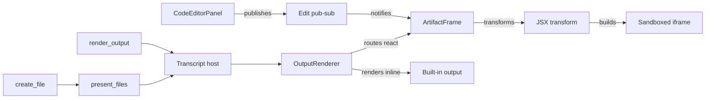

# Artifacts and Render Tools

Two in-process MCP servers let the agent put custom UI into a session. `create_file` plus `present_files` build sandboxed React artifacts, and `render_output` renders eight built-in output types inline. Both surface through the same transcript detection path and share the iframe theming and height-reporting machinery. The frontend never trusts agent-written JSX directly — it transforms, sandboxes, and CSP-restricts every artifact before it runs.

## Two tool surfaces

`create_file` and `present_files` deliberately mirror Claude.ai's artifact interface. The agent has already been trained on this exact tool pair, so the frontend gains artifact authoring for free. It needs no extra system-prompt coaching and no schema for the model to learn. `server/lib/artifact-tools.ts` registers both tools. The frontend watches the transcript for a `present_files` call and reads the matching `create_file` payload by file path.

`render_output` is a separate MCP server (`server/lib/render-output-tool.ts`) for cases that do not need a full custom component. It accepts eight types:

- `markdown`, `html`, `table`, `json`, `chart`, `file`, `conversation`
- `react` — validated against esbuild before the tool acknowledges success

For `react` payloads, JSX syntax errors surface to the agent immediately, instead of failing silently at render time. Calling `render_output` again with the same title replaces the previous version, so the agent can iterate on one output without cluttering the transcript.

## From JSX to a sandboxed iframe

The JSX transform and the iframe HTML builder moved to `@hammies/frontend` (`src/lib/artifact-transform.ts`, `src/lib/build-artifact-html.ts`). Inbox and Studio now share one implementation — see that package's [`artifact-runtime` spec](../../../frontend/openspec/specs/artifact-runtime/spec.md) for the transform contract. Inbox imports `transformArtifactCode`, `unwrapReactData`, and `escapeForScript` from it and passes the result to `ArtifactFrame`.

`ArtifactFrame` (`src/components/session/ArtifactFrame.tsx`) drives the pipeline. A React Query call transforms the code, keyed by the source string so identical artifacts hit cache instantly. `buildArtifactHtml` then produces the iframe's `srcDoc`.

The iframe runs with `sandbox="allow-scripts allow-same-origin allow-popups allow-downloads"` and inherits the host origin. The sandbox attribute is not a boundary against the parent. The CSP's `connect-src` allowlist is the real containment, and artifact code runs with the signed-in user's authority. A `MutationObserver` on the parent's `<html>` class keeps the iframe's theme variables synced when the user toggles dark mode. The iframe reports its content height via `postMessage`, after two `requestAnimationFrame` ticks. A 2-second fallback timer covers the case where the module script fails to parse.

## Non-React output types

`OutputRenderer` (`src/components/session/OutputRenderer.tsx`) switches on `spec.type` and renders each `render_output` payload with a dedicated component. `markdown` goes through the shared `Markdown` component. `table` uses `DataTable`, adding the filter field only when the output is expanded into its own panel — the grid bounds its own height and scrolls the body under a frozen header either way, so neither branch asks for a pager. `json` walks the value with a custom collapsible tree. `chart` lazy-loads Recharts and a shadcn `ChartContainer`. `conversation` renders a simple message list.

`html` output and `.html` files take a lighter path than React artifacts. `injectIntoHtml` splices a theme `<style>` block and a height-reporting script into the raw HTML. The iframe sandbox omits `allow-same-origin` here, because these documents never need same-origin fetch — the frame keeps a stricter boundary. This path posts a distinct `html-height` message type, not the `ArtifactFrame` bridge's `height` type, decoded through the same `decodeIframeMessage` helper. That helper takes a required `onInvalid` handler, so a height report from our own frame that fails the schema is logged rather than dropped the way a neighbouring frame's message is. `file` output shows an inline preview for images, video, and HTML, plus a download link for everything else.

## Editing an artifact live

`CodeEditorPanel` (`src/components/session/CodeEditorPanel.tsx`) opens a Monaco editor beside the artifact panel. Every keystroke calls `setEditingCode`, and `ArtifactFrame`'s consumer side reads it back through `useEditingCode`. Both go through the pub-sub store in `src/hooks/use-artifact-editor.ts`. The store is a plain `Map` plus a `Set` of listeners per key, wired to React through `useSyncExternalStore`.

React Query was not a fit here. It would push every keystroke through a query layer built for network data, where this needs synchronous, same-tick updates between one producer and one consumer. Saving calls `updateArtifactCode`, which writes the edited code back to the session JSONL. The artifact-editor pub-sub only carries the in-progress edit, never the persisted source.

## Caching and lifecycle

`ArtifactFrame` keeps two bounded caches so long sessions do not leak memory. `srcDocCache` (50 entries) holds built HTML documents keyed by `sessionId:sequence:transformedCode`. `artifactHeightCache` (500 entries) holds the last reported height keyed by `sessionId:sequence`. Both evict FIFO once full.

The height cache sizes a remounted iframe correctly before its first `postMessage` arrives, which avoids a layout shift. A separate `heightReported` flag, not the cache, controls when the iframe becomes visible. That split avoids a flash of a blank frame on first mount.

## Session-result actions

`InboxResultPanel` (`src/components/session/InboxResultPanel.tsx`) is a fourth, narrower render path. It renders the agent's structured session result — `draft`, `task`, `context_updated`, or `skipped` — not a `render_output` payload. `transcriptHost.tsx` parses this JSON once, at the end of a session, and hands it to `InboxResultPanel` directly.

A `draft` result offers an inline rich-text editor and a save action. A `task` result offers a "Mark Complete" button. Both call `mutatePluginItem` against the originating plugin, Gmail or Notion Tasks, instead of the artifact `sendAction` bridge. These actions have no iframe to talk back through.

## See also

- [Inbox](./index.md) — package overview and domain map
- [Artifacts and Render Tools spec](../../openspec/specs/artifacts-and-render-tools/spec.md) — the owning contract
- [Session Views Controller](./session-views-controller.md) — the `present_files` → `create_file` lookup in the transcript view
- [Session Files](./session-files.md) — the JSONL source of truth artifact code and edits persist to
- [Shared UI Components](./shared-ui-components.md) — `DataTable`, `Markdown`, and other components `OutputRenderer` composes
- [Theming](./theming.md) — the parent theme tokens iframes read and re-sync on toggle
