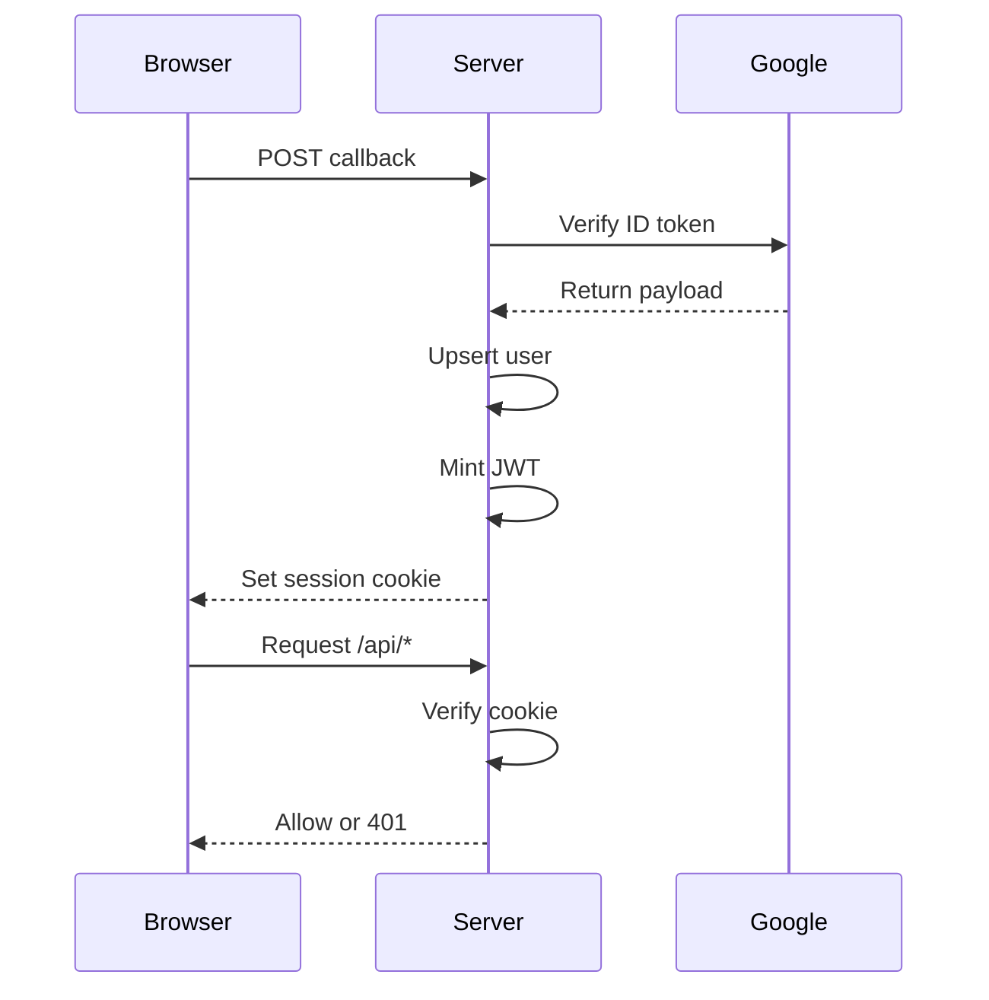

# Auth and Sessions

Inbox authenticates users with Google Sign-In and issues a stateless JWT session cookie shared across the Hammies subdomains. Every `/api/*` route runs behind auth middleware that verifies this cookie before granting access. A second CSRF layer checks request origin on top of the cookie's `SameSite=Lax` protection.

## Signing in

The browser runs Google's Sign-In UI and posts the resulting ID token to `POST /api/auth/callback`. `verifyIdToken` in `server/lib/auth.ts` delegates to `@hammies/auth/server`'s `verifyGoogleIdToken`, which checks the token's signature and `aud` claim against `GOOGLE_CLIENT_ID` through Google's JWKS. No client secret or redirect URI ever reaches the server, because the browser completes the OAuth exchange itself.

A verified token upserts the user's `email`, `name`, and `picture` into the `users` table, refreshing `last_login_at` on every sign-in. `signSession` then mints a 14-day JWT, and the route sets it as the `hammies_session` cookie. The rate limiter caps the callback at 10 requests per client per 60 seconds, guarding Google's tokeninfo quota against replay or brute-force attempts.

A malformed request body fails `AuthCallbackBody` validation in `server/lib/schemas.ts` before the credential ever reaches Google. `GET /api/auth/client-id` exposes `GOOGLE_CLIENT_ID` so the frontend can render the sign-in button. A missing env var makes the call throw, and the request 500s.

## Gating every request

An auth middleware wraps every `/api/*` route after the unprotected `/api/auth` and `/api/health` paths. It reads the `hammies_session` cookie, calls `getSession` to verify the JWT, and returns 401 when the cookie is missing or invalid.

On success, the middleware sets typed context variables downstream handlers read with `c.get()`:

- `user` — the signed-in user's name, email, and picture
- `userEmail` and `userName` — convenience accessors for the same user
- `sessionToken` — the JWT itself, needed by the credential proxy
- `workspace` — set only when the workspace cookie resolves to one the user belongs to

`server/types/hono-env.ts` declares `AppEnv`, a typed `c.get()`/`c.set()` shape with `userEmail` and `googleAccessToken`. The running server instead wires a broader local type in `server/index.ts` that matches the fuller variable set above.

The middleware also re-wraps the rest of the request inside `runWithRequestContext({ requestId, userEmail })`. Every log call downstream then auto-attaches the signed-in user. Logs written before auth resolution carry only a `requestId`, which matters for incident triage.

## CSRF protection

`csrfProtection` middleware runs on `/api/*` before the auth middleware, adding an Origin check on top of the cookie's `SameSite=Lax` protection. GET, HEAD, and OPTIONS requests skip the check, since safe methods never mutate state.

Every other method reads the `Origin` header, falling back to the `Referer` header's origin when `Origin` is absent. A request from an origin in `ALLOWED_ORIGINS` proceeds. A request from any other named origin gets a 403 response and a warn-level log recording the method, path, and origin.

The middleware does not treat missing `Origin` and `Referer` headers as an attack. The Vite dev proxy strips them, and non-browser clients may omit them too, so the middleware logs a debug line and lets the request through. `SameSite=Lax` remains the primary defense in that case.

Two paths skip CSRF entirely: `/api/webhooks`, which receives POSTs from third-party servers with no browser origin, and `/api/connections/connect`, the OAuth redirect target.

## Session lookup and logout

`GET /api/auth/session` reads the cookie and, when it verifies, returns the user plus their workspace list and the resolved active workspace. A missing or invalid cookie is not an error. The response is `{ user: null }` with a 200 status, and the frontend renders the signed-out state from it.

`POST /api/auth/logout` clears the cookie via `sessionCookie(null, host)` and always returns `{ ok: true }`. Logout is idempotent, because a stateless JWT session has no server row to delete. Clearing the cookie is the whole operation.

## The shared cookie

`hammies_session` carries, by default:

- a 14-day expiry
- `HttpOnly`
- `SameSite=Lax`
- `Secure`, in production

When the request host ends in `.tail21f7c3.ts.net`, the cookie's `Domain` scopes to that whole suffix, so inbox, studio, and vision recognize one sign-in as SSO. Off the tailnet, the cookie stays host-only.

JWT sessions are stateless: there is no server-side session store, so logout only clears the cookie. The 14-day expiry caps how long a stolen or replayed token stays valid. An older opaque-token scheme persisted sessions in `auth_sessions(token PRIMARY KEY)`; no code reads or writes that table now, and it stays only for rollback safety.

## Out of scope here

This domain covers sign-in, the session cookie, and CSRF. Per-user encrypted credentials for third-party APIs (Gmail, Notion, and similar) live in [credentials vault](credentials-vault.md), reached through the [credential proxy](credential-proxy.md). Workspace membership and the active-workspace cookie belong to the [`workspace` spec](../../openspec/specs/workspace/spec.md). [Health, rate limit, and logging](health-rate-limit-logging.md) covers the rate limiter itself, beyond its use on the callback route.

## See also

- [Inbox](index.md)
- [Credentials Vault](credentials-vault.md)
- [Credential Proxy](credential-proxy.md)
- [Health, Rate Limit, Logging](health-rate-limit-logging.md)
- [Database](database.md)
- [auth-and-sessions spec](../../openspec/specs/auth-and-sessions/spec.md)
