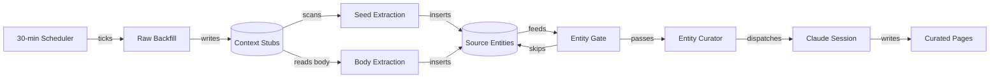

# Context System

The context system turns plugin items — Gmail threads, Notion tasks, Gorgias tickets — into a curated knowledge base under the workspace's `context/` directory. Four stages carry the pipeline, from cheap filesystem writes to Claude-priced curation, each running at its own cadence. The curator only ever sees entities the earlier stages have already filtered for noise.

## Pipeline stages

`runBackfill` (`server/routes/backfill.ts`) calls each plugin's `query()` for new or changed items, then `itemToContext()` renders one stub per item under `context/<plugin>/`. `renderItem` runs the plugin's `enrichForContext` first when defined, then calls `extractEntitiesForItem` so entity extraction never lags a fresh stub. A `backfill_state` row tracks each plugin's cursor, so an interrupted pass resumes instead of restarting from the first item.

Seed extraction (`server/lib/entity-extractor.ts`) prefers `plugin.extractEntities(item)`. When a plugin has no override, `parseStubEntities` falls back to a regex scan of the stub's emails and `folder-path` frontmatter. `canonicalize` lowercases emails and slugifies names before every entity lands in `source_entities`, so the same person never fragments into two rows.

Body extraction (`server/lib/body-extractor.ts`) sends each stub's body to a local Ollama model — `OLLAMA_MODEL`, default `qwen3.5:4b`. The request body and provider response both pass Zod contracts before the extracted entities are consumed. It asks for named people, companies, products, and projects that never surface in headers. `isNoiseEntity` filters promo subdomains, automated senders, and ubiquitous platform names before insert. Ollama occasionally hallucinates, so this filter runs last, right before the entity reaches the queue. Local inference keeps a body-heavy workload off the Claude token budget entirely.

Entity curation dispatches one Claude session per entity. The queue and gate that decide which entity goes next, and the session lifecycle that runs it, are their own sections below.

## The entity queue and gate

`topUnprocessedEntities` ranks entities by unprocessed source count, domain entities first. That ordering lets a company page exist before its contacts reach the front of the queue. Contact sessions then steer toward the company page instead of spawning duplicates.

Before any session dispatches, `gateEntity` (`server/lib/entity-gate.ts`) rejects three classes of entity with pure regex and set-membership checks, at zero token cost:

- Opaque IDs — account numbers, UUIDs, raw URLs, ticket-number strings.
- Personal email-provider domains — `gmail.com`, `yahoo.com`, and similar.
- Self-references — Hammies' own domains and the workspace owner.

`curateEntity` adds two more gates after `gateEntity` passes. A per-type minimum (`MIN_SOURCES_BY_TYPE`) skips low-yield entity types until enough sources accumulate:

- `folder`, `tag` — 5 sources
- `project`, `product`, `channel` — 3 sources

An engagement check then skips any person, domain, or company with no evidence of a Hammies reply among its sources. Cold inbound alone never earns a session. Every skip still marks its sources processed, so the queue keeps advancing.

## Curation sessions

`curateEntity` builds a prompt capped at 30 source filenames (`MAX_SOURCES_IN_PROMPT`) and 6000 characters of the existing candidate page (`MAX_CANDIDATE_CHARS`), then hands it to `runBackgroundCurationSession` (`server/lib/curation-session.ts`). Sessions run with their CWD set to `plugins/context/assets` and `skipDbRecord: true`, so the inbox session list never shows a curation run. The default model is Haiku 4.5, structured tool work the smaller model handles well; override it with `CURATION_MODEL`.

The helper claims a `backfill_state` row before calling `startSession`, so two callers can never dispatch the same entity at once. A stale-lock TTL reclaims an abandoned row after 5 minutes. The TTL stays short because `tsx-watch` restarts the dev server often enough to kill in-flight sessions before their `onComplete` callback fires. `onComplete` runs exactly once, at successful end-of-stream, and marks the entity's sources processed.

When the entity is a person at a domain with its own curated page, `findParentCompanyPage` steers the session toward enriching that company page instead. It adds a contact row or a personnel subsection rather than creating a standalone person page.

## Scheduling and drivers

`scheduleContextBackfill` (`server/lib/context-backfill-scheduler.ts`) runs raw backfill every 30 minutes, guarded by an `isRunning` flag so an overrunning tick can't overlap the next. The same function also schedules two lighter server-side loops that replaced the original shell scripts: extract-entities every 5 minutes, and curate-next every 1 minute. A `qmd update && qmd embed` tick every 30 minutes keeps the corpus searchable for downstream agent sessions.

Body extraction still runs from outside the server. `scripts/body-extract-loop.sh` polls `POST /api/backfill/extract-bodies` once per configured source, then backs off to a two-minute sleep once every source reports zero extractions in a cycle. Touching `/tmp/body-extract.pause` pauses the loop without killing it.

## REST surface

`/api/backfill/*` (`server/routes/backfill.ts`) exposes one route per pipeline action:

- `POST /:pluginId` — raw backfill for one plugin
- `POST /:pluginId/re-render` — rewrite existing stubs without re-querying
- `POST /extract-entities` — bulk seed extraction over existing stubs
- `POST /extract-bodies` — Ollama body extraction, scoped by `?source=`
- `POST /curate-entity/next` — claim and curate the top-ranked entity
- `POST /curate-entity` — curate one named entity
- `POST /record-discovered` — insert entities an agent surfaced mid-session
- `POST /curate` — the legacy per-source path, kept for rollback

`buildPluginContext` (`server/lib/plugin-context.ts`) injects each plugin's credential lazily per request, refreshing Google OAuth tokens through `refreshGoogleToken`. `requireAdmin` (`server/lib/workspace-context.ts`) gates workspace-mutating routes to the active workspace's `admin` role.

Every database query in the pipeline decodes through a query-specific row schema before domain logic sees it. The `/record-discovered` request body is validated the same way, so malformed database values, model output, and HTTP input fail at their boundary rather than leaking inward as assumed shapes.

## Viewing curated context

`ContextPanel` (`src/components/session/ContextPanel.tsx`) renders one focused entity: its curated pages, related threads, and related tasks. Each shows as an accordion section that opens by default only when it has content. Its header links back to the originating plugin item through the navigation store's `switchTab` and `selectItem` actions.

## Operator tools

`scripts/consolidate-entity.sh` merges, renames, deletes, or audits curated pages directly on disk. A merge or rename redirects every cross-page link with `sed`, appends a `LOG.md` row, and purges the matching `source_entities` rows. This stops the old slug from resurfacing in the queue. Curation sessions can propose the same class of change through the `<plugin-edits>` and `proposals.md` conventions in their prompts. Only this script commits a structural change directly.

## See also

- [Inbox](./index.md) — package overview and domain map
- [Context System spec](../../openspec/specs/context-system/spec.md) — the contract this page explains
- [Plugin System](plugin-system.md) — owns `query()`, `itemToContext()`, `extractEntities()`, `backfillDir()`
- [Session Manager](session-manager.md) — the session lifecycle curation sessions run through
- [Database](database.md) — the Postgres pool `source_entities` and `backfill_state` live in
- [Health, Rate Limit, Logging](health-rate-limit-logging.md) — the HTTP rate limit on `/api/backfill/*`
