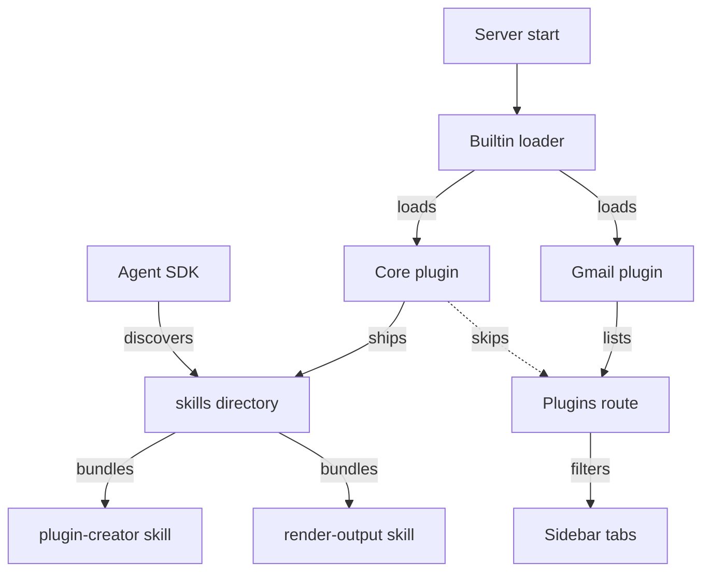

# Core Plugin

Core is a built-in, skills-only plugin — it has no data tab, only a `skills/` directory the Claude Agent SDK loads into every workspace session. It ships two skills: `plugin-creator`, which scaffolds new inbox plugins, and `render-output`, which teaches the agent how to render visual output. Because `hasSkills` is `true` and `fieldSchema` is absent, the plugin loader treats it as invisible in the sidebar but always active.

## Why core has no sidebar tab

The [plugin system](plugin-system.md) validates every registered plugin through `isValidPlugin`, which normally requires `query`, `mutate`, or `itemToContext`. Core satisfies that check through a separate `hasSkills === true` clause, so a skills-only plugin still registers without any data method. `GET /api/plugins` builds the sidebar's tab list by filtering on `fieldSchema?.length > 0`. Core never sets `fieldSchema`, so the route excludes it and the client never renders a Core tab.

The server loads core through `loadBuiltinPlugins`, which adds its ID to `builtinIds` on every startup. A workspace plugin can still register under the `core` ID in its own workspace registry, but the builtin entry always survives a workspace reload.

## Skills bundle

Bundling `plugin-creator` and `render-output` as separate skill files lets the SDK activate each independently. Only the skill matching the current request loads, not one large instruction block.

### plugin-creator

`plugin-creator` activates when a user asks to add a new source — phrasing like "create a plugin for X" or "connect X to inbox." It first checks `skills/*/SKILL.md` for an existing API client to reuse, then plans the field mapping, actions, and auth before writing any code. Two extra questions gather curation direction: what the item's `process-*` skill should do, and what entities `curationPrompt` should extract.

After the plugin goes live, the curation agent may still edit two fields. It refines `curationPrompt` as it learns what the source reveals, and adds filter logic to `itemToContext` that skips irrelevant items. It never edits `query`, because that method drives the app's list view, invisible to the curation agent.

The skill leans on three reference files:

- `plugin-interface.md` — the full `Plugin` type
- `patterns.md` — sub-item, route, and auth patterns
- `slack-plugin-example.md` — one fully annotated example

### render-output

`render-output` activates whenever the agent has something visual to show — a chart, a table, or an interactive UI. It teaches two output flows:

- **`create_file` + `present_files`** — preferred for React (`.jsx`), HTML, Markdown, and SVG files, written to `/mnt/user-data/outputs/<name>.<ext>`.
- **`render_output`** — preferred for structured, non-interactive data: table, chart, markdown, or json.

Updating either flow means re-emitting the same call. Only the latest `create_file` path or `render_output` call renders.

The skill also encodes the sandbox's constraints:

- React artifacts resolve only `Tailwind CSS`, `shadcn/ui`, `recharts`, and `lucide-react` — any other import leaves an undefined identifier.
- Artifacts can't reach `localStorage`, `sessionStorage`, `document.cookie`, or external `fetch()`. They call `sendAction` so the agent performs the side effect instead.
- HTML outputs skip Tailwind entirely and read the app's theme through CSS variables like `var(--foreground)`, never hardcoded colors.

Two reference files carry the component patterns. `component-patterns.md` shows standard shadcn compositions — tabs, cards, forms. `app-components.md` lifts patterns straight from the Inbox app's own components.

The skill covers HOW to render. [Session instructions](session-instructions.md) covers WHEN, and the [artifacts and render tools](artifacts-and-render-tools.md) page documents the panel that renders the result.

## Hooks manifest

`hooks/hooks.json` ships with an empty `hooks: {}` object and a description string, not deleted, not filled in. Keeping the file in place means a future hook addition is a one-file edit, not a new manifest structure. No hook fires from core today.

## See also

- [Inbox](./index.md) — package overview and domain map
- [Core Plugin spec](../../openspec/specs/core-plugin/spec.md) — the contract this page explains
- [Plugin System](plugin-system.md) — the `Plugin` interface, loader, and registry core registers into
- [Artifacts and Render Tools](artifacts-and-render-tools.md) — the panel that renders `render-output` and `present_files` calls
- [Session Instructions](session-instructions.md) — the system prompt that complements these skills at session start
- [Context System](context-system.md) — the curation pipeline `itemToContext` and `curationPrompt` feed
