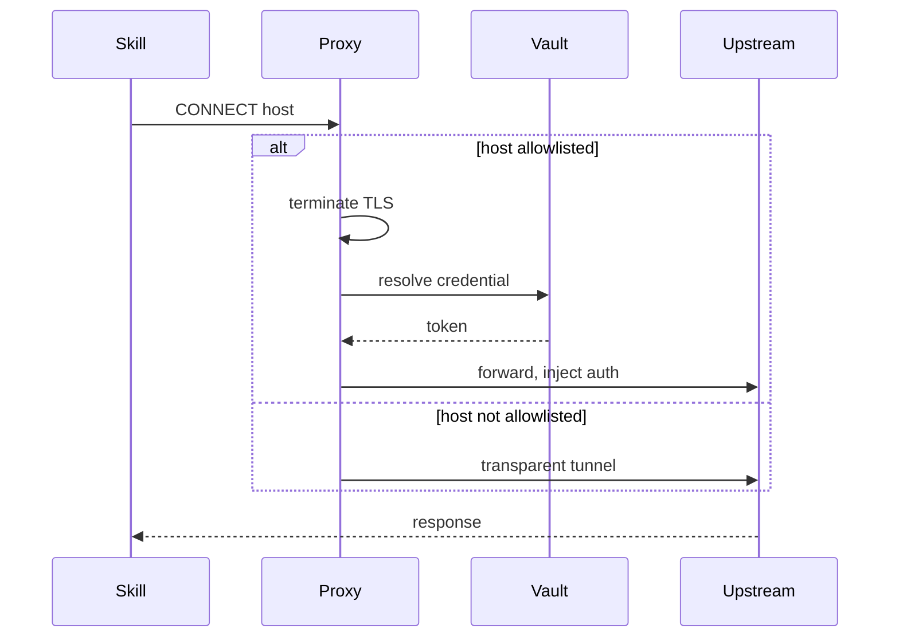

# Credential Proxy

The credential proxy is a localhost HTTPS proxy that lets agent subprocesses call Notion, GitHub, Shopify, and other third-party APIs without ever holding a token. It terminates TLS for an allowlisted set of hosts, resolves the caller's credential from the vault, and rewrites the outgoing request to carry it. Every other host passes through as a raw, uninspected tunnel.

## Why a proxy instead of a credential in the environment

Agent-emitted skills are arbitrary code. Handing a skill a raw token in `process.env` means every skill author must plumb it through their HTTP client and avoid logging it. The proxy keeps every secret out of the agent's address space. A skill writes a bare `fetch()` call, and the proxy injects the token in flight. See [Credentials Vault](credentials-vault.md) for where the token comes from.

## Deciding which hosts to intercept

Neither the host list nor the host-to-integration map lives in this package. Both derive from the live `@hammies/auth` integration registry, which each plugin populates through its `studio.integrations[].proxy` declaration. `shouldIntercept` and `hostToIntegration` delegate to the shared `resolveHostRule`, the same resolver Studio's own proxy uses. The most specific matching pattern wins: an exact host beats a subdomain match, and a deeper subdomain beats a shallower one.

The map used to be hardcoded here, and it drifted the moment a plugin added or narrowed a host pattern. Its `googleapis.com` catch-all absorbed every Google host into one `google` integration. `googleads.googleapis.com` needs its own credential plus a `developer-token` header; BigQuery, Analytics Data, Gmail, Calendar, and Sheets each belong to a distinct integration. All of them received the `google` service-account row's raw stored value, which is a JSON key blob — unmintable and unusable as a bearer token.

## Injecting a credential

The matched rule carries its own `inject` shape, so the proxy reads the strategy from the registry rather than from a table of its own. `formatAuthHeader` builds the line. Four strategies exist:

- **Bearer** — most integrations (Notion, GitHub, Slack, Google, Air, QuickBooks, Pinterest) get `Authorization: Bearer <token>`.
- **Header** — Shopify and Klaviyo want the token in a named header instead (`X-Shopify-Access-Token`, `Klaviyo-API-Key`).
- **Basic** — Gorgias encodes an email from the credential's `extras` alongside the token as `Basic base64(email:token)`.
- **Query** — Meta, Instagram, and Gemini accept a token only in the URL. The proxy rewrites the request line's query string, not a header.

The proxy replaces an existing `Authorization` (or integration-specific) header rather than sending two. A rule may also declare config-backed extra headers, such as Google Ads' `developer-token`. The proxy drops whatever the caller sent under those names and pushes the resolved value, so a placeholder in an agent's environment cannot survive into the upstream request. When `resolveCredential` returns null, the proxy forwards the request unchanged and lets the upstream API return its own 401.

## Terminating TLS for an intercepted host

A CONNECT to an allowlisted host gets a per-host certificate, signed by a CA the proxy generates once at startup and caches in memory. `generateCertForHost` caches certificates too, capped at 100 entries with LRU eviction. A long-running agent that touches thousands of Shopify subdomains cannot grow the cache without bound. The proxy writes `200 Connection Established` to the client socket before it starts the TLS handshake. Starting the handshake first would make the client misframe the response and drop the connection. It closes the per-host TLS listener when the client socket closes, so file descriptors do not accumulate over the proxy's lifetime.

Once TLS is up, the proxy buffers the decrypted request until it sees the `\r\n\r\n` header terminator. It then rewrites the headers or request line and opens a real TLS connection to the upstream host to forward the request. The body streams through unmodified on both the request and response sides — only headers and the request line are ever rewritten.

## Reaching the proxy from an agent subprocess

`getProxyEnv(sessionToken)` returns four environment variables for a spawned agent subprocess:

- `HTTPS_PROXY` — the proxy URL, with the session token embedded as userinfo.
- `NO_PROXY` — a bypass list that skips the proxy for `.anthropic.com` and other infra hosts.
- `NODE_EXTRA_CA_CERTS` — the proxy's CA bundle, which also carries the public root certificates so direct TLS to bypassed hosts still verifies.
- `NODE_OPTIONS` — the existing value with `--import "agent-proxy-preload.mjs"` appended.

[Session Manager](session-manager.md) calls `getProxyEnv` when it builds a session's spawn environment. Wiring the proxy into a subprocess is out of scope here.

The session token itself rides in the standard `Proxy-Authorization` header, not a custom one. HTTP clients — curl, `undici`, Python's `requests` — already encode the userinfo of a proxy URL as Basic auth automatically. A skill therefore needs no proxy-aware client configuration to opt in.

Node's built-in `fetch()` does not read `HTTPS_PROXY` on its own, because it is built on `undici`, which ignores that variable. The preload script parses `HTTPS_PROXY` at subprocess startup and calls `setGlobalDispatcher` with a `ProxyAgent` carrying the session token. Every `fetch()` call in the subprocess then routes through the proxy, with no skill touching proxy configuration. When `HTTPS_PROXY` is unset, the preload is a no-op.

## Trust boundary

The proxy binds to `127.0.0.1` only. It holds every user's resolvable credentials, so binding to `0.0.0.0` would turn it into a local-network credential lookup gated only by a guessable session token. The proxy and the agent subprocesses that reach it share the loopback interface, as a child of the inbox server. That shared loopback is the trust boundary the design relies on.

## See also

- [Inbox](index.md) — package overview and domain map
- [Credential Proxy spec](../../openspec/specs/credential-proxy/spec.md) — the contract this page explains
- [Credentials Vault](credentials-vault.md) — stores and refreshes the credential the proxy resolves
- [Integrations](integrations.md) — the per-integration OAuth registry `resolveCredential` reads
- [Session Manager](session-manager.md) — spawns the agent subprocess and consumes `getProxyEnv`
- [Auth and Sessions](auth-and-sessions.md) — issues the session token carried in `Proxy-Authorization`
