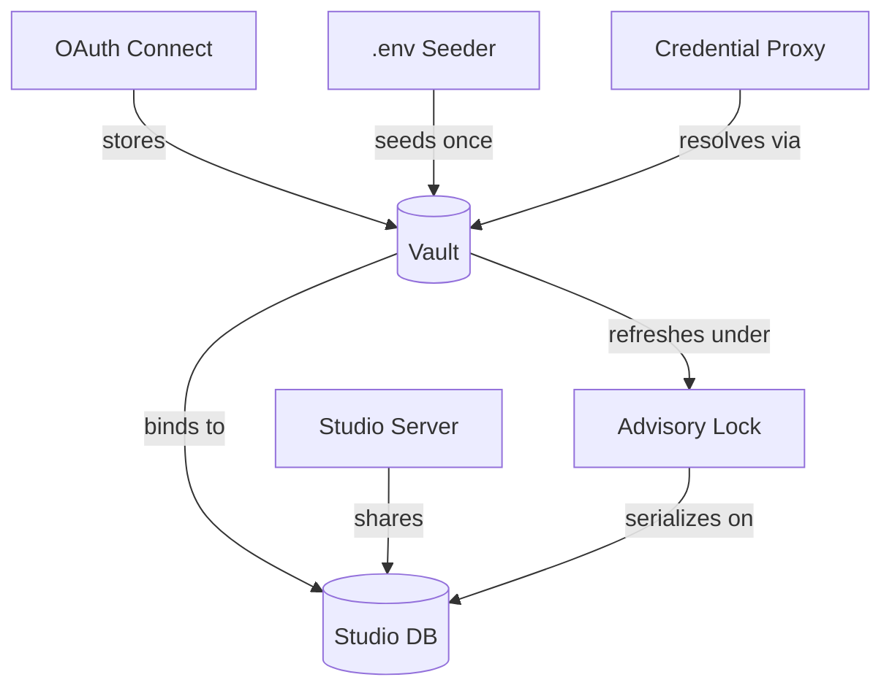

# Credentials Vault

Inbox stores every OAuth token and API key in a shared, encrypted vault instead of plaintext config. Inbox does not implement the vault — it re-exports the encryption and storage logic from `@hammies/auth` and binds it to the studio database at boot. This page covers inbox's two ingestion paths, its refresh wiring, and the legacy `.env` credential map that still backs the Agent SDK.

## Where the vault lives

The vault's encryption, per-user and per-workspace storage, and resolution order live in `@hammies/auth`'s [`credential-vault`](../../../auth/openspec/specs/credential-vault/spec.md) spec. `server/lib/vault.ts` is a re-export shim. It adds no logic beyond passing through the shared functions. Inbox's own contribution is configuration, not implementation.

At boot, inbox points `configureCredentialStore(...)` at a Postgres pool bound to `STUDIO_DATABASE_URL`, not its own `DATABASE_URL`. Studio and the data-pipeline broker read that same database, so all three processes share one credential row and one advisory-lock keyspace. Without that binding, each process refreshes its own copy, and a shared token like QuickBooks' forks into two conflicting versions. See [Health, Rate Limit, Logging](health-rate-limit-logging.md) for the pool setup this binding depends on.

## Connecting an integration

Connecting an OAuth integration starts at `GET /connections/connect/:integration`. Inbox generates a 24-byte random state, stores it in an in-process map keyed by that state, and redirects the browser to the provider's authorization URL. The stored state also captures the request's origin, because Vite's dev proxy strips the `Origin` header the callback would otherwise need. The rate limiter caps this route at 20 requests per minute, per user or IP, under the label `oauth-connect`.

The callback endpoint looks up the state, deletes it, and checks that it has not expired and that its stored integration matches the URL. It rebuilds the redirect URI from the origin captured at connect time, not from the callback's own headers, so the two exchanges agree. It exchanges the authorization code for a token, using form-encoded or HTTP Basic auth depending on the integration's config. `storeUserCredential` stores the extracted token — `access_token`, or a provider-specific field for Slack. The browser then redirects back to the integrations settings page.

## The `.env` credential map and seeding

`server/lib/credentials.ts` is a separate, legacy credential map, loaded from a workspace's `.env` file at boot into an in-process `Map`. It is not a vault: values stay in plaintext in server memory, never encrypted or persisted to Postgres. Two callers still depend on it. `getAgentEnv()` returns those values as environment variables for spawned Claude sessions. It strips `ANTHROPIC_API_KEY`, so a session bills to the user's Claude subscription instead of API credits.

`seedWorkspaceCredentials()` is the other caller. On first boot, it inserts each `.env` value into `workspace_credentials`, encrypted, so a fresh deploy with only a `.env` file starts in a working state. Once a row exists in the vault, it is authoritative. Editing `.env` afterward does not update it — the operator must reconnect the integration or edit the vault row directly.

## Refreshing tokens

Token refresh and expiry logic live in `@hammies/auth`. Inbox's job is wiring, not policy. The credential proxy's `resolveCredential` callback calls `maybeRefreshToken` first, then falls back to a plain lookup if no refresh happened. See [Credential Proxy](credential-proxy.md) for how outbound agent traffic uses the resolved token.

Inbox supplies the lock primitive, `pgAdvisoryLockAdapter(getVaultPool())`, the same helper studio uses. Both processes hash their lock key against the identical vault pool, so a refresh in one process blocks a concurrent refresh in the other. That serialization is what stopped the QuickBooks refresh-token chain from forking a second time.

## Checking and removing connections

`GET /connections` reports every registered integration's connected status without ever returning a token. A user-scope integration counts as connected when a `user_credentials` row exists for that email. A workspace-scope integration also counts as connected during the `.env`-to-vault migration, when the matching `.env` variable is still present in process memory.

`DELETE /connections/:integration` only removes a user-scope credential. A workspace-scope integration returns 403 on this route, because a workspace token is shared infrastructure, not a personal grant one user can revoke alone.

## See also

- [Inbox](index.md) — package overview and domain map
- [Credentials Vault spec](../../openspec/specs/credentials-vault/spec.md) — the contract this page explains
- [Credential Proxy](credential-proxy.md) — injects the resolved token into outbound agent traffic
- [Integrations](integrations.md) — the OAuth registry `connections.ts` reads
- [Health, Rate Limit, Logging](health-rate-limit-logging.md) — the pool and boot sequence the vault binding depends on
- [Plugin System](plugin-system.md) — plugin-declared integrations that feed the registry at boot
