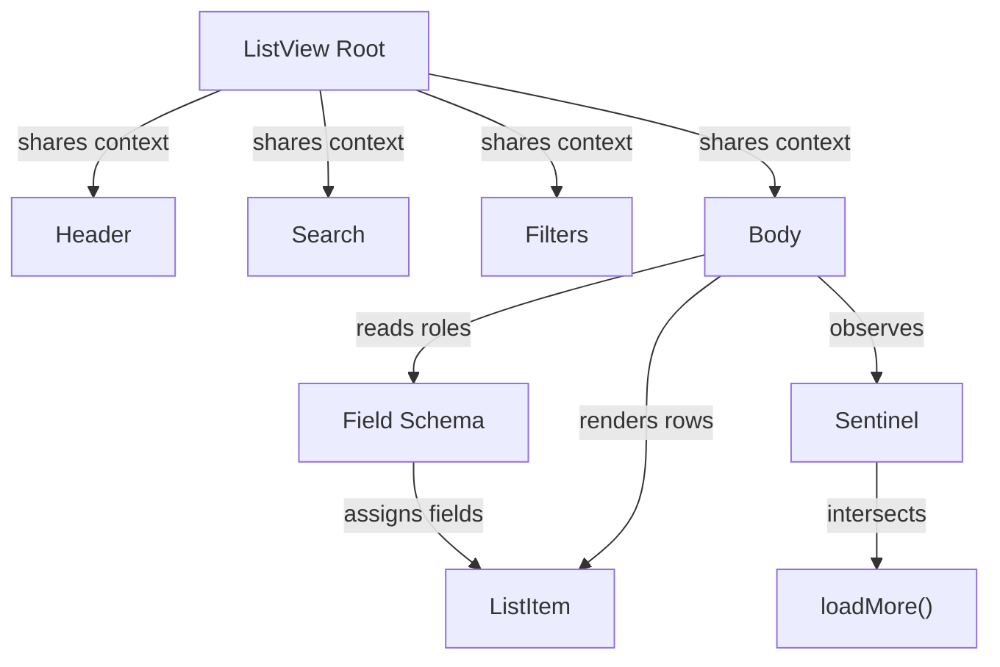

# Data Table and List Views

Inbox renders every plugin's results through two primitives: `<DataTable>` for tabular output and the compound `<ListView>` for every scrollable list panel. `<ListView>` backs every list panel in the app — emails, tasks, sessions, plugin items. It derives each row's title, subtitle, timestamp, and badges from a plugin-declared `FieldDef[]` schema, so a new plugin needs no list markup.

## Choosing a primitive

`<DataTable>` shows arbitrary tabular results, most often the output of an agent tool that returns SQL-style rows. It moved to `@hammies/frontend` (`src/components/DataTable.tsx`) so Studio can share the same component; that package's `ui-components` spec now owns its sort, filter, and pagination behavior. Inbox imports it directly rather than keeping a local copy.

`<ListView>` is the primitive for every scrollable list panel in the app. Each consumer — emails, tasks, sessions, any plugin's items — composes the same four subcomponents and wires them to its own data source.

## Composing a `<ListView>` panel

`<ListView>` is a compound component. `ListView.Root` holds `items`, `fieldSchema`, `getItemId`, `selectedId`, and `onSelect` in React context. Every subcomponent reads that context through a hook, which throws when used outside the root. This lets each consumer arrange its own header, search box, and filter popover around a shared body.

- `ListView.Header` wraps the shared `PanelHeader` chrome, with the mobile sidebar toggle and title on the left and the consumer's action buttons on the right.
- `ListView.Search` is fully controlled: the parent owns the search value and decides how it drives the data fetch.
- `ListView.Filters` reads every field with `filter.filterable === true` from `fieldSchema`, and calls the consumer's `optionsFetcher` for fields with dynamic options, such as plugin-provided enums.
- `ListView.Body` renders the scrollable row list and owns virtualization, infinite scroll, and the empty, loading, and error states.

Filter and search *state* belongs to the consumer, not to `<ListView>` — see [Navigation](navigation.md) for the `useActiveFilters` store most panels wire it through.

## How field schema drives row rendering

A plugin ships one `FieldDef[]` describing each property's type (`text`, `date`, `boolean`, ...) and its role in a list row. `getTitleField`, `getSubtitleField`, and `getTimestampField` each pick one field for its row slot. An explicit `listRole` always wins; otherwise the fallback is the first non-hidden field of the matching type. `getSubtitleField` never returns the title field twice, even without an explicit role.

`extractFieldValue` walks a dot path such as `author.name`, returning `undefined` at any missing or non-object segment. This lets a schema reference a nested value without the plugin flattening its data first. The timestamp always renders through the shared `formatRelativeDate`, so every list panel in the app reads relative dates the same way.

`getBadgeFields` collects every field with a `badge` config. `ListView.Body` maps each through the field's `labelFn` and `colorFn`. It skips a field whose `id` is in the caller's `hiddenBadgeFields`, and drops a `show: "if-set"` badge when its value is falsy. A boolean badge only renders when true — there is no "false" pill.

Row layout follows the subtitle. With a subtitle present, row one pairs `[subtitle, timestamp]` and row two shows the title; without one, row one pairs `[title, timestamp]` alone. When a row is selected, its badges force `primary-foreground` colors regardless of what `colorFn` returned.

## Infinite scroll and render performance

`ListView.Body` places an invisible sentinel `
` at the end of the row list and observes it with an `IntersectionObserver` using a 200px `rootMargin`. The observer reads `loadMore` through a ref, so a stale render never queues a request for data the consumer already replaced. It disconnects on unmount and whenever `hasMore` or `loading` flips, so no observer survives a panel switch.

Each row wrapper sets `contentVisibility: auto` with a `containIntrinsicSize` height hint. This lets the browser skip layout and paint for rows scrolled out of view. That matters once a list passes roughly 1,000 plugin items. The size hint still keeps scrollbar geometry correct before rows render.

`ListItem` is `memo`d with a comparator that ignores `onClick` and `icon`. `onClick` is a new closure on every render. Every row's click still resolves to the same handler as long as `title`, `subtitle`, `timestamp`, `isSelected`, and `badges` stay unchanged. Selection changes and search keystrokes no longer re-render every visible row.

## Empty, loading, and error states

`ListView.Body` renders exactly one of three fallback states before it renders rows. `loading` renders a `<ListSkeleton>` sized to `itemHeight`. A set `error` renders the caller's `errorContent` if given, otherwise the error text in the destructive color. An empty, non-loading, non-erroring list renders `<EmptyState>` with the caller's icon and message, defaulting to the `Bot` icon.

## See also

- [Inbox](index.md) — package overview and domain map
- [Data Table and List Views spec](../../openspec/specs/data-table-list-views/spec.md) — the contract this page explains
- [Shared UI Components](shared-ui-components.md) — `PanelHeader`, `SearchInput`, `FilterPopover`, `ListSkeleton`, `EmptyState`, and the shadcn kit these primitives build on
- [Navigation](navigation.md) — the filter and search state stores that `ListView.Search` and `ListView.Filters` wire into
- [Plugin System](plugin-system.md) — where a plugin declares the `FieldDef[]` schema this page's rendering rules consume
