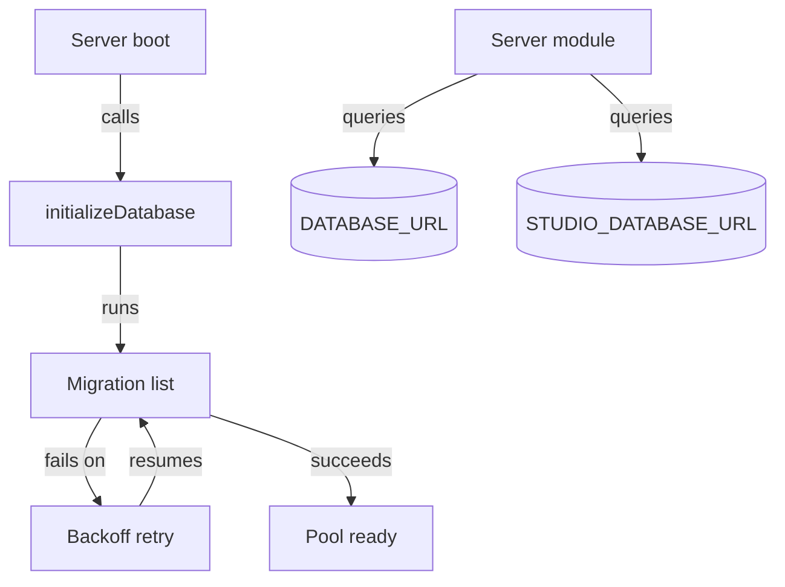

# Database

`server/db/pool.ts` gives every inbox server module one Postgres connection pool, four query helpers, and a transaction wrapper. It also owns `initializeDatabase()`, the forward-only migration runner that runs on every boot. There is no SQLite fallback and no server-side cache — Postgres is the only store.

## Getting a pool and running queries

`getPool()` builds the pool from `DATABASE_URL` on first use, then returns that same instance on every later call. It sets `max: 10`, a 30-second idle timeout, and a 5-second connection timeout. A missing `DATABASE_URL` throws immediately instead of returning a broken pool, and the failure is not cached — the next call retries with a fresh check.

Four helpers wrap the pool, each typed by the caller's row shape:

- `query<T>()` returns every row.
- `queryOne<T>()` returns the first row, or `undefined` when none matched — never `null`.
- `execute()` returns `{ rowCount }`, normalizing the driver's `null` to `0`.
- `withTransaction()` runs a callback inside `BEGIN`/`COMMIT`. It rolls back and re-throws on any error. It always releases the client, so a partial write can never leak a connection back to the pool.

`queryRows()` and `queryOptionalRow()` add the runtime boundary that the raw pool helpers cannot provide. Each caller supplies a query-specific Zod contract and a stable query name. Production decodes every PostgreSQL row against that contract before returning it; an optional-row query also rejects cardinality above one. Driver values therefore cannot become trusted application types solely through a TypeScript generic.

## Two pools: inbox data and the credential vault

Inbox binds two separate pools to two separate databases. `getPool()` serves inbox's own tables — sessions, preferences, credentials — from `DATABASE_URL`. `getVaultPool()` serves the shared OAuth credential vault from `STUDIO_DATABASE_URL`. Studio and the data-pipeline broker read the same database. All three processes refresh one credential row under one advisory lock. See [Credentials Vault](credentials-vault.md) for how the vault itself works; this page covers only the pool it runs on.

`vaultQuery()`, `vaultQueryOne()`, and `vaultExecute()` mirror the three query helpers above but run against the vault pool. `getVaultPool()` falls back to `DATABASE_URL` when `STUDIO_DATABASE_URL` is unset. This restores pre-split behavior but forks the refresh-token chain. Set `STUDIO_DATABASE_URL` wherever a credential refresh can run.

## Startup and migrations

`initializeDatabase()` reads and runs an ordered array of migration filenames from `server/db/migrations/` on every boot. The array, not the directory listing, is the source of truth — a file added to the directory but missing from the array never runs. Every statement in every migration uses an idempotent guard (`IF NOT EXISTS`, `IF EXISTS`, or an `information_schema.columns` check). No migrations table tracks what already ran. Re-running the full list against an already-initialized database is a no-op by design.

A migration query can fail with a network or connection-class error — `ECONNRESET`, `08006`, `57P03`, and others in a fixed allowlist. That query retries with exponential backoff capped at five seconds. This keeps startup alive through a Tailscale route flap to the database host instead of leaving the server with no working backend. A migration that fails for any other reason — bad SQL, an authentication error, a schema conflict — rejects `initializeDatabase()` immediately without retrying.

Adding a schema change means two edits: a new `NNN_<name>.sql` file in `server/db/migrations/`, and that filename appended to the array in `pool.ts`. A migration file never changes after it has run anywhere, even to fix a typo — corrections ship as a new migration instead.

## Why no SQLite and no server cache

Inbox started on SQLite (`better-sqlite3`) and finished migrating to Postgres. The old schema file and its one-time conversion script are both deleted. Nothing under `server/` imports `better-sqlite3` anymore.

A table that looks like a cache is not one. `api_cache` is gone because React Query now caches on the client. `backfill_state` and `body_extraction_log` track *progress* through work that still has to run, not a memoized result to skip. `session_messages` is gone for the same reason — the Claude Agent SDK's JSONL files under `~/.claude/projects/` are the one transcript store. Postgres never held a second copy to drift from it. See [Session Manager](session-manager.md) for how a session's JSONL file gets read.

## Current schema

Migrations 001 through 009 leave the tables below. `notion_options`, `api_cache`, and `session_messages` existed briefly and are gone, each removed once its owning system moved the responsibility elsewhere.

| Table | Owning domain | Purpose |
|---|---|---|
| `sessions` | [Session Manager](session-manager.md) | Session metadata and a linked-source pointer |
| `users` | [Auth and Sessions](auth-and-sessions.md) | Google-authenticated user records |
| `auth_sessions` | [Auth and Sessions](auth-and-sessions.md) | Browser session tokens (`inbox_session` cookie) |
| `user_preferences` | [Preferences](preferences.md) | Per-user key/value settings |
| `user_credentials` | [Credentials Vault](credentials-vault.md) | Per-user encrypted OAuth tokens |
| `workspace_credentials` | [Credentials Vault](credentials-vault.md) | Per-workspace shared encrypted tokens |
| `workspaces` | [`workspace` spec](../../openspec/specs/workspace/spec.md) | Workspace registry (id, name, path) |
| `workspace_members` | [`workspace` spec](../../openspec/specs/workspace/spec.md) | Workspace membership and role |
| `backfill_state` | [Context System](context-system.md) | Per-plugin cursor for context backfill |
| `source_entities` | [Context System](context-system.md) | Entity index for proximity-grouped curation |
| `body_extraction_log` | [Context System](context-system.md) | Resume marker for bulk body-text extraction |
| `webhook_replay_claims` | [Webhooks](webhooks.md) | Expiring, atomic replay claims shared by every Inbox instance |

## See also

- [Inbox](index.md) — package overview and domain map
- [Database spec](../../openspec/specs/database/spec.md) — the contract this page explains
- [Credentials Vault](credentials-vault.md) — the store the vault pool serves
- [Context System](context-system.md) — owns `backfill_state`, `source_entities`, and `body_extraction_log`
- [Session Manager](session-manager.md) — reads the JSONL transcript instead of a `sessions`-table copy
- [Health, Rate Limit, Logging](health-rate-limit-logging.md) — the boot sequence that calls `initializeDatabase()`
