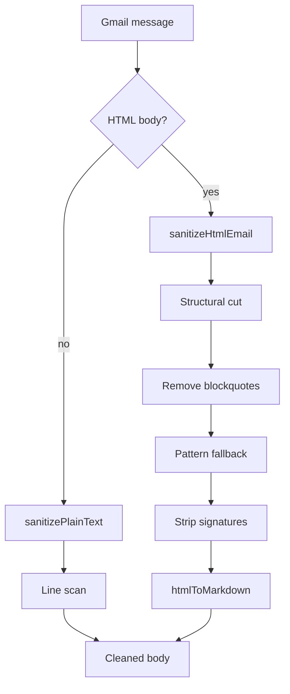

# Email Sanitizer

The email sanitizer strips quoted reply history, forwarding headers, and client signatures from inbound Gmail message bodies before the inbox ever renders them. It runs server-side inside `parseMessage()`, once per message, so the API never ships raw client HTML to the frontend. Two independent functions handle the two body formats: `sanitizePlainText` for plain-text bodies and `sanitizeHtmlEmail` for HTML bodies.

## Two code paths, one per body format

`parseMessage()` in `gmail.ts` picks the sanitizer by `bodyIsHtml`: plain text goes through `sanitizePlainText`, HTML goes through `sanitizeHtmlEmail` and then `htmlToMarkdown`. The two functions share no code — plain text uses a line-by-line scan, HTML uses layered regex passes over the raw markup. A regex approach handles HTML because the load-bearing patterns are textual, not structural. `On...wrote:` text gets fragmented across `` boundaries; a Chinese full-width colon can split into sibling spans. A real DOM parser solves the easy cases; the regex fallback covers clients that don't use a recognized structural wrapper.

## Plain-text sanitization: line-by-line scan

`sanitizePlainText` walks the body line by line and stops at the first line that marks a reply boundary. Boundary markers:

- a `>`-prefixed quote line
- an `On ... wrote:` attribution, checked across up to 3 lines since Gmail and Shortwave wrap it differently
- a Chinese `写道` attribution
- an Outlook `From:`/`Sent:` header block
- a Chinese `发件人:` header
- an `-----Original Message-----` separator

`Sent with/via X` footers and standalone client-name lines (Shortwave, Superhuman, Spark, and others) are removed without truncating — the scan skips them and keeps reading.

## HTML sanitization: structural cut before text patterns

`sanitizeHtmlEmail` truncates at known per-client structural markers before it falls back to text patterns. Each client wraps quoted history in a recognizable `
` or `<table>`:

- Shortwave — a `shortwave-signature` div
- Gmail — a `gmail_quote` or `gmail_extra` div
- Outlook Web — a `divRplyFwdMsg` div
- Outlook desktop / Apple Mail — a `border-top:solid` separator div
- GoHighLevel — a `reply-timestamp-box` div

The function checks each marker in turn and, when found, slices the HTML at that point. This structural pass is the fast path: it's an exact string search, not a regex sweep, so it runs before the more expensive text-pattern scan.

## Removing nested blockquotes

After the structural cut, the function repeatedly removes only the innermost `<blockquote>` — one with no nested `<blockquote>` inside — until none remain. A single-pass regex would pair an outer opening tag with an inner closing tag, leaving a dangling `</blockquote>`. The loop instead removes only the innermost blockquote each pass, which stays correct on multi-level threads. An unclosed `<blockquote>`, which Apple Mail and iOS Mail emit, truncates the body at its enclosing block instead of looping forever.

## Text-pattern fallback and the earliest-match rule

When no structural marker matches, the function scans the remaining HTML against five text patterns:

- `发件人:` — Chinese Outlook header
- Chinese `写道` attribution
- `On ... wrote:` attribution
- bold `From:`/`Sent:` or `From:`/`Date:` blocks
- `-----Original/Forwarded Message-----` separator

Every pattern is evaluated, and the match with the lowest character index wins, regardless of pattern order. A nested `On...wrote:` inside a quoted reply can sit later in the pattern list but earlier in the document than the true reply boundary. The earliest-match rule picks the true boundary in that case, instead of whichever pattern the loop reaches first.

Patterns tolerate HTML tags interspersed in the matched text, using a `(?:[^<]|<[^>]+>)` unit, because Outlook and Apple Mail split attribution text across multiple `` elements. Once a match is found, the function walks backward to the nearest enclosing HTML block element. It cuts there, never mid-element — the spec lists the recognized tags. Cutting at a block boundary keeps the truncated body valid HTML.

## Cleanup passes after truncation

Three more passes run regardless of which branch stripped the quoted history. Inline `background-color` styles and `bgcolor` attributes are removed, because HTML emails like calendar invites hard-code colors that clash with the inbox's own theme. Elements wrapping `Sent with/via X` text or a standalone client name are removed. Trailing `
`/`
` elements whose only content is whitespace, `&nbsp;`, or inline tags are removed in a loop until the body stabilizes. This clears the deep `&nbsp;` padding that Outlook and Word HTML emit.

## Preserving the sender's own signature

`sanitizeHtmlEmail` accepts `{ keepSignature: true }`, which skips stripping `gmail_signature` and `gmail_signature_prefix`. The caller sets this only for the last message of a thread: the sender's signature is useful there, but noise on earlier quoted messages.

## Where the sanitizer runs

`parseMessage()` in `gmail.ts` is the only caller. It picks `sanitizeHtmlEmail` or `sanitizePlainText` by `bodyIsHtml`, and for HTML bodies chains `htmlToMarkdown` immediately after, before the parsed message ever leaves the function. `getMessage()` and the last message in `getThread()`'s loop both pass `{ keepSignature: true }`. Every other message in a thread passes no options, so its signature gets stripped.

## Testing and fixtures

The unit suite in `email-sanitizer.test.ts` covers every scenario in the owning spec against synthetic HTML, plus nine real Gmail fixtures saved as raw HTML files. A separate live suite hits the Gmail API directly and is excluded from `test:ci`. It fetches a real thread by ID and is meant for interactive debugging. Adding support for a new email client means adding both a fixture and a test that asserts the new pattern fires. The spec's Technical Notes table records the fixture-to-pattern mapping.

## See also

- [Inbox](index.md) — package overview and domain map
- [Email Sanitizer spec](../../openspec/specs/email-sanitizer/spec.md) — the contract this page explains
- [Gmail Plugin](gmail-plugin.md) — the plugin whose message parser calls the sanitizer
