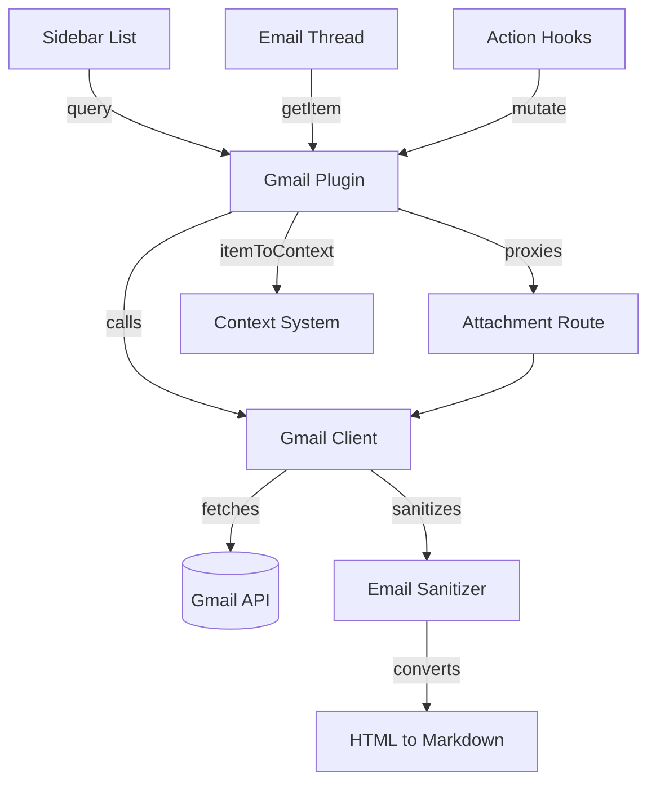

# Gmail Plugin

The `gmail` plugin is a built-in [plugin system](plugin-system.md) plugin. It wraps the Gmail REST API behind per-user OAuth, for thread search, label mutation, and message composition. Every message body passes through the shared sanitizer and an HTML-to-Markdown converter before the client renders it.

## Two front doors, one client

Every Gmail call funnels through `gmail.ts`, a thin fetch wrapper around the Gmail REST API. The plugin reaches that client two ways. The generic `Plugin` contract satisfies the plugin loader and drives the sidebar's list panel. A second REST surface, mounted by the plugin's own `routes()`, preserves the pre-plugin URL shape and serves the custom `EmailThread` component and its hooks. Both paths call the same `gmail.ts` functions, so only the entry point differs.

The wrapper validates each Google response with the schema for that endpoint before returning it. A malformed thread, label, message, profile, history, or attachment payload therefore fails inside the provider adapter instead of reaching plugin rendering or mutation logic as an assumed shape.

## Manifest and fields

The manifest declares `auth: { integrationId: "google-workspace", scope: "user" }`. The loader requires a per-user Google OAuth grant before it mounts any route. `requireToken` reads that grant through `ctx.getCredential("google-workspace")` on every handler. A missing or unrefreshable token throws an error the client shows as a "Google account not connected" state.

The manifest sets `components: { detail: "EmailThread" }` and no `components.list` entry. `PluginDetail` special-cases the `gmail` plugin ID and imports `EmailThread` directly, instead of resolving it through that string. `fieldSchema` marks `from`, `subject`, and `date` as list roles, and `isUnread`, `isImportant`, `isStarred` as badges. That is the whole contract the sidebar's generic [list view](data-table-list-views.md) needs to render a thread row.

`EmailListView.tsx` — the file the Technical Notes table lists as the frontend list component — defines its own field schema and calls its own `useEmails` hook. Nothing in the client mounts it today; the sidebar renders Gmail threads through the same generic list panel every other plugin uses.

## Listing threads

`query` builds a Gmail search string from the active filters. It starts from `filters.q` if the user typed a search, else from `in:inbox`, then appends one `label:<name>` term per selected label.

A `filters.flags` selection takes a different path, because Gmail's `is:` operator is message-level. `in:inbox is:starred` can miss a thread starred only on an older reply, since Gmail unions labels across a thread's messages. To resolve a flag filter, the plugin:

- lists the scope's thread IDs with one cheap call
- fetches each thread's summary at concurrency 20
- keeps only threads whose label set matches every selected flag
- returns the full match set in one response, with no further pagination

Without a flag filter, `query` fetches one 200-thread page — the whole inbox, matching Studio's session list. It paginates further pages by cursor. Either path also fetches the user's label map in parallel. It then calls `addDerivedFields`, which resolves `isImportant`, `isStarred`, and up to `MAX_LABEL_BADGES` (3) label names per thread.

`searchThreads` re-sorts each fetched page newest-first. Gmail's `q=` order is search-relevance, not date, so an unsorted page could show today's message below week-old ones.

## Reading a thread

`EmailThread` fetches its data through `use-email-thread`, which calls the dedicated `/api/gmail/threads/:id` route — an alias for `getItem`. It sets `staleTime: 0`, so every open re-fetches; nothing caches the thread server-side.

`gmail.getThread` fetches the full thread and runs `parseMessage` on each message. `parseMessage` sanitizes the body (see [Email Sanitizer](email-sanitizer.md)) and, for HTML bodies, converts the sanitized markup to Markdown through `htmlToMarkdown`. Only the thread's last message keeps its own sender's signature; every earlier message loses its signature and quoted history.

`EmailMessage` renders a body as Markdown when `bodyFormat` is `"markdown"`, or when a plain body looks like Markdown — bold, underline, or heading markers. Otherwise it renders as preformatted plain text. The Markdown path always goes through the shared `@hammies/frontend` `Markdown` component. The plugin keeps no renderer of its own, so a thread looks the same here and in the Studio Email app.

## Replying and mutating

`mutate` dispatches on a fixed action set, and throws `Unknown Gmail action` on anything else:

- `archive` removes only the `INBOX` label — Gmail's own archive semantics, not a delete
- `trash` moves the thread to Trash
- `star` and `unstar` toggle the `STARRED` label
- `mark-important` and `mark-not-important` toggle the `IMPORTANT` label
- `modify-labels` adds and removes an arbitrary label set from the payload
- `send` and `save-draft` build a MIME message and send or save it

`send` and `save-draft` share one path. `markdownToHtml` converts the composed text to HTML, and `buildRawEmail` assembles a `multipart/alternative` message with both parts. A reply threads through `In-Reply-To` and `References`, built from the RFC 2822 `Message-ID` of the message it answers.

`use-email-actions` applies each mutation optimistically, against both the open thread's cache and the sidebar list's cache. It rolls both back if the request fails. `use-email-draft` derives reply-all recipients from the last message's `From`, `To`, and `Cc` headers, minus the signed-in user. It persists the in-progress body to local storage per thread, so a reload never loses a draft. It also seeds the editor from an existing Gmail draft when no local draft exists.

## Caching

The plugin caches one thing on the server: the user's label map, keyed by access token, for 5 minutes (`getUserLabelMapCached`). Access token, not user email, because two tabs on the same account already share one token — caching by token needs no extra user lookup.

Nothing else the plugin touches carries a server-side cache. Every open of a thread, every send, and every draft save is a live Gmail API round trip.

## Attachment proxy

`GET /api/gmail/messages/:id/attachments/:attachmentId` keeps the OAuth token server-side — the browser never receives it. The route resolves a MIME type from the `?filename=` query string when the caller supplies one — more accurate for spoofable extensions like `.csv`. Without a filename, it sniffs the first bytes instead. Four image formats and PDF each have a recognizable signature; anything else falls back to `application/octet-stream`.

`Content-Disposition` follows from that MIME type. Images, PDFs, and text render `inline` — used for CID-replaced images embedded in a sanitized body. Everything else — Office documents, archives, and unrecognized binaries — downloads as `attachment`. An inline Office document fails to render; a "Save" on the failed view captures the viewer shell, not the file.

A failed `getAttachment` call returns a `502` JSON error with no `Content-Disposition`, so a token failure surfaces as a failed request, not a corrupt download. The response also carries a one-year immutable `Cache-Control`, because Gmail attachment IDs are content-addressed and never change.

## Context-system integration

`itemToContext` filters at stub-generation time. It returns `null` in two cases: when the thread has no subject and no body, or when the sender's local part starts with one of five automated-mail prefixes:

- `noreply@`
- `no-reply@`
- `notifications@`
- `automated@`
- `donotreply@`

These prefixes would add marketing and transactional noise to the curated context, with no curation value. A surviving thread becomes a Markdown stub with `email-thread` frontmatter — thread ID, subject, date — followed by a heading, the sender, and the body. That is the shape the [context system](context-system.md)'s curation pipeline expects from every plugin.

## See also

- [Inbox](index.md) — package overview and domain map
- [Gmail Plugin spec](../../openspec/specs/gmail-plugin/spec.md) — the contract this page explains
- [Email Sanitizer](email-sanitizer.md) — the HTML-cleanup step `parseMessage` calls
- [Plugin System](plugin-system.md) — the loader, registry, and route-mounting this plugin registers into
- [Context System](context-system.md) — the curation pipeline `itemToContext` feeds
- [Credentials Vault](credentials-vault.md) — where the `google-workspace` OAuth grant lives
- [Data Table and List Views](data-table-list-views.md) — the generic list panel Gmail's sidebar renders through
- [Rich Text Editor](rich-text-editor.md) — the compose editor `EmailThread`'s draft reply uses
