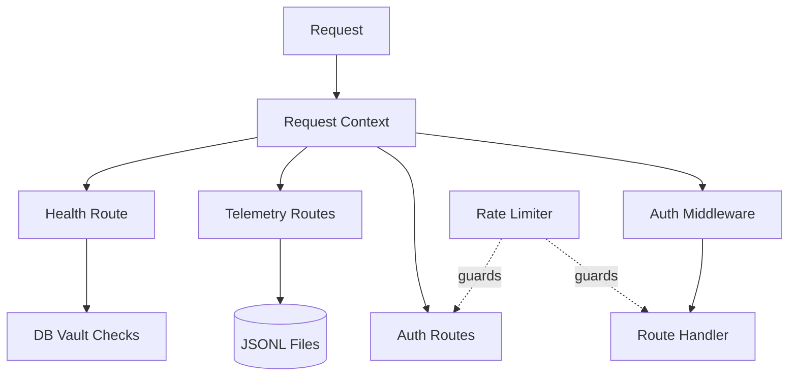

# Health, Rate Limit, Logging

Health checks, rate limiting, structured logging, versioned JSON envelopes, and crash telemetry are independent server primitives that keep the inbox server observably correct. The health route reports database and vault status to unauthenticated probes, and an in-memory rate limiter guards public routes from brute force. A structured logger correlates every log line to its request, the response middleware normalizes JSON at the HTTP boundary, and a client-side heartbeat catches renderer crashes error trackers cannot see.

Health, telemetry, and the auth routes bypass the auth middleware by design — probes, post-crash tabs, and a logging-in user hold no session cookie yet. The rate limiter and the logger apply independently of that boundary.

## Checking server health

`GET /api/health` runs before the auth middleware, so load balancers and uptime probes need no credentials. `runHealthChecks` pings the database with `SELECT 1`, validates `VAULT_SECRET`'s shape, and counts loaded plugins. `isHealthy` gates the HTTP status. It returns true only when both the database and vault checks pass, so plugin or workspace failures never flip the response to 503. The database check also reports `latencyMs`, so probes catch a slow connection without a separate metric.

`VAULT_SECRET` must be exactly 64 hex characters. A value that is set but malformed returns a distinct error instead of passing as valid. A truncated secret causes silent decryption failures elsewhere in the [credentials vault](credentials-vault.md), so the health check fails loud instead of letting a broken value through.

## Limiting request rate

`rateLimit(opts)` wraps a Hono route in a fixed-window counter, keyed by `${label}:${keyFn(c)}`. The default `keyFn` is `getClientIp`, which reads the first `x-forwarded-for` entry, then `x-real-ip`, then falls back to `"unknown"`. The limiter stores buckets in a plain `Map`, not Redis, because the inbox runs as a single Node process. No external store is worth the operational cost until the server scales horizontally.

Every response carries `X-RateLimit-Limit` and `X-RateLimit-Remaining` headers. A request that meets `max` within the window gets a 429, with a `Retry-After` header in seconds. A 60-second reaper interval drops expired buckets so the map cannot grow without bound. The interval is `unref()`'d, so it never keeps the process — or a test run — alive.

## Correlating logs across a request

Every inbox module logs through `createLogger`, shared from `@hammies/frontend/lib/serverLogger`. `server/index.ts` wraps each request in `runWithRequestContext({ requestId, userEmail? })`. `AsyncLocalStorage` then makes every nested `log.*` call — including async descendants — pick up the request ID automatically. Call-site context wins when a key collides with the auto-injected `requestId` or `userEmail`. This removes the need to thread a request ID through every function signature between the middleware and a route handler.

In production, each call writes one JSON line to stdout, or to stderr for `error` level, so log aggregators can parse structured fields. In development, the format is human-readable: `[LEVEL] [module] req=<8-char-id> message key=value`, with the request tag only when a context is active. `LOG_LEVEL` filters output — set it to `warn` and debug and info calls stop printing. `createLogger("foo").child({ sessionId })` returns a logger that adds `sessionId` to every subsequent call. A route handler using it does not have to pass `sessionId` at each call site.

## Versioning JSON responses

`versionedJsonEnvelope` runs after route handlers and rewrites JSON responses into the shared contract envelope when the handler has not already produced one. Successful bodies become `{ contractVersion, data }`; failures become `{ contractVersion, error }` with a stable fallback code, message, and request ID. It leaves 204 responses, non-JSON bodies, and already-versioned envelopes untouched. This lets legacy handlers migrate incrementally without exposing an unversioned server response to the runtime-validating client.

## Catching client-side crashes

`initCrashTelemetry()` starts a 5-second heartbeat. Each tick snapshots:

- Heap usage and limit
- DOM node and iframe counts
- Open panel count and active tab
- Long tasks since the last tick

The snapshot writes to `localStorage` under `inbox:lastHeartbeat`, then posts to `/api/telemetry/heartbeat`. A Sentry-style error tracker cannot catch a renderer-OOM crash, because the JS context dies before any handler runs. The persisted snapshot survives that death and is read on the next boot.

A clean page close, via `pagehide` or `beforeunload`, writes `inbox:cleanUnload` with the current timestamp. On boot, the client checks whether the last heartbeat has a matching clean-unload mark. Without one, it treats the previous tab as crashed and posts the heartbeat to `/api/telemetry/crash`. Both telemetry routes mount before the auth middleware and skip authentication entirely, so a post-crash tab without a session cookie can still report. The server appends each payload as one JSON line to `data/telemetry/{heartbeat,crash}.jsonl` and always returns 204. A payload over 16 KB fails to append, but the route still returns 204, because it never reports its own failures to the client.

## See also

- [Inbox](index.md) — package overview and domain map
- [Health, Rate Limit, Logging spec](../../openspec/specs/health-rate-limit-logging/spec.md) — the contract this page explains
- [Credentials Vault](credentials-vault.md) — `VAULT_SECRET` decrypts the tokens this vault stores
- [Auth and Sessions](auth-and-sessions.md) — the auth middleware health, telemetry, and auth routes bypass
- [Database](database.md) — the Postgres pool the health check pings
