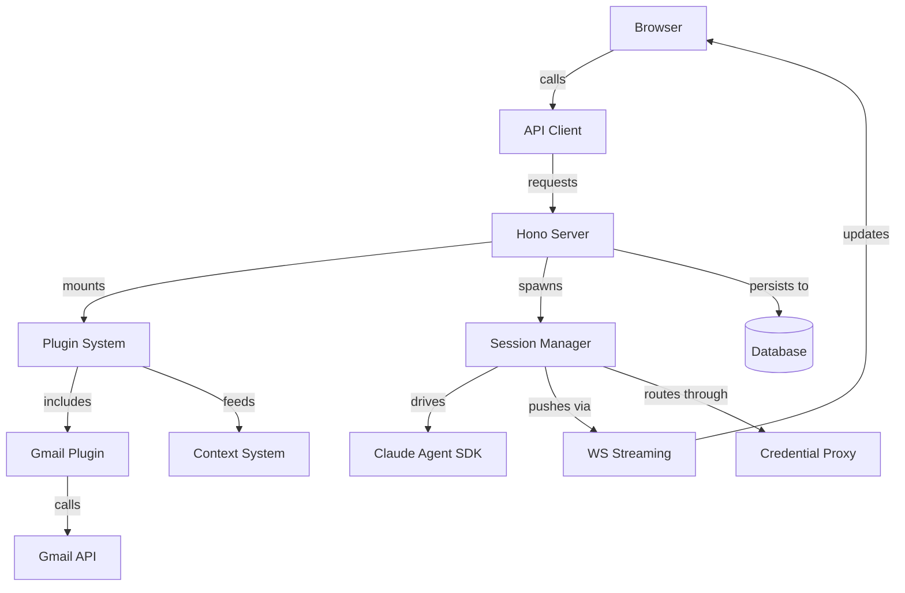

# Inbox

Inbox is Hammies' unified web app for Gmail, Notion tasks, and Claude Code agent sessions. A React client calls a Hono API server, which persists to Postgres and exposes Gmail and other sources through one plugin system. The server also streams session events in real time and curates plugin data into a searchable workspace knowledge base.

## Client shell

The client renders through a Zustand [navigation](navigation.md) store instead of a URL router, because inbox multiplexes per-tab panel state no router alone can hold. [Shared UI components](shared-ui-components.md) and [theming](theming.md) wrap the workspace's shadcn kit, and [data table and list views](data-table-list-views.md) render every plugin's list panel from one schema. The [rich text editor](rich-text-editor.md) backs the session composer and the Gmail draft surface. The [API client](api-client.md) wraps every `fetch()` call in one runtime-validated helper, using the wire types the [`user-and-types` spec](../../openspec/specs/user-and-types/spec.md) defines.

## Server foundation

Every server module that needs durable state goes through the [database](database.md)'s single Postgres pool and migration runner. [Auth and sessions](auth-and-sessions.md) issues the JWT cookie that gates every `/api/*` route, and the [`workspace` spec](../../openspec/specs/workspace/spec.md) scopes each request to one filesystem and credential set.

Credentials flow through three layers:

- [Integrations](integrations.md) — the OAuth registry every plugin configures against.
- [Credentials vault](credentials-vault.md) — encrypted token storage in Postgres.
- [Credential proxy](credential-proxy.md) — injects tokens into outbound agent traffic without exposing the secret.

A signed [`webhooks` spec](../../openspec/specs/webhooks/spec.md) route accepts provider events, and [health, rate limit, and logging](health-rate-limit-logging.md) keep the server observable. [Preferences](preferences.md) stores per-user UI settings, scoped only to the authenticated user.

## Plugins

The [plugin system](plugin-system.md) discovers, loads, and hot-reloads every inbox plugin, then mounts each one's REST routes at `/api/:pluginId/*`. Two plugins ship built-in. [Core](core-plugin.md) bundles the `plugin-creator` and `render-output` Claude skills into every workspace. The [Gmail plugin](gmail-plugin.md) wraps thread search, label mutations, and draft composition behind the shared `Plugin` contract. A workspace can add more plugins, including Notion, under its own `plugins/` directory, and the loader treats them identically.

## Sessions

The [session manager](session-manager.md) owns the full Claude Agent SDK lifecycle. It spawns, resumes, and aborts sessions, then indexes each transcript's JSONL file. It also builds the agent's environment, discovers plugin paths, and registers the MCP servers every session needs.

[Session streaming](session-streaming.md) delivers those events to the browser over one multiplexed websocket, with cursor-based replay so a reconnecting tab recovers without a full reload. [Session views controller](session-views-controller.md) exposes the REST surface and the `SessionView` detail panel that renders the transcript. [Session files](session-files.md) gives each session a scoped upload and output directory, and [session instructions](session-instructions.md) appends the inbox's behavioral system prompt to every run. The [`title-generator` spec](../../openspec/specs/title-generator/spec.md) covers the fire-and-forget hook that titles a session once its transcript has enough content.

## Content pipeline

Inbound Gmail messages pass through the [email sanitizer](email-sanitizer.md) first, which strips quoted history, forwarding headers, and signatures so only new content reaches the UI. The [artifacts and render tools](artifacts-and-render-tools.md) let the agent author renderable output as a sandboxed iframe. A code-editor panel can patch that output live through a shared store.

The [context system](context-system.md) turns plugin items into a curated knowledge base under the workspace's `context/` directory. Four stages run in order:

- Raw backfill writes one stub per item.
- Seed-entity extraction pulls structured entities from each stub.
- Body extraction finds entities the headers miss.
- Entity curation folds new sources into each entity's page.

## See also

- [Hammies Workspace](../../../../docs/system/index.md)
- [API Client](api-client.md)
- [Artifacts and Render Tools](artifacts-and-render-tools.md)
- [Auth and Sessions](auth-and-sessions.md)
- [Context System](context-system.md)
- [Core Plugin](core-plugin.md)
- [Credential Proxy](credential-proxy.md)
- [Credentials Vault](credentials-vault.md)
- [Data Table and List Views](data-table-list-views.md)
- [Database](database.md)
- [Email Sanitizer](email-sanitizer.md)
- [Gmail Plugin](gmail-plugin.md)
- [Health, Rate Limit, Logging](health-rate-limit-logging.md)
- [Integrations](integrations.md)
- [Navigation](navigation.md)
- [Plugin System](plugin-system.md)
- [Preferences](preferences.md)
- [Rich Text Editor](rich-text-editor.md)
- [Session Files](session-files.md)
- [Session Instructions](session-instructions.md)
- [Session Manager](session-manager.md)
- [Session Streaming Protocol](session-streaming.md)
- [Session Views Controller](session-views-controller.md)
- [Shared UI Components](shared-ui-components.md)
- [Theming](theming.md)
