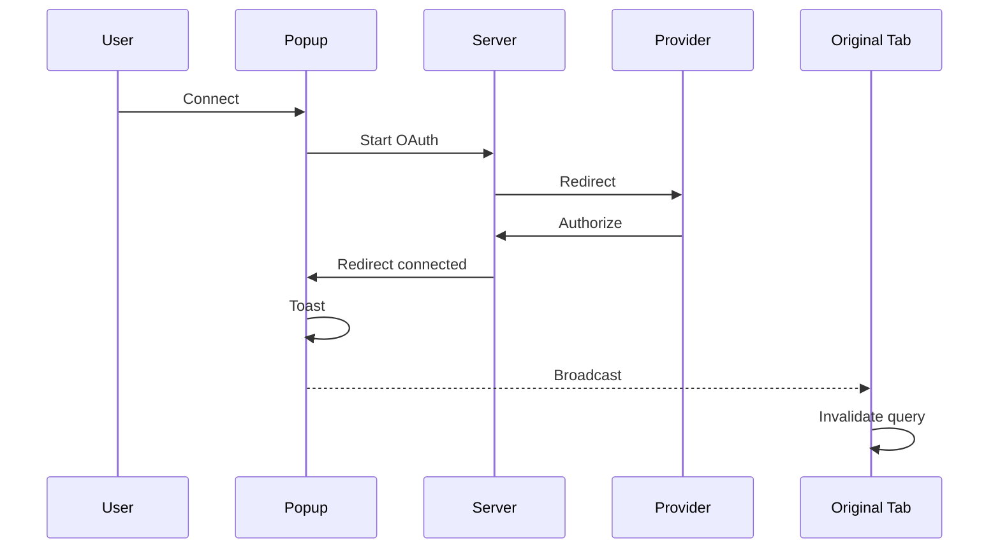

# Integrations

Integrations are the external services inbox can connect to — Gmail, Notion, Slack, and any plugin-declared provider — read from a shared `@hammies/auth` registry. Inbox owns the browser-side connect flow: opening the popup, handing OAuth results back to the original tab, and keeping the connection list correct without a reload. A plugin can also contribute its own integration and brand icon, served through the same route Studio uses.

## The shared registry

The `INTEGRATIONS` catalog — every provider's OAuth URLs, scopes, and token exchange method — lives in `@hammies/auth`, documented by its own [integrations spec](../../../auth/openspec/specs/integrations/spec.md). Inbox re-exports the catalog and its lookup helpers from `server/lib/integrations.ts`, so its routes and scripts share one source of truth with Studio.

Two scopes split the credential model. A `scope: "user"` integration stores one token per email address. A `scope: "workspace"` integration stores one token per workspace, and may start out seeded from that workspace's `.env` file. See [Credentials Vault](credentials-vault.md) for the storage tables and the resolution order between the two.

## The connect-button flow

Clicking Connect opens the provider's authorize URL in a new tab via `window.open`, not a full-page navigation. This keeps the original tab and its React Query cache alive through the round-trip. The popup passes the original tab's origin as a query param, because Vite's dev proxy strips the `Origin` header the callback needs. The provider's callback redirects the popup to `/settings/integrations`, with `?connected=<id>` on success or `?error=<reason>` on failure. `IntegrationsPage` reads that param once per load, shows a toast, and clears it from the URL.

The server side of this exchange — state generation, code exchange, token storage — belongs to [Credentials Vault](credentials-vault.md). This page covers only the browser-side handoff.

## Keeping connection status correct across tabs

The popup and the original tab are separate windows. The popup's success cannot update the original tab's in-memory state directly. `IntegrationsPage` posts a message on a `BroadcastChannel` named `oauth-connection` when it detects `?connected=<id>`. The original tab listens on that same channel and invalidates the `["connections"]` query. A `BroadcastChannel` message is best-effort — it needs both tabs open and a listener already in place.

So the connections query is authoritative on its own, not dependent on the broadcast arriving. It sets `staleTime: 0`, `refetchOnMount: "always"`, and `refetchOnWindowFocus: true`, and inbox excludes it from the IndexedDB cache other queries persist into. Reopening or refocusing the original tab always refetches, even when the broadcast message never arrives. An earlier version cached this query for five minutes and skipped focus refetches. So the Connect button kept reading `Connect` after a successful OAuth until the tab reloaded.

## Plugin icon assets

A plugin can declare its own integration in its manifest, including an icon path like `icons/microsoft.svg`. At boot, inbox aggregates every workspace plugin's manifest and calls `registerPluginIntegrations` with `inboxPluginAssetUrl` as its asset-URL builder. That builder turns the plugin's relative icon path into `iconUrl: /api/plugin-assets/<plugin>/<path>` on the integration record the connections API returns.

`GET /api/plugin-assets/:id/*` looks up the plugin's root directory by name and serves the requested file through `resolvePluginAsset`, the same helper Studio's own plugin-asset route uses. `resolvePluginAsset` allowlists image extensions and rejects any path that escapes the plugin's directory, so inbox and Studio share one path-traversal check instead of maintaining two. `IntegrationIcon` renders that `iconUrl` in an `` tag ahead of its built-in per-id SVG map, so a plugin-declared integration shows its own brand icon. Built-in integrations carry no `iconUrl` and fall back to the bundled SVG or inline icon set.

## Migrating `.env` credentials to the vault

Before the vault existed, a workspace's OAuth tokens and API keys lived in plaintext in its `.env` file. `server/scripts/migrate-env-to-vault.ts` moves those values into `workspace_credentials`, one row per integration, run once per workspace as a manual step. Without flags, it maps each `.env` key to an integration using `buildEnvToIntegrationMap()`, the registry's built-in env-var lookup. A `--<integration>=<ENV_VAR>` flag overrides that mapping for a custom env var name the registry does not know.

The script only ever writes `workspace_credentials`, never `user_credentials`. An earlier version of the lookup also matched user-scope integrations, and cross-attributed a user's personal Google refresh token to the workspace row. Scoping the migration to workspace credentials only closed that gap.

## See also

- [Inbox](index.md) — package overview and domain map
- [Integrations spec](../../openspec/specs/integrations/spec.md) — the contract this page explains
- [Credentials Vault](credentials-vault.md) — token storage, refresh, and the connect/callback server route
- [Credential Proxy](credential-proxy.md) — injects the resolved token into outbound agent traffic
- [Plugin System](plugin-system.md) — plugin discovery and manifests, the source of plugin-declared integrations
- [Navigation](navigation.md) — the panel stack that mounts `IntegrationsPage` in the settings surface
