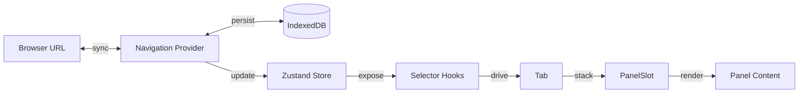

# Navigation

Inbox has no URL router. A Zustand store holds a 2D grid of navigation state: tabs down the sidebar, panels stacked horizontally per tab. A provider component keeps that grid synced with the browser URL and IndexedDB.

## The tab-and-panel grid

Each tab carries its own panel stack, scroll offset, and UI state — filters and animation hints. Static tab kinds are `sessions` and `settings`. Dynamic kinds are a `plugin:*` tab per installed plugin and an ephemeral `recent:*` tab opened from search or history. Switching tabs swaps in that tab's whole state. A user reading an email who jumps to Sessions returns to the same detail panel.

`useNavigationStore` (`src/lib/navigation-store.ts`) replaced an earlier Context-and-reducer design. That design re-rendered every consumer on any state change. Selector hooks now subscribe to one state slice each.

`PanelState` is a discriminated union with ten variants:

- `list`
- `detail`
- `session`
- `new_session`
- `output`
- `code_editor`
- `ask_user`
- `subagent`
- `compose`
- `settings`

`src/types/navigation.ts` declares the union. `PanelContent` switches on `panel.type` to pick each renderer. Adding a panel type means adding one union member and one switch case. The [navigation spec](../../openspec/specs/navigation/spec.md) lists the exact props each variant carries.

## Panel stack actions

`useNavActions()` exposes the store's mutators:

- `selectItem`
- `pushPanel`
- `popPanel`
- `replacePanel`
- `openSession`
- `openNewSession`
- `openRecent`
- `setFilter`
- `clearFilters`

Their return value is shallow-stable across renders. A component can pass an action as a prop without breaking child memoization.

`selectItem` snapshots panels past position two into `savedPanels` before swapping the selected item. This preserves any session panel a user had open on the prior item. Selecting that item again restores those extra panels. `pushPanel` is idempotent by panel `id`. A caller can push a panel without first checking whether it exists. `openSession` replaces an existing session panel in place rather than stacking a second one.

`replacePanel` swaps a single panel by id. Callers use it when a detail panel becomes a session panel for a different item.

## Hydration and persistence

`NavigationProvider` parses the URL synchronously on mount, before React's first paint. This pre-populates the active tab and its `list`, `detail`, and `session` panels immediately. The app never flashes the default tab while IndexedDB hydration is still pending.

An async effect then calls `loadNavigationState()` and merges it with the URL-derived tab. It flips `_initialized` once the merge completes. The persisted state wins for `savedPanels`, filters, and scroll offsets. The URL wins for the selected item and panel composition.

`INBOX_NAV_STATE_VERSION` versions the persisted state. A stored version below the current one drops the blob outright. Replaying an old panel shape could reference a `type` the renderer no longer handles. `validateState()` also strips any panel whose `type` fails the `validTypes` allowlist. It deliberately excludes `new_session`, so a half-typed compose panel never survives a reload.

Every store update after hydration schedules a save 100ms later. A single timer collapses rapid changes into one IndexedDB write.

## URL sync

`buildUrl` and `parseUrl` form a round trip between store state and the URL pathname. Every tab kind maps to its own path shape, and `parseUrl` reverses the mapping. After hydration, a store change computes the new URL and calls `navigate()` only when it differs from the last URL the provider pushed. This keeps browser history free of duplicate entries.

The reverse direction handles back and forward navigation. It fires when `location.pathname` changes without the provider's own `navigate()` call. The effect calls the matching store action to converge on the new URL: `switchTab`, `selectItem`/`deselectItem`, or `openSession`. A `recent:*` path bypasses `switchTab` entirely and rebuilds the tab through `createRecentTabState`. A freshly opened recent link has no existing tab to reuse.

## Rendering the stack

`SlotStack` lays tabs out as vertical scroll-snap slots. Each slot lazy-mounts via `IntersectionObserver` once it nears the visible area. The active tab always mounts synchronously, so it never waits on the observer.

Inside a tab, `Tab` picks a `DesktopTab` or `MobileTab` layout by viewport. Desktop scrolls panels side by side and animates a shrinking width on pop. Mobile scroll-snaps full-screen panels and reads swipe gestures back to a list.

`PanelSlot` animates item-to-item navigation specifically. It keeps the outgoing panel's cached content mounted during its exit animation. The store's `panelTransition` and `itemDirection` values drive the animation direction. Every stack action except `selectItem` sets `panelTransition: "none"`. That suppresses the slide, so a plain push or pop just appears.

Selector hooks guard against needless re-renders in two ways. `useTabPanels` and `useActiveFilters` return module-level empty constants for a tab with no data, never a fresh array or object. `useHydratedPanels` shows only the `list` panel until hydration completes. An exception applies when the synchronous URL parse already produced detail panels. In that case it shows those panels immediately, avoiding a flash.

## Persisted React Query cache

`main.tsx` persists the React Query cache to IndexedDB alongside navigation state. List and detail data then render instantly on reload. `isTransientQuery` (`src/lib/query-persistence.ts`) excludes keys whose restored copy would mislead.

`isTransientQuery` excludes `session` and `sessions` because the agent rewrites transcripts constantly. It excludes `connections` because OAuth status must reflect the server right after a redirect. It excludes infinite-query (`pages`) results too, except `plugin-items-infinite`. That query loads its full result in one page, so it restores cleanly.

## Out of scope here

This page covers the tab-and-panel grid, its store, and its URL and IndexedDB sync. Which component renders inside a given panel type belongs to [session views controller](session-views-controller.md) and each plugin's own spec. Sidebar tab chrome and reordering belong to [shared UI components](shared-ui-components.md). Keyframe and scroll-snap styling belong to [theming](theming.md).

## See also

- [Inbox](index.md) — package overview and domain map
- [Navigation spec](../../openspec/specs/navigation/spec.md) — the contract this page explains
- [Session Views Controller](session-views-controller.md) — what renders inside a session panel
- [Data Table and List Views](data-table-list-views.md) — the list panels that drive `selectItem`
- [Shared UI Components](shared-ui-components.md) — the sidebar tab chrome this store drives
- [Theming](theming.md) — the animation keyframes `PanelSlot` and scroll-snap rely on
