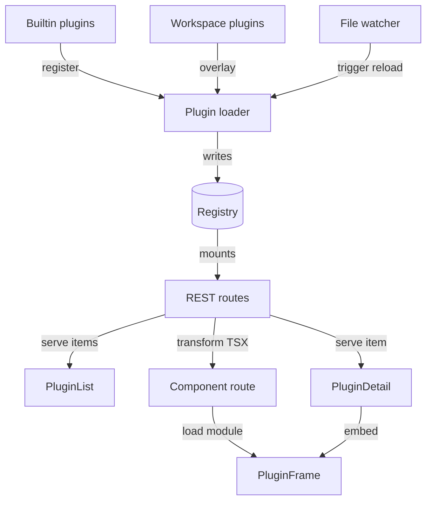

# Plugin System

The plugin system discovers, loads, and hot-reloads every inbox plugin, then exposes each one through auto-mounted REST routes and generic list/detail UI. A plugin is a TypeScript module whose default export implements `query`, `mutate`, or `itemToContext` against a shared `Plugin` interface. Built-in and workspace plugins merge by ID, so a workspace can override or extend a builtin without forking it.

## Discovery and the builtin/workspace registry

At startup, `loadBuiltinPlugins` scans `packages/inbox/plugins/*/plugin.ts` and registers each export into a shared `registry`, marking its ID in `builtinIds`. `loadPlugins(workspacePath, workspaceId)` then scans the workspace's `inbox/*/plugin.ts` and `plugins/*/plugin.ts` directories, with a legacy `inbox-plugins/*.ts` fallback, into a separate per-workspace registry. A workspace plugin never touches the shared `registry` directly, so `builtinIds` always tells a builtin apart from an override. A workspace-less reload only clears non-builtin entries, leaving builtins untouched.

`getPlugins(workspaceId)` and `getPlugin(id, workspaceId)` merge the two registries at read time: builtins load first, then each workspace plugin overlays any builtin sharing its ID. The overlay is a shallow per-key merge — `{ ...builtin, ...workspaceOverlay }`. A workspace plugin declares only the keys it changes, and inherits the rest. This lets the agent workspace's Gmail plugin add curation methods and override `query`, while inheriting the builtin's Gmail API calls, `auth`, and `components`.

Plugins live on the filesystem rather than in the database because a plugin is executable code — credentials, query logic, side-effect mutations. Storing plugin source as a database blob and evaluating it at runtime would grant every workspace user code-execution privileges over every other workspace. The filesystem puts the trust boundary at "who can write into the workspace directory", which the deployment already controls.

### Validation

`isValidPlugin` requires a non-empty `id` string plus at least one of `query`, `hasSkills`, or `itemToContext`. Anything else logs a warning and gets skipped — a broken plugin file never crashes the loader. A default export can be a single `Plugin` object or a `Plugin[]` array. `toPluginArray` normalizes either shape before registration, so one file can share client setup across multiple plugin surfaces. Notion's `notion-tasks` and `notion-pages` plugins both come from one shared client this way.

## Hot-reload

A one-second poll compares the modification time and size of paths the loader can actually import: workspace `inbox/*/plugin.{ts,js}`, `plugins/*/plugin.{ts,js}`, and legacy `inbox-plugins/*.{ts,js}` entrypoints. A change, addition, or removal fires `scheduleReload`, debounced 500ms per workspace to coalesce rapid saves.

The poller replaced a recursive `fs.watch` after the Agent `plugins/` tree grew beyond 82,000 files. That watcher subscribed to dependency, asset, log, and runtime-state trees before its callback could ignore their events, then failed with `EMFILE` alongside tsx, Vite, and other agent sessions. Entrypoint polling uses no persistent file watchers and never traverses those nested trees.

A reload calls `loadPlugins` for that workspace, then `mountPluginRoutes` again to pick up any new bespoke routes. `stopWatching` clears polling intervals, pending debounce timers, snapshots, and scan state on shutdown, so no reload fires after the server starts exiting.

Every plugin import goes through a `cacheBustingImport` helper that appends `?v=${Date.now()}` to the module URL. Node's ESM cache is keyed by URL, so a bare `import(path)` after an edit would return the stale module and silently defeat hot-reload.

## REST surface

`GET /api/plugins` returns the sidebar manifest — every workspace plugin with a non-empty `fieldSchema`. Each entry maps to a client-safe shape: `id`, `name`, `icon`, `fieldSchema`, plus derived `hasSubItems`/`hasGetItem`/`hasFilterOptions` flags. Skills-only plugins like `core` never set `fieldSchema`, so this filter excludes them from the tab list even though the loader still registers them.

Item routes resolve the plugin through `getPlugin(pluginId, getWorkspaceId(c))` and call the matching plugin method:

- `GET /:pluginId/items` — calls `query`
- `GET /:pluginId/items/:itemId` — calls `getItem`
- `GET /:pluginId/items/:itemId/subitems` — calls `querySubItems`
- `POST /:pluginId/items/:itemId/mutate` — calls `mutate`, after validating the payload against `actionSchemas[action]` when the plugin declares one
- `GET /:pluginId/fields/:fieldId/options` — calls the matching `filterOptions` fetcher

`getWorkspaceId(c)` scopes every lookup to the requester's workspace, so a route never falls back to a different workspace's overridden version.

A plugin can also register bespoke routes through `routes(hono, helpers)`, for endpoints that don't fit `query`/`mutate`, like an attachment proxy or an OAuth callback. `mountPluginRoutes` mounts each one once under `/api/:pluginId/`; a `mountedPluginIds` set stops a hot-reload from mounting the same routes twice.

## Component rendering

`GET /api/:pluginId/components/:name` checks the plugin's own directory, the workspace's `plugins/` tree, and the builtin plugins root, in that order, for the component's `.tsx` file. It transforms whichever file resolves with `esbuild` into an ES module. Results cache in an LRU map (`COMPONENT_CACHE_MAX = 50`) keyed by plugin, name, and path. The cache invalidates by file `mtime`, so an edited component reflects immediately without a server restart.

`PluginFrame` loads that module inside a sandboxed iframe built by `buildPluginComponentHtml`. The iframe uses `srcDoc`, which gives it a null origin with no access to the parent's cookies or `localStorage`. It also sets `allow-same-origin`, so its importmap can still resolve `react`, `react-dom`, and `@hammies/frontend/*` against the parent server's prebuilt modules. A Content-Security-Policy scopes script and style sources to that same origin. Every JSON prop is escaped to block a script-tag breakout.

A `postMessage` bridge connects the iframe to the parent. From inside the component:

- `navigate`, `selectItem`, and `pushPanel` calls reach the parent's navigation store
- `sendAction` and `saveState` calls trigger a session action or persist UI state
- a `height` message lets `PluginFrame` auto-resize the iframe

`PluginFrame` decodes every incoming message against a versioned contract schema. A message from another window or origin is dropped in silence, because a page with several frames sees a steady stream of them. A message from the plugin's own frame that fails the schema is a different thing — both ends are our code — so `decodeIframeMessage` hands it to a required `onInvalid` handler, and `PluginFrame` logs the formatted contract report before dropping it.

## Generic list and detail rendering

Plugins that skip `components.tab` render through `PluginView`. It composes a list panel (`PluginList`) and a stack of detail panels (`PluginDetail`, or a linked session view) inside the shared `Tab`/`Panel` navigation shell. `PluginList` derives filters, badges, and each row's title/subtitle/timestamp from the plugin's `fieldSchema`. It persists filter and hidden-badge state per plugin through `usePreference`, and paginates through `usePluginItemsInfinite`.

`PluginDetail` picks one of three render paths, based on what the plugin declares:

- a sub-item message thread, when `querySubItems` exists
- a `PluginFrame` iframe, when the plugin declares `components.detail`
- an auto-generated widget tree, when neither applies

The widget tree comes from the plugin's `detailSchema` when set. Otherwise it's inferred: `html`/`markdown` fields become prose widgets, and everything else becomes one key-value table.

`PanelWidget` renders that widget tree, reading each field by a dot-path into the item. It supports five widget types:

- `kv-table` — a two-column table of field values
- `prose` — rendered markdown for one field
- `badge-row` — a row of pill-shaped values
- `action-buttons` — buttons that call `onMutate`
- `json-tree` — a raw JSON fallback for anything unrecognized

`PropertiesPopover` adds an inline edit surface for plugins with filterable select/multiselect fields (Notion-backed status, priority, tags). It fetches options through the same `/fields/:fieldId/options` route and writes changes through `usePluginMutations`.

## Fetching, pagination, and optimistic mutations

`usePlugins` polls `/api/plugins` every 2 seconds, up to 15 attempts, while the manifest is empty. This covers the window before a fresh server finishes its first plugin load. `usePluginItemsInfinite` accumulates pages by feeding each response's `nextCursor` back into the next fetch. This lets a list load its full result set instead of stopping at the first page. `useInfiniteScroll` attaches a viewport-rooted `IntersectionObserver` plus an eager-fill effect. Together they keep roughly 100 rows preloaded ahead of the viewport, so fast scrolling never outruns the fetch chain.

`usePluginMutations` applies an optimistic patch to both the list and detail query caches before the request resolves. The patch covers a status change, a tag edit, or a Notion-style property update. It rolls the caches back on error and invalidates both on settle, so a failed mutation never leaves stale optimistic data on screen.

## Workflow panels: a related, separate registry

`panel-registry.ts` loads a different kind of extension from the same `workflows/` convention. Each workflow's `inbox-panels.json` declares a widget-tree schema per tag, and its `inbox-mutations.ts` exports mutation handlers the registry indexes by kebab-cased export name. `GET /api/panels` and `POST /api/panels/mutate/:action` expose these to `<PanelWidget>` consumers outside the plugin item path. A load builds into fresh objects and swaps them in atomically, so a request never sees a half-loaded registry mid-reload.

## See also

- [Inbox](index.md) — package overview and domain map
- [Plugin System spec](../../openspec/specs/plugin-system/spec.md) — the contract this page explains
- [Core Plugin](core-plugin.md) — a skills-only builtin plugin that registers through this loader
- [Gmail Plugin](gmail-plugin.md) — the builtin plugin the agent workspace overlays for curation
- [Data Table and List Views](data-table-list-views.md) — the shared list-rendering primitives `PluginList` draws on
- [Navigation](navigation.md) — the `Tab`/`Panel` shell and filter state `PluginView` composes into
- [Context System](context-system.md) — the curation pipeline `itemToContext` and `curationPrompt` feed
