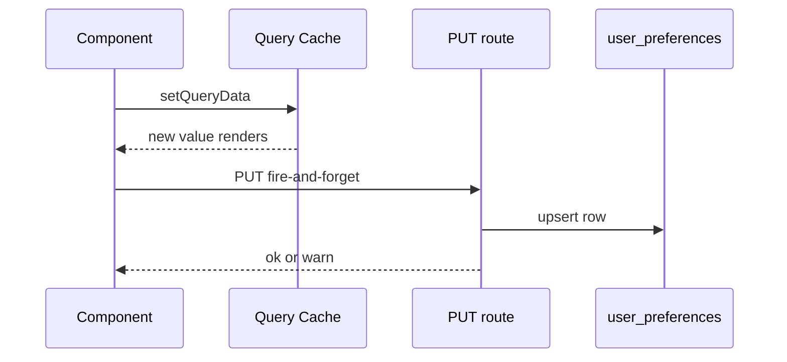

# Preferences

Preferences is a per-user key/value store for client-side UI state — panel layouts, toggle states, theme choice. Every row belongs to one authenticated user, with no global defaults and no workspace-shared settings. The client writes optimistically, so a toggle never waits on a network round-trip.

## Reading and writing a preference

`GET /api/preferences` returns every row for the authenticated user as one object, `{ [key]: value }`. The route parses each stored string as JSON. A row that predates the JSON convention fails to parse and returns as the raw string instead. `PUT /api/preferences` upserts a single `{ key, value }` pair, validated by the `SetPreferenceBody` Zod schema before it touches the database. `PUT /api/preferences/batch` upserts a `{ prefs: { [key]: value } }` map inside one `withTransaction` call. A multi-key reset — like restoring a default layout — either lands completely or not at all.

All three routes require the `inbox_session` cookie. A missing or unknown cookie returns `401` before the route reads the table. An invalid PUT body returns `400` with the first Zod issue message.

## One bag, not typed columns

The `user_preferences` table keys each row by `(user_email, key)` and stores `value` and `updated_at` alongside. Every preference is feature-local, so the schema stores `value` as a JSON-encoded string rather than adding a typed column per toggle. The client owns the key namespace. The server never validates what a key means, only that a PUT body parses.

This design trades server-side validation of preference contents for one benefit: no preference change ever needs a backend deploy.

## The `usePreference` hook

`usePreference(key, defaultValue)` reads one shared React Query entry, keyed `["preferences"]` with `staleTime: Infinity`, so every component reading preferences shares one fetch. Before that query resolves, or when the key is absent from the loaded bag, the hook returns `defaultValue`.

The returned setter writes the query cache synchronously through `queryClient.setQueryData`, so every hook watching that key re-renders immediately. It then fires a `PUT` without awaiting it. A persistence failure only logs a `console.warn`. It never throws to the caller, because a preference is by definition non-destructive. If the write did fail, the next page load reads the server's last-persisted value and the optimistic change reverts.

## See also

- [Inbox](index.md) — package overview and domain map
- [Preferences spec](../../openspec/specs/preferences/spec.md) — the contract this page explains
- [Database](database.md) — the pool `user_preferences` persists through
- [API Client](api-client.md) — wraps the `GET` and `PUT` calls the hook makes
- [Auth and Sessions](auth-and-sessions.md) — issues the session cookie every route requires
