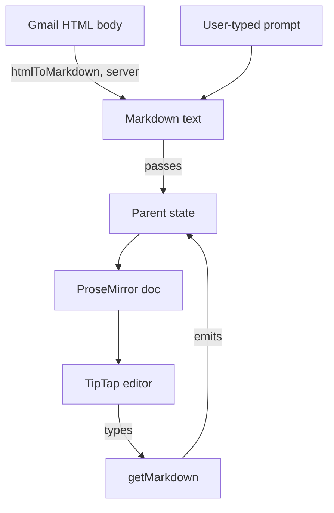

# Rich Text Editor

`<RichTextEditor>` is a controlled, markdown-in-markdown-out editor built on TipTap. It backs the session composer and the Gmail draft surface, adding block content and a slash-command menu that plain text cannot support.

## Controlled markdown round-trip

The parent owns the value; the editor never holds state the parent cannot see. It initializes from the `value` prop and, on every keystroke, calls `onChange` with markdown from `tiptap-markdown`'s `getMarkdown()` storage getter. `getMarkdown` reads the storage object through `Reflect`, not a typed cast, because TipTap exports no type for the markdown extension's shape.

A `lastEmittedRef` tracks the most recent markdown the editor itself produced. When the parent passes a new `value`, an effect compares it against that ref. A match means the change came from the editor's own `onChange`, so the effect no-ops and the cursor stays put. A real external change — a template load, a Gmail draft swap — calls `editor.commands.setContent` with `emitUpdate: false`. This updates the document without re-triggering `onChange`, so the parent's own state never changes underneath it.

Markdown is the only accepted value, and markup in it stays literal text. The editor used to sniff for a leading `<` and route the value through `generateJSON()`, on the assumption that Gmail drafts arrive as HTML. They do not: `parseMessage` in `plugins/gmail/app/lib/gmail.ts` runs every HTML body through `htmlToMarkdown` before it reaches a client, and the session composers are seeded from markdown the user typed, so that branch could never fire.

It was not free. When a table did arrive mangled, the dead branch made the editor look responsible; the loss was server-side, in a converter that had no table rules. Deleting it leaves one wire format, stated once, so the next investigation starts upstream where the conversion actually happens.

`TableKit` registers the table, row, header and cell nodes. These are load-bearing rather than polish: `tiptap-markdown` parses a GFM pipe table only if there are nodes to put the rows in, and without them it concatenates every cell into a single paragraph — `NDCDueNov 1010/27`. That is strictly worse than the one-line-per-cell flattening the Gmail converter's shared table rules now prevent, which is why the two changes shipped together.

## Extension stack

`useMemo` builds the extension array once per mount. The array never changes, so the underlying ProseMirror schema stays stable across re-renders. It composes:

- `StarterKit`, with its built-in code block and link disabled
- `Placeholder`, for empty-state text
- `TaskList` and `TaskItem`, for checklists
- `CodeBlockLowlight`, for syntax-highlighted code
- the `Markdown` serializer, for the round-trip
- the local slash-command extension

`CodeBlockLowlight` uses `lowlight`'s `common` grammar set, loaded once at module scope rather than per editor instance.

## Slash command menu

Typing `/` in any block opens `<SlashCommandMenu>`, rendered through TipTap's `Suggestion` plugin. The extension's `render()` factory mounts the menu with a `ReactRenderer`. It appends the menu's element to `document.body`, so the menu escapes clipping from the editor's own container. `SlashCommandMenu` itself renders through a `createPortal` to `document.body` for the same reason. It positions itself at the query's `clientRect`.

The `SLASH_COMMANDS` registry supplies the menu's items:

- headings 1 through 3
- bullet and numbered lists
- a task list
- a code block
- a blockquote
- a horizontal rule

Each entry's `command` deletes the typed `/` range and applies its block transform in one chained call. Arrow keys and `Enter` route through `useImperativeHandle`. This lets the `Suggestion` plugin's native `onKeyDown` hook forward keyboard events into menu state React owns.

## Submit shortcut and bubble menu

`Mod-Enter` (`Cmd-Enter` on macOS, `Ctrl-Enter` elsewhere) calls the parent's `onCmdEnter`. The callback lives behind `onCmdEnterRef`, a ref a separate effect keeps current. The keymap captures this ref once, when the extensions array builds, so it always calls the latest closure without remounting the editor.

Selecting text reveals a `<BubbleMenu>` toolbar:

- bold
- italic
- strikethrough
- inline code
- a link toggle

The link button reads the selection's current `href` through the same `Reflect` unwrapping as `getMarkdown`. It then prompts for a URL and applies or clears the link mark.

## Why selection scroll is suppressed

`editorProps.handleScrollToSelection` returns `true` unconditionally, telling ProseMirror to skip its default ancestor-scrolling walk. That walk scrolls every scrollable ancestor into view on each selection change, including the outer panel group's `overflow-x-auto` container. Left enabled, this walk caused a visible horizontal jump whenever a draft loaded while its panel slid in. The browser's native focus-visibility behavior is enough inside the editor element alone.

## Disabled, placeholder, and autofocus

The `disabled` prop maps to TipTap's `editable` flag through its own effect, separate from the extension array. Toggling it never rebuilds the document. `Placeholder` renders the `placeholder` prop text (default `"Start typing..."`) only while the document is empty. `autofocus` focuses the editor at `"end"`, so the cursor lands after any content seeded at mount. That content might be a loaded draft or template, never an empty line.

## See also

- [Inbox](index.md) — package overview and domain map
- [Rich Text Editor spec](../../openspec/specs/rich-text-editor/spec.md) — the contract this page explains
- [Shared UI Components](shared-ui-components.md) — the other shared primitives this editor's consumers compose alongside it
- [Session Views Controller](session-views-controller.md) — the session composer panels that embed this editor
- [Gmail Plugin](gmail-plugin.md) — the draft surface that feeds this editor HTML instead of markdown
