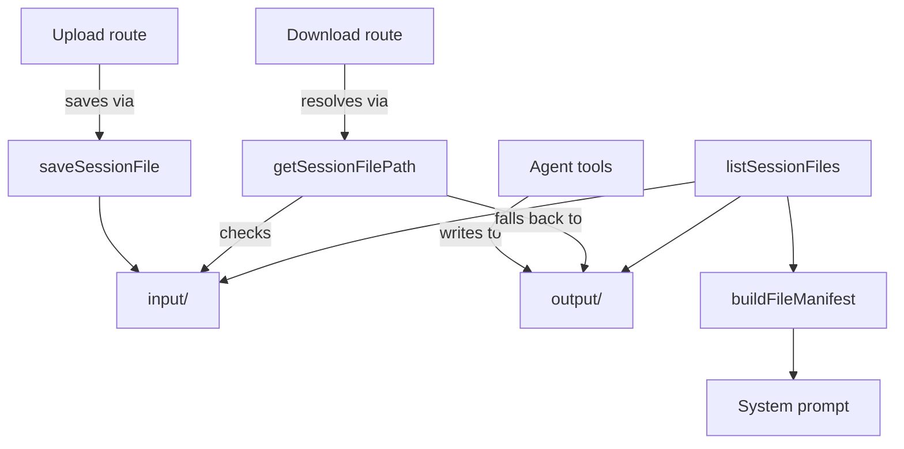

# Session Files

Every session gets a scoped directory pair on disk: `input/` for files the user uploads, `output/` for files the agent writes. The filesystem, not the database, is the store, because the agent reads and writes these files with plain POSIX tools. The API layer only validates paths, sanitises names, and describes what exists.



## Directory layout and validation

The sessions root is `${workspacePath}/temp/sessions/`, under the workspace's gitignored `temp/` scratch convention. Each session gets `<root>/<sessionId>/input/` and `<root>/<sessionId>/output/`, created on first access so callers never pre-create them. `getSessionFilesDir` accepts `"input" | "output"` as a typed literal, defaulting to `"input"`.

`validateSessionId` allowlists `^[a-zA-Z0-9_-]+$` and rejects everything else, including `.`, `/`, `\`, and spaces. This blocks path traversal (`../`) at the boundary, on top of `join`'s own safe join semantics. It is defence in depth — the Claude Agent SDK happens to use UUIDs, but the check does not depend on that format. `sanitizeFilename` replaces every character outside `[a-zA-Z0-9._\- ]` with `_`. The sanitised name is what lands on disk and what the API returns. There is no separate display-name field the client could use to reconstruct the original filename.

## Uploading and downloading

`POST /api/sessions/:id/files` reads a multipart `file` field, buffers it, and calls `saveSessionFile`, which always writes to `input/` and returns `{ name, path, size, mimeType }`. `GET /api/sessions/:id/files/:filename` calls `getSessionFilePath`, which checks `input/` first, then `output/`, and returns the first match or `null`. The route never needs to know which side produced a file — both are addressable by the same sanitised name.

The download route also accepts a `path` query parameter for absolute file references outside the session directory. A workspace-root prefix check and a `..` reject gate that path. That branch skips `getSessionFilePath` entirely and serves render-time artifact output instead — see [Artifacts and Render Tools](artifacts-and-render-tools.md). For a resolved session file, `guessMimeType` maps the extension to a `Content-Type`. An allowlist of image, video, and HTML prefixes then picks `inline` or `attachment` disposition.

## Listing and the system-prompt manifest

`listSessionFiles` walks `input/` then `output/`. It skips either directory if it does not exist yet, and skips any entry that fails `statSync` — a broken symlink, for example. `buildFileManifest` turns that list into the text a session's system prompt gets, formatted as a bullet per file:

```
Session files:
- name1 (input/, 1234 bytes)
- name2 (output/, 5678 bytes)
```

An empty session returns `""`, so the prompt carries no empty section header. The manifest is plain text, not JSON. A token-budget review found JSON syntax alone cost roughly a quarter of the prompt tokens spent on file listings in sessions with many files. [Session Instructions](session-instructions.md) owns where this manifest gets prepended to the system prompt; this page owns only the string it prepends.

## See also

- [Inbox](./index.md) — package overview and domain map
- [Session Files spec](../../openspec/specs/session-files/spec.md) — the owning contract
- [Session Instructions](session-instructions.md) — prepends `buildFileManifest`'s output to the system prompt
- [Session Views Controller](session-views-controller.md) — the upload/download routes' place in the session REST surface
- [Artifacts and Render Tools](artifacts-and-render-tools.md) — the render-time `/mnt/user-data/outputs/<name>` file convention and the download route's absolute-path branch
- [Session Manager](session-manager.md) — resolves the `workspacePath` every helper here takes as its first argument
