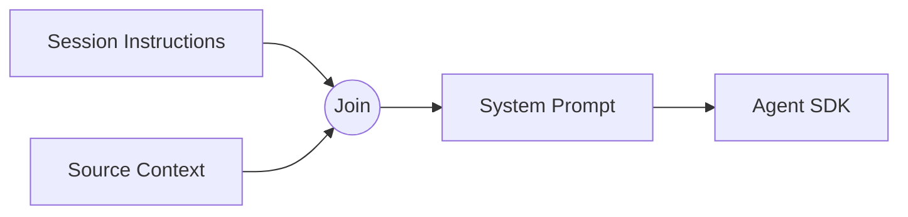

# Session Instructions

`SESSION_INSTRUCTIONS` is a single constant string appended to the system prompt of every inbox agent session. It plays the same role inside the app that `CLAUDE.md` plays in a terminal, teaching the agent how to behave on this surface. The [session manager](session-manager.md) joins it with the session's source context before the run starts.

## Trusting the credential proxy

The first block of instructions the agent reads tells it that the [credential proxy](credential-proxy.md) injects every API credential automatically. The agent never needs an API key, a token, or a `.env` file. It calls third-party APIs through its skill scripts as if the credentials were already there. This block leads the prompt on purpose. Agents that hit an auth question in their first turn tend to stall, asking for a credential they will never receive directly.

## Behaving inside a session

Six rules follow the authentication block, each closing a failure mode the inbox team observed in production:

- **Read the source first.** When a session starts from an email thread, Notion task, or Gorgias ticket, the agent fetches the full record through a skill before replying. The inline summary is a hint, not a substitute.
- **Link every external artifact.** A Gmail draft, Shopify order, or Notion page the agent creates or touches carries its direct URL in the reply.
- **One `render_output` call per artifact.** The [artifacts and render tools](artifacts-and-render-tools.md) panel maps one call to one panel; a fused output collapses that navigation into a single blob.
- **Update by reusing the title.** A corrected output calls `render_output` again with the same title, and the renderer treats the repeat as a replacement, not a duplicate.
- **Match the format to the data.** The instructions enumerate these types:
  - `table`
  - `json`
  - `markdown`
  - `html`
  - `chart`
  - `react`, whose `data` field must be `{ code: "<JSX string>" }`, never a raw object
- **Ask through `AskUserQuestion`.** Any question, confirmation, or proposal goes through the tool's button UI, never a plain-text sentence the user cannot click.

## Reaching the prompt

The session manager concatenates the string with per-session content right before a run starts: `[SESSION_INSTRUCTIONS, context].filter(Boolean).join("\n\n")`. Keeping the instructions as one exported constant, instead of a template, keeps the module diffable in review and prevents it from growing multiple parameterized shapes. No other module reads or rewrites the string at runtime. The [session manager](session-manager.md) is its only consumer, and it passes the joined result straight to the Agent SDK's `appendSystemPrompt` field.

## Out of scope here

This page covers only the instruction text and its composition. The `render_output` tool implementation lives in [artifacts and render tools](artifacts-and-render-tools.md) and [session views controller](session-views-controller.md). The `AskUserQuestion` tool registration and the per-session source-context payload belong to [session manager](session-manager.md). The credential proxy itself is documented at [credential proxy](credential-proxy.md).

## See also

- [Inbox](index.md)
- [Session Manager](session-manager.md)
- [Artifacts and Render Tools](artifacts-and-render-tools.md)
- [Session Views Controller](session-views-controller.md)
- [Credential Proxy](credential-proxy.md)
- [session-instructions spec](../../openspec/specs/session-instructions/spec.md)
