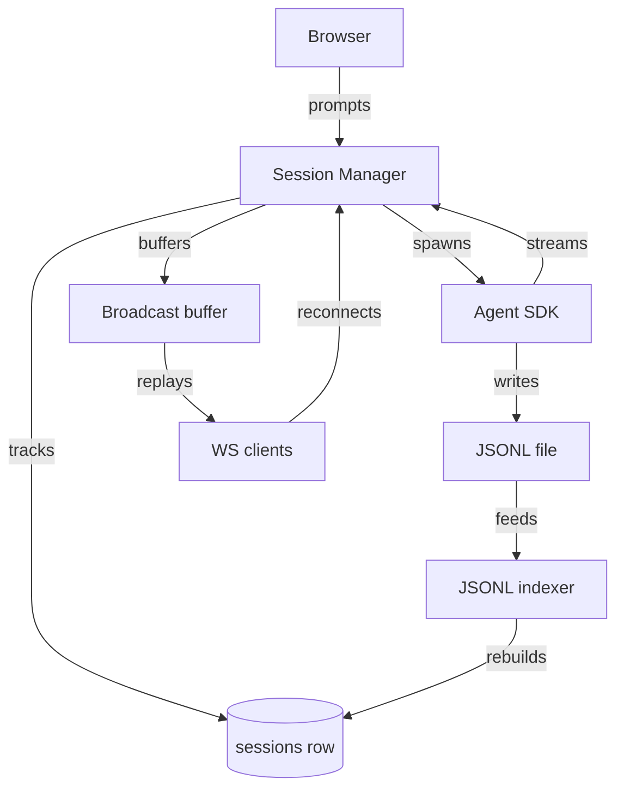

# Session Manager

Session Manager is the single module that owns every Claude Agent SDK session end to end. It spawns and resumes agent processes, tracks each session's status in Postgres, and streams live events to WebSocket clients through a sequenced broadcast buffer. The JSONL file the Agent SDK writes to disk, not the database, stays the one authoritative transcript.

Every phase of a session's life reads or writes the same ambient state:

- the running-query registry
- the pending-question map
- the JSONL file
- the DB row
- the broadcast buffer

Splitting that lifecycle into separate modules would duplicate this state. It could also force a circular import graph. One file owns it instead, behind roughly 30 small exports.

## Starting and resuming a session

`startSession` calls the Agent SDK's `query()` with a fixed tool allowlist, `bypassPermissions` mode, and `includePartialMessages` enabled:

- Read
- Grep
- Glob
- Bash
- Write
- Edit
- Skill

It registers an `AbortController` in the running-query map. It mounts the `render_output` and `artifact` in-process MCP servers — see [Artifacts and Render Tools](artifacts-and-render-tools.md). It also discovers plugin paths: the inbox core plugin, plus every subdirectory of the workspace's `plugins/` folder. The system prompt is the SDK's `claude_code` preset appended with [Session Instructions](session-instructions.md) and, when the session links to an email or task, the source content.

`resumeSessionQuery` reuses the same env, MCP, and plugin setup, and adds `resume: sessionId`. It reads the session's JSONL once, to compute the next broadcast sequence number. That same read collects any `attached_context` entries the user attached since the last turn — see Attaching context, below. It inlines those entries into the prompt before the SDK sees it. A caller can override the model per call; otherwise the SDK's default (Sonnet) or the `SESSION_MODEL` env var applies.

`buildAgentEnv` strips a maintained set of sensitive names — API keys, OAuth secrets, harness tokens — from the inherited `process.env`. This runs before the env reaches the agent process. Nobody can safely enumerate every variable a plugin might need. The function excludes the known-dangerous ones instead, and lets the rest through.

A `userSessionToken` on the call routes third-party API calls through the [Credential Proxy](credential-proxy.md). Without a token — background jobs, dev-time sessions — the function falls back to injecting raw workspace credentials directly.

## Queued prompts, aborts, and crash recovery

A prompt submitted while a session's iterator is still running does not start a second one. It queues in a per-session FIFO list and returns `{ started: false, queued: true }`. The active iterator's cleanup can run on success, on error, or after an explicit abort. Cleanup drains the next queued prompt on a microtask, and re-enters `resumeSessionQuery`. Archiving a session discards its queue instead of draining it, so an archived session never auto-resumes.

`abortRunningSession` calls the registered controller's `abort()`. It also flushes any queued prompt immediately. The stop button doubles as "send my queued message now" this way — the same behavior Claude Desktop's stop button has.

On boot, `recoverStaleSessions` scans every row stuck in an active status. It resolves each by how stale it is:

- recent `running` rows auto-resume with a continuation prompt
- recent `awaiting_user_input` rows wait for the client to reconnect
- rows older than the cutoff (30 minutes by default) flip to `errored`

This exists because a server crash mid-stream used to leave permanent spinners in the UI.

## Ask-user questions and needs_attention recovery

When the agent calls `AskUserQuestion`, a `canUseTool` hook intercepts it. The hook stores the resolving function in a `pendingQuestions` map, keyed by session ID, and awaits it. The session's status flips to `awaiting_user_input` while it waits. It flips back to `running` once `provideAskUserAnswer` delivers the user's reply.

The agent's iterator can crash while a question is still pending — a process exit, an SDK error, an upstream timeout. When that happens, the session moves to `needs_attention` instead of `errored`. The last question re-broadcasts too, so a reconnecting client still renders the inline answer form.

`needs_attention` is durably resumable, even past a full server restart, because no in-memory resolver needs to survive it. `wsSubscribe` replays the pending question from the JSONL on every reconnect. `POST /sessions/:id/answer` falls back to `resumeSessionQuery` when no resolver is registered, formatting the answer as a plain prompt.

## Attaching context to a running session

`attachSourceToSession` appends an `attached_context` system entry to the JSONL. This happens when the user attaches an email or task to an already-running session. The Agent SDK's resume flow only forwards user and assistant messages, though — the agent would never see a plain append. The SDK only honors `system` prompt injection at session start, never on resume.

`collectPendingAttachments` walks the JSONL backward from the end. It stops at the last user or assistant turn, collecting any `attached_context` entries in between. `inlineAttachments` prepends those entries as `<attached_context>` blocks to the next prompt sent to the SDK. The browser still renders the plain user text. Only the SDK-bound prompt carries the inlined blocks.

## WebSocket clients, presence, and the broadcast buffer

One multiplexed WebSocket connection per browser tab watches many sessions at once, tracked in a client registry keyed by connection ID. `wsSubscribe` replays missed events using a client-supplied `fromSequence` cursor against a per-session ring buffer of the last 500 sequenced broadcasts. A covered cursor replays as `session_event` messages. A cursor older than the buffer's window returns `cursor_miss` instead, and the client falls back to a REST snapshot. Terminal-state, pending-question, and presence replay all run after the buffer replay, so message events land before the status transition they describe.

The buffer only stores sequenced `{ sequence, message }` payloads. Presence and status flips broadcast live, but never buffer. A reconnecting client re-derives those instead, from the DB and presence maps. `clearBroadcastBuffer` drops a session's buffer once it reaches a terminal status — `complete`, `errored`, `needs_attention`, or `archived`.

This keeps long-lived server processes from accumulating memory for sessions whose agent process already exited. 500 was chosen as roughly the tail of a busy, hour-long session. A smaller cap forced snapshots after brief tab switches. A larger one risked hundreds of KB per session.

Presence broadcasts debounce by 200 ms, so a user with several open tabs produces one `presence` event instead of one per tab. A reaper runs every 30 seconds. It drops any presence entry whose last heartbeat is older than 60 seconds — covering tabs that closed without a clean unsubscribe.

## The sessions row and its status machine

`createSessionRecord` inserts a row with status `running`. Its summary comes from the linked item's title, or else the prompt's first 80 characters. The row also carries the trigger source that started the session. `touchSession` debounces `updated_at` writes to once per 5 seconds, per session. A streaming session emits far more events than the connection pool should absorb as raw writes.

All session queries decode their PostgreSQL results through operation-specific row schemas before returning a session or using its status. List and linked-session reads project only the fields in their named row contract; they derive `linked_item_title` from `metadata` without passing `metadata`, `workspace_id`, or future table columns into the strict decoder. This keeps nullability, timestamps, status values, and JSON fields honest at the database boundary, including startup indexing and compare-and-swap transitions.

`updateSessionStatus` enforces a fixed transition table with an atomic compare-and-swap `UPDATE`, so two concurrent callers cannot race a session into an invalid state:

- `running` → `complete`, `errored`, `awaiting_user_input`, `needs_attention`, `archived`
- `awaiting_user_input` → `running`, `complete`, `errored`, `needs_attention`, `archived`
- `needs_attention` → `running`, `complete`, `errored`, `archived`
- `complete` / `errored` → `running`, `archived`

An update whose current row status is not a valid source for the target is silently skipped and logged only outside production. `archiveSession` and `unarchiveSession` flip this status. They also append a cross-tool `archived` flag to the JSONL, so Studio and Claude Code see the same archive state as Inbox.

## JSONL as the single source of truth

The Agent SDK writes every message to a session's JSONL file, regardless of what Inbox does. Inbox never copies those messages into Postgres. Duplicating them would drift, or need a write-through layer that becomes its own bottleneck. `indexAllAgentSessions` rebuilds the `sessions` table from every JSONL file on boot, using an insert-only query. The session list survives a DB reset this way, without touching any live row.

`watchProjectsDir` polls the workspace's project directory every 5 seconds. Polling avoids the `EMFILE` errors `fs.watch` risks with many active watchers. It reindexes any file whose modification time advanced.

Listing, searching, and title resolution all read only the head and tail of each file. `listAllAgentSessions`, `searchAgentSessions`, and `findAgentSession` never load the full transcript. That keeps those operations cheap, even for long sessions.

`getAgentSessionTranscript` and `patchArtifactCode` are the exception. Rendering a transcript, or rewriting an edited artifact's source, needs the real content. The JSONL is the only place that content lives. Patching an artifact anywhere else would silently desync from what the JSONL still holds.

## Session titles: resolution, rename, and migration

A session's displayed title resolves from the JSONL itself, in this order:

1. `custom-title` — the editable, cross-tool title a rename writes
2. `ai-title` — Claude Code's own auto-generated title
3. `last-prompt` — the latest user prompt
4. the first real prompt in the transcript
5. the SDK's final result text

Both the session list and the single-session detail route prefer this JSONL-resolved title over the cached DB `summary`. A rename can't show the new name in one place, and the old name in the other. `updateSessionSummary` writes both. It updates the DB `summary` column, and, via `writeCustomTitle`, appends a `custom-title` line to the JSONL. That append is skipped when the file's latest custom title already matches.

`backfillCustomTitles` is the one-shot, idempotent migration that seeds JSONL `custom-title` entries from real DB summaries. Claude Code and Studio pick up titles Inbox generated before this round-trip existed, this way.

`autoNameSession` runs when a session completes. It fires only if the summary still equals the raw prompt prefix, meaning the user never renamed it. It then calls out to generate a title — see the `title-generator` spec. Sessions with fewer than two transcript entries skip auto-naming, since a trivial or immediately-errored session has nothing worth titling.

## The Sessions tab and its client hooks

`<SessionTab>` renders the Sessions tab's list panel and its stacked detail panels, reading panel state from [Navigation](navigation.md). `<NewSessionPanel>` is the compose panel. It seeds a draft prompt when given a linked item. It uploads any attached files first, then calls the create-session API. `<SidebarRecentSessions>` lists the ten most recently active sessions — running, awaiting input, or touched within a day — with a colored dot for each status.

`<AttachToSessionMenu>` (exported as `SessionActionMenu`) lets a user attach the current item to an existing session, or start a new one. Its search hits every unarchived session server-side, not just the sidebar's short recent list.

`useSessions` and `useRecentSessions` back these views with one shared React Query cache. The sidebar and the tab container never disagree on what counts as "recent" this way. `useSessionMutations` wraps lifecycle actions with optimistic updates:

- resume
- abort
- archive / unarchive
- rename

Each mutation flips a Zustand store's status immediately, then reconciles against the server response, or rolls back on error.

## Out of scope here

This page covers session lifecycle, the JSONL/DB relationship, and the WebSocket fan-out. The MCP tools themselves (`render_output`, `artifact`, `AskUserQuestion`) belong to [Artifacts and Render Tools](artifacts-and-render-tools.md). The WebSocket transport — the Hono route, upgrade handling, cookie auth — belongs to [Session Streaming Protocol](session-streaming.md). The `sessions` table schema belongs to [Database](database.md).

Session-list UI and filtering belong to [Session Views Controller](session-views-controller.md). Auto-naming's title-generation prompt lives in the [title-generator spec](../../openspec/specs/title-generator/spec.md). Exactly what credential injection sends per host lives in [Credential Proxy](credential-proxy.md).

## See also

- [Inbox](index.md) — package overview and domain map
- [Session Manager spec](../../openspec/specs/session-manager/spec.md) — the contract this page explains
- [Navigation](navigation.md) — the panel-stack state `<SessionTab>` reads
- [Session Streaming Protocol](session-streaming.md) — the WebSocket transport this module's broadcast buffer feeds
- [Session Files](session-files.md) — shares the workspace-path resolution this page owns
- [Session Instructions](session-instructions.md) — the system-prompt text `startSession` appends
- [Artifacts and Render Tools](artifacts-and-render-tools.md) — the MCP servers registered here, and the artifact code `patchArtifactCode` rewrites
- [Credential Proxy](credential-proxy.md) — where a session's outbound API calls route when a user token is present
- [Database](database.md) — the `sessions` table schema this module's rows live in
- [Session Views Controller](session-views-controller.md) — the session-list UI built on the rows and status this page maintains
