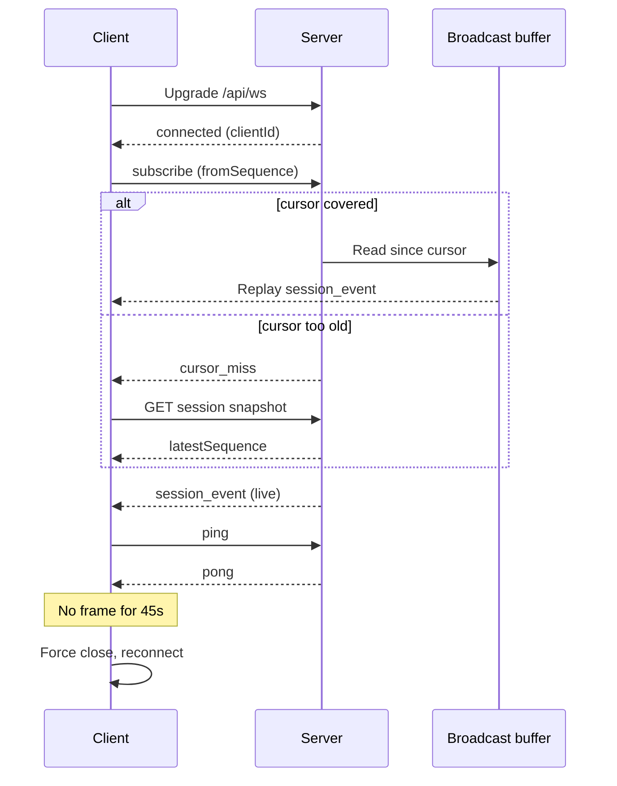

# Session Streaming Protocol

The inbox server streams agent-session events to browser tabs over one multiplexed WebSocket at `/api/ws`. A per-session broadcast buffer replays events a briefly disconnected client missed, addressed by a sequence cursor. When the buffer cannot cover the gap, a client-side recovery coordinator falls back to a REST snapshot of the session transcript.

## Connecting and subscribing

The browser opens one WebSocket per tab, not one per session. `GET /api/ws` runs behind the same auth middleware as every other `/api/*` route. A missing or invalid `inbox_session` cookie rejects the upgrade before it reaches the handler. See [Auth and Sessions](auth-and-sessions.md) for that gate.

On a successful upgrade, the server allocates a `clientId` and sends `{ type: "connected", clientId }`. The client answers with one `subscribe` frame naming every session it watches. Each entry carries an optional `fromSequence` cursor:

- A cursor inside the buffer window replays every buffered event with `sequence > fromSequence`, in order.
- A cursor older than the buffer's oldest entry gets `cursor_miss` instead, with no replay.
- No cursor means a fresh subscriber. The server sends only future live events.

Buffer replay always runs before terminal-state replay, so message events land before the status transition that follows them. A session already `complete`, `errored`, or `awaiting_user_input` resends its terminal event on every subscribe, cursor or not. A client that connects after the session ended still sees the right end state without polling. `unsubscribe` removes fanout for the named sessions until the client subscribes again.

## The broadcast buffer

Each session gets its own in-memory ring buffer, capped at `BROADCAST_BUFFER_CAPACITY = 500`. The server drops the oldest entry once the cap is reached. Only sequenced `session_event` broadcasts enter the buffer. Lifecycle events never do, because the server re-derives them from the database and presence state on any subscribe:

- `session_complete`
- `session_error`
- `ask_user_question`
- `presence`

The server drops a session's buffer once no further sequenced events will land for it — a status move to any of these:

- `complete`
- `errored`
- `needs_attention`
- `archived`

A server restart wipes every buffer in the process. A client that reconnects afterward with a stale `fromSequence` always gets `cursor_miss`. It then falls back to the REST snapshot, the same path used at initial bootstrap, not a special case.

## The snapshot's latestSequence cursor

`GET /api/sessions/:id` reports `latestSequence`, computed as `jsonlLines.length - 1` from the durable JSONL transcript. The live broadcaster's counter starts at `jsonlLines.length` on resume. This cursor lines up with the sequence the next live event will carry.

Per-message `sequence` values inside the snapshot's `messages` array can be sparse, for three reasons:

- The transcript parser filters out non-display JSONL lines.
- Thinking blocks use fractional offsets, so the UI renders them on their own lines.
- Subagent merging renumbers some entries.

Trusting the highest per-message sequence instead of the explicit cursor would leave the client's `latestSequence` behind the broadcaster's counter. Every post-resume event would then reclassify as a gap, producing a snapshot-fetch loop. The client takes `max(messageIds[last], latestSequence)` for exactly this reason.

## Keepalive and reconnect

The client sends `{ type: "ping" }` every `PING_INTERVAL_MS = 20_000` while the socket is open. The server answers `{ type: "pong" }`. Any inbound frame, not only a pong, resets an `ALIVE_TIMEOUT_MS = 45_000` watchdog.

When the watchdog elapses with no traffic, the client force-closes the socket rather than waiting on `ws.onclose`. `ws.onclose` can take minutes to fire on a silently dead connection, from laptop sleep or a dropped NAT mapping.

Every close, forced or not, schedules a reconnect with exponential backoff: `1s, 2s, 4s, …` capped at 30 seconds. On reopen, the client sends one `subscribe` frame covering every active session. Each entry's cursor is that session's current `latestSequence` — a single batched resubscribe, not one frame per session.

## Client recovery coordinator

`session-recovery.ts` is a pure state machine, deliberately separate from the Zustand store and from React. The session store consults it for every inbound event before any reducer touches the transcript, so nothing mutates state out of order. Isolating the classification logic this way made a chaos test practical. It also caught bugs — snapshot tokens leaking, events deferred forever — that were hard to reproduce inside the store.

The coordinator classifies each event by comparing its sequence to `latestSequence`:

- **ignore** — `sequence <= latestSequence`; already applied, dropped as a duplicate.
- **defer** — bootstrap hasn't finished, or a snapshot is in flight; the event waits in `deferredEvents`.
- **recover** — the sequence skips ahead of `latestSequence + 1`; the coordinator schedules a snapshot.
- **apply** — the sequence is exactly `latestSequence + 1`; the reducer ingests it now.

## Snapshot lifecycle and the circuit breaker

`beginSnapshotRecovery` sets the coordinator's `inFlight` token and returns `true`. It returns `false` instead if a snapshot is already running. Every successful begin must pair with exactly one `completeSnapshotRecovery` or `failSnapshotRecovery` call. A leaked token classifies every later event as `defer` forever — the worst bug class in this subsystem. Nothing ever renders again for that session.

A failed snapshot clears both `inFlight` and `pendingReplay`, so a persistent backend error does not retry in a tight loop. When three consecutive snapshots complete without closing the gap between `highestObservedSequence` and `latestSequence`, the coordinator opens a circuit breaker. The open breaker:

- Pins `highestObservedSequence` to `latestSequence`.
- Clears `pendingReplay`.
- Makes `applySnapshot` skip flushing deferred events.

This trades a slightly stale transcript for protection against the alternative. Before the breaker existed, a runaway loop of snapshot fetches and slice allocations crashed the renderer in production.

## Batching bursts into one render

`use-session-transcript.ts` queues incoming events and drains the queue on the next animation frame. It calls `ingestEventBatch` once per frame, instead of `ingestEvent` per message. A burst of buffered-replay or rapid live events would otherwise trigger one `set()` per message. A large session's replay can be hundreds of events in a single tick — enough to pin the main thread and trip React's maximum-update-depth guard. When every event in a batch classifies as `ignore`, the store skips allocating a new slice entirely and only mirrors the coordinator's recovery state.

## Reliability invariants

A seeded chaos test (`session-store.chaos.test.ts`, 5 seeds × 1000 random actions) guards these invariants. A Playwright multi-tab smoke test guards them too. Every store transition must hold:

- `messageIds` stays sorted and unique.
- `messageById`'s keys match `messageIds` exactly.
- `latestSequence` never decreases.
- `inFlight` is set if and only if one snapshot is currently running.

## Out of scope here

This page covers the WebSocket wire protocol, the broadcast buffer, and client-side recovery only. Session creation, resume, and JSONL storage belong to [Session Manager](session-manager.md) and [Session Files](session-files.md). Optimistic prompt reconciliation happens in the same reducers this protocol feeds, but the optimistic-update contract itself is out of scope.

## See also

- [Inbox](index.md)
- [Session Manager](session-manager.md)
- [Session Files](session-files.md)
- [Auth and Sessions](auth-and-sessions.md)
- [Database](database.md)
- [session-streaming spec](../../openspec/specs/session-streaming/spec.md)
