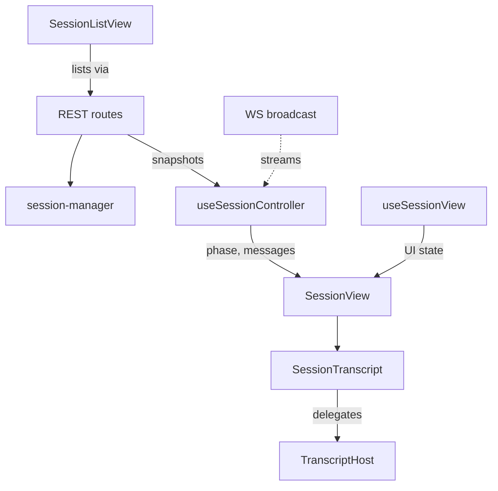

# Session Views Controller

The session views controller exposes `session-manager` over HTTP: REST routes under `/api/sessions/*`, a `SessionListView` for browsing, and a `SessionView` detail panel. The detail panel splits into `useSessionController`, which owns data and streaming, and `useSessionView`, which owns UI-only state. The transcript itself renders through the shared `SessionTranscript` component from `@hammies/frontend`, with this app supplying only what it alone can provide.



## REST surface

The `sessionRoutes` Hono app covers the full session lifecycle under `/api/sessions/*`:

- create, list, and read a session
- rename it or answer a pending question
- resume, attach context to, or abort it
- archive it, or patch its artifact code

`POST /` is rate-limited per user email or IP — starting a session spawns an agent process and burns API tokens. File upload uses `multipart/form-data`, not JSON-plus-base64, because it writes straight to the filesystem without a base64 round-trip. Download streams from the same `input/`-then-`output/` search [Session Files](session-files.md) defines.

## First paint and live updates

`GET /:id` returns the DB record plus the JSONL transcript read through `session-manager`. The WebSocket (WS) broadcast is the live source. REST exists for first paint, and for replay after a client reconnects past the WS buffer's 500-event capacity. The transcript hook calls REST for a snapshot, then applies WS deltas, and re-fetches on a `cursor_miss`.

The Agent SDK's JSONL never carries the session's initial prompt: the SDK takes it as a constructor argument, not a streamed message. `withInitialUserPrompt` prepends a synthetic user message at sequence 0, so REST responses match what the WS broadcast already synthesizes at connect. Snapshot recovery also de-duplicates: a recovered transcript can hold two JSONL entries sharing one message UUID at different line sequences. The reducer keeps only the later, enriched copy, using that same UUID as the transcript's React key.

## The pure session reducer

`session-reducer.ts` holds the pure logic — no React, no network code. `reduceSnapshot` replaces a slice wholesale from a REST response. `reduceEvent` folds one WS event into the slice, and both are plain functions a test calls directly.

Optimistic prompts reconcile here too: `reduceEvent` drops a pending prompt once a live user-message echo with matching text arrives. It unwraps a slash-command envelope first, if that is what the user actually typed, before comparing text.

## Controller and view: why the split

`useSessionController` owns everything that changes asynchronously — REST queries, WebSocket events, and mutations — and derives `phase` from them. `useSessionView` owns UI-only state instead: whether the title input is open, staged file attachments, and navigation back-callbacks. Splitting them keeps a title-edit keystroke off the transcript's memoisation graph. It also lets each hook be tested independently: the controller without rendering, the view hook without WebSocket mocks.

`phase` is a discriminated union, not a set of booleans:

```
loading | error | streaming | awaiting_input | sending | idle | errored | archived
```

Booleans admitted impossible states — a regression once let `isLoading` stay `true` while a session was already `awaiting_input`, rendering the form under a skeleton. `awaiting_input` carries its `PendingQuestion`, and `error` carries its `message`; `SessionView` drives every render conditional off `phase.status` alone.

## The transcript and the host seam

`SessionView` composes the controller and the view hook, then hands their output to the shared `SessionTranscript` component — the panel itself does no fetching. That shared component moved to `@hammies/frontend` once Inbox and Studio's forks had drifted from the same renderer; the pure classification layer moved to `@hammies/session-core`. Three capabilities stay app-specific because they are Inbox concepts a shared UI package must not learn. Those are rendering an output, resolving a run-file URL, and rendering a structured panel from an assistant text block.

`useInboxTranscriptHost` supplies all three through one `TranscriptHost` object, memoised on the panel-schema query so its identity only changes when schemas actually load. `renderTextBlock` recognizes `<inbox-context>` and `<inbox-result>` tags, plus any tag a plugin's panel schema declares. One seam handles all three cases, instead of teaching the shared transcript about the plugin registry.

Two behaviors changed with the move. The transcript no longer virtualizes rows: WebKit has no scroll anchoring, so estimate-based windowing visibly jumps the viewport. A bare `Write` no longer counts as an artifact either, because sessions run against a real repo and typed React modules broke the JSX renderer. A written file still renders when the agent calls `present_files` on it explicitly.

## Composing and sending

`SessionInput` is a plain textarea plus a send/stop button. Sending is a plain function, not a hook, because it needs no subscribed state of its own. `useLocalDraft` persists the draft text to IndexedDB, debounced 300ms, keyed per session so a tab-switch never loses an in-progress prompt. Pending file attachments upload in parallel through `uploadPendingFiles`; a failed upload logs and is skipped rather than blocking the whole send.

## First-load skeleton

`SessionView` shows `PanelSkeleton` until `dataReady && readySessions.has(sessionId)` clears. `dataReady` flips once the controller's `session.id` matches the panel's `sessionId`. `readySessions` fills once `onArtifactsReady` fires: the transcript's count of react artifacts to render, matched against how many report a live height. A 3-second timeout marks a session ready either way, so a stalled artifact never blocks the skeleton forever. The `readySessions` Set caps at 100 entries with FIFO eviction, added after a long-lived SPA tab's memory profile showed it growing without bound.

## Browsing sessions

`SessionListView` composes the shared `ListView` with a fixed `sessionFieldSchema`:

- title
- updated timestamp
- a status badge
- three hidden fields search matches against

Status filters persist through `useNavigation`'s filter store, not local state, so a tab-switch or a deep link restores the same filtered view. When the sessions query errors, the list still renders its cached data instead of clearing. The global `SessionConnectionSurface` toast is the only error feedback, so a user keeps their scroll position and can still navigate.

## See also

- [Inbox](index.md) — package overview and domain map
- [Session Views Controller spec](../../openspec/specs/session-views-controller/spec.md) — the owning contract
- [Session Manager](session-manager.md) — `startSession`, `resumeSessionQuery`, and the JSONL/DB layer these routes call into
- [Session Streaming Protocol](session-streaming.md) — WS framing, the 500-event buffer, and `cursor_miss` recovery
- [Session Files](session-files.md) — the upload/download routes' `input/`-then-`output/` file layout
- [Artifacts and Render Tools](artifacts-and-render-tools.md) — `ArtifactFrame`, `OutputRenderer`, and the sandboxed-iframe rendering `TranscriptHost` delegates to
- [Navigation](navigation.md) — the panel stack `useSessionView` pushes output and subagent panels onto
- [Data Table and List Views](data-table-list-views.md) — the shared `ListView` primitive `SessionListView` composes
