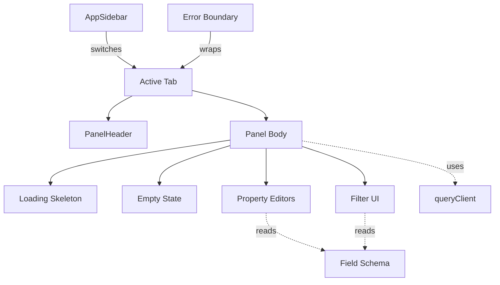

# Shared UI Components

Shared UI components are the presentational primitives every inbox feature composes but no single feature owns. Each one is too inbox-specific for `@hammies/frontend`'s shadcn library, and too widely used to live inside a single feature folder. `src/components/shared/` and `src/lib/` hold them, so a feature spec can reference `<PanelHeader>` or `<ErrorBoundary>` without redefining its contract.

## Panel chrome

`PanelHeader` renders every panel's chrome: a 12-tall flex row with a truncating `left` slot and a shrink-to-fit `right` slot for action buttons. A pointer handler on the header disambiguates horizontal panel scroll from a vertical tab-drag. It tracks the first 10px of movement, then calls `dragTab.onVerticalDrag` only when vertical movement wins. The handler bails immediately when the drag starts on a button, link, or input, so those elements keep their own pointer events.

`PanelHeader` also exports `<BackButton>` and `<SidebarButton>`, two mobile-only buttons a consumer places in the `left` slot. `<DetailView>` is the concrete example. It shows `<SidebarButton>` when the panel opened from the sidebar or carries no `onBack` handler, and `<BackButton>` otherwise. This routes a sidebar-originated view to the drawer instead of popping a parent panel that never existed. `<DetailView>` composes that header with three body states. It shows the `<PanelSkeleton>` block while `loading`, an inline error message when `error` is set, and `children` in a scrolling body otherwise.

`<EmptyState>` and `<ListSkeleton>` fill the equivalent states for list panels. `<EmptyState>` shows one centered muted message. `<ListSkeleton>` repeats a muted block into rows sized to `itemHeight`. `<SearchInput>` is the matching search box: a controlled text field with a clear button that appears only once the value is non-empty.

## Error boundaries

`<ErrorBoundary>` lives in `@hammies/frontend/components/ErrorBoundary`. The inbox imports it rather than keeping a local copy. `getDerivedStateFromError` catches a child's render throw, and `componentDidCatch` logs `[ErrorBoundary:<label>]` with the component stack. The default fallback shows a "Something went wrong" card with the error message and a "Try again" button that calls `reset()`. React boundaries never auto-reset, so `resetKeys` makes the clear explicit. When any key differs from the previous render, `componentDidUpdate` clears the error and the children render again.

The inbox places three independent boundaries, so a single throw never blanks the whole UI. One wraps the entire authenticated app in `App.tsx`, labeled `"App"`. A second wraps each tab in the panel grid, keyed by `resetKeys={[tabId]}` so switching tabs always clears a prior crash. A third wraps every plugin iframe in `PluginDetail`, keyed by `resetKeys={[itemId]}` so navigating to a new item recovers a crashed one.

## Sidebar

`<AppSidebar>` reads `useActiveTab()` and `useSortedPlugins()`, then renders the workspace switcher, Settings, one entry per installed plugin in the user's stored order, and the recent-sessions group. The active tab's entry gets `ACTIVE_TAB_CLASSES`, which forces a primary-color background over the default secondary style. Dragging a plugin entry to a new position writes the reordered id list through `usePreference<string[]>("pluginOrder", [])`, so the order survives a reload. A `savedUrls` ref remembers each workspace's last pathname, so switching workspaces and back restores the same detail view instead of resetting to root.

## Sign-in

`<LoginPage>` renders when no user session exists. It polls for `window.google.accounts` every 50ms, then calls Google Identity Services' `initialize` and `renderButton` into a ref'd container once the script loads. The sign-in callback exchanges the returned credential through `authCallback`, then refreshes the user. A failed exchange shows an inline error instead of a blank screen.

The package also carries a local `LiquidGlassFilter` SVG filter. The mounted app renders the `@hammies/frontend` copy instead, so the local file is currently unused.

## Property and filter editors

`PropertyEditor.tsx` exports four small typed editors: `PropertySelect` and `PropertyPerson` wrap shadcn's `Select` at a compact `size="sm"`, differing only in `PropertyPerson`'s "Unassigned" placeholder for person fields. `PropertyMultiSelect` wraps `ComboboxChips` for free-text or multi-value editing, rendering each current value as a removable chip beside an autocomplete input. `PropertyDate` opens a `Calendar` inside a `Popover`. Picking a date formats it to `yyyy-MM-dd` with `date-fns`, then closes the popover. Every editor accepts an `onChange` that only fires on an actual value change, and a `loading` flag that shows a small spinner beside the control.

`<FilterCombobox>` and `<FilterPopover>` drive panel filters against `useActiveFilters()` from the navigation store. `<FilterPopover>` reads `getFilterFields(fieldSchema)` to find which columns are filterable, and renders nothing when none are. Each field's options come from `field.filter.filterOptions` when the schema declares them, or from an async `optionsFetcher` keyed by field id otherwise. Clearing a filter chip calls `setFilter(key, "")`, which the navigation store's `cleanFilters` strips from the active filter map entirely.

`<BadgeToggleMenu>` is a dropdown of `Checkbox` toggles. The session view uses it to show or hide message types, such as tool calls or thinking blocks. Its trigger badge shows the count of currently active toggles.

## Cross-cutting libraries

`queryClient.ts` calls the shared `createQueryClient` from `@hammies/frontend`, overriding two settings. `staleTime` is 5 minutes, so a cached query renders instantly instead of flashing a refetch. `gcTime` is 24 hours, and it must stay at or above the React Query persister's `maxAge`. A shorter `gcTime` once evicted in-memory entries while the persisted copy lingered. That mismatch was the source of an earlier phantom-stale-data bug.

`formatters.ts` re-exports five generic helpers from `@hammies/frontend`:

- `formatRelativeDate`
- `formatTimeAgo`
- `truncate`
- `formatFileSize`
- `getInitials`

It then adds inbox-only helpers. `formatEmailAddress` strips the surrounding `<...>` from a `"Name <addr>"` string. `sessionStatusLabel`, `sessionStatusColor`, and `sessionStatusBadgeClass` are the single source for how a session status renders. A component imports one of these rather than hard-coding a label or color. That discipline is what keeps a status from reading "Needs Attention" in one place and "Attention Needed" in another. Every colour they return is a theme token — one status still returned a fixed `blue-500` while its four siblings used chart tokens, and a frozen shade is unreadable in whichever mode it was not picked for.

`plugin-utils.ts` derives a list row's title, subtitle, and timestamp from a generic plugin item. Each getter checks `fieldSchema` first, looking for a field whose `listRole` matches title, subtitle, or timestamp. It falls back to a heuristic key list — `TITLE_KEYS`, `SUBTITLE_KEYS`, or `TIMESTAMP_KEYS` — only when no field declares that role. `getItemTimestamp` also normalizes unix-seconds and numeric-string values to an ISO string before handing them to `formatRelativeDate`. `formatters.ts` exports its own, simpler `getItemTitle` for contexts with no `fieldSchema`, such as the session-linked items in `NewSessionPanel` and `SidebarRecentSessions`. The two same-named exports serve different call sites and are not interchangeable.

`field-schema.ts` supplies the getters that `ListView` and the property/filter editors share. `getTitleField`, `getSubtitleField`, and `getTimestampField` each pick one field for its row slot, preferring an explicit `listRole` over the first field of the matching type. `getBadgeFields` and `getFilterFields` collect every field with a badge or filter config. `extractFieldValue` walks a dot path like `"author.name"` through a plugin item, returning `undefined` at any missing or non-object segment. `logger.ts` re-exports `createLogger` from `@hammies/frontend/lib/logger`. It is the only sanctioned console emitter, so log prefixes and levels stay uniform across the app.

## Out of scope here

This page covers presentational primitives and shared libraries that live in the inbox package itself. The [rich text editor](rich-text-editor.md) has its own page. `DataTable` and the compound `ListView` layouts belong to [data table and list views](data-table-list-views.md). Navigation primitives — `<PanelSlot>`, `<Tab>`, `<NavigationProvider>` — and the store they read belong to [navigation](navigation.md). Iframe theme forwarding (`THEME_VARS`, `IFRAME_BASE_CSS`, `injectIntoHtml`) moved to `@hammies/frontend/lib/iframe-theme` in 2026-07 and is now owned by [artifacts and render tools](artifacts-and-render-tools.md).

## See also

- [Inbox](index.md) — package overview and domain map
- [Shared UI Components spec](../../openspec/specs/shared-ui-components/spec.md) — the contract this page explains
- [Data Table and List Views](data-table-list-views.md) — `ListView` composes `PanelHeader`, `ListItem`, and `field-schema` from this page
- [Navigation](navigation.md) — `useDragTab`, `useActiveFilters`, and the tab store `PanelHeader` and the filter editors read
- [Auth and Sessions](auth-and-sessions.md) — the session cookie `LoginPage`'s sign-in flow establishes
- [Artifacts and Render Tools](artifacts-and-render-tools.md) — the iframe theme helpers this domain's Technical Notes once pointed at
