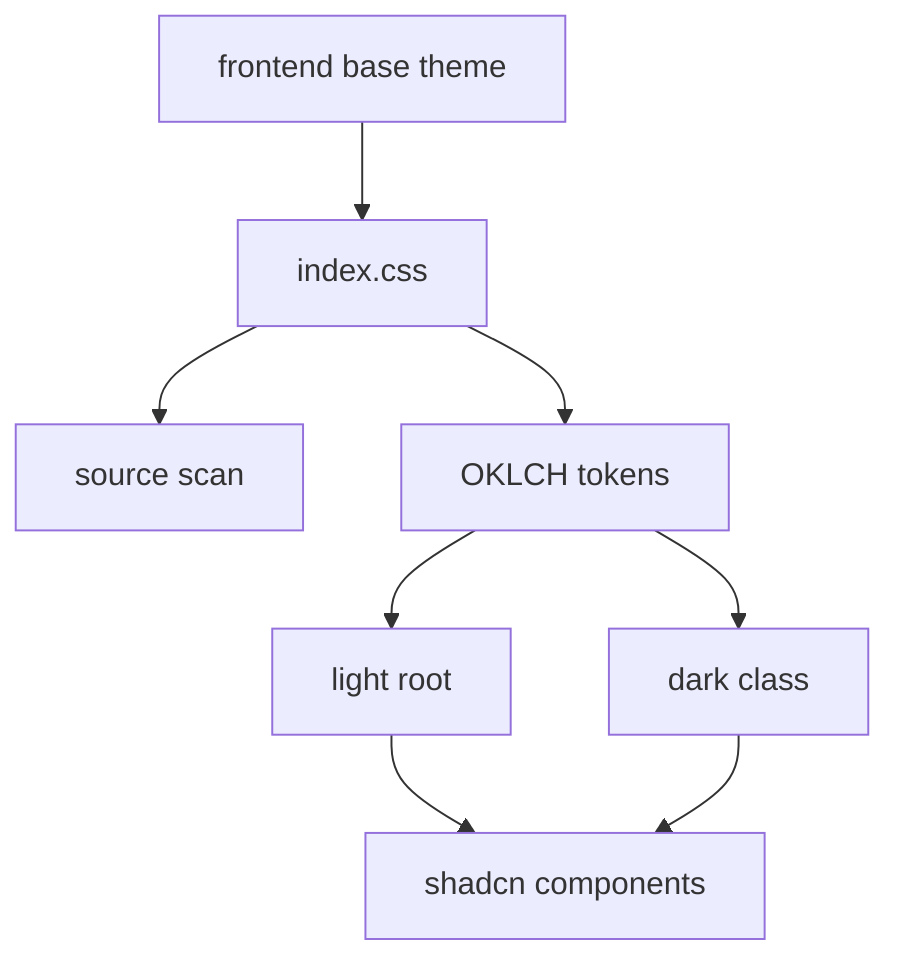

# Theming

Theming is the inbox's visual surface layer, built on `@hammies/frontend`'s base shadcn theme. `src/index.css` imports the shared styles and redefines OKLCH color tokens for light and dark mode. `public/manifest.json` and `public/sw.js` add PWA installability, independent of the CSS layer.

## Overriding the base theme

`@hammies/frontend` supplies the base shadcn theme; `src/index.css` imports it first, then layers inbox-specific tokens on top. The `@source` directive tells Tailwind's JIT scanner to include the frontend package's classes, so shared component styles are not stripped from the build. The `@plugin "@tailwindcss/typography"` line loads `prose` styles for rendered markdown.

Both `--primary` and `--secondary` use the OKLCH color space, so light and dark variants share the same hue and lightness without hand-tuned pairs. `--primary` keeps one identical alpha-blended value everywhere. `--secondary` flips between black and white at low alpha, adding contrast against whichever surface sits beneath it. The `.bg-primary` rules repeat the same token pair, scoped to elements that carry that utility class directly. This keeps the secondary accent correct even inside a differently-themed ancestor.

## Scrollbars and layout resets

One global rule sets `scrollbar-width: thin`; no component restyles its own scrollbar. `body` gets `padding-top: env(safe-area-inset-top)`, so content clears the dynamic status bar when the app runs standalone on iOS. Below the 768px breakpoint, `body` background matches `--card`. The active panel goes full-bleed there, so a mismatched body color would show through the safe-area strip and behind the sidebar sheet.

## PWA install surface

`public/manifest.json` declares standalone display mode, a dark theme color, and 192px/512px icons, so the app installs like a native shortcut on iOS and Android. Those icons live in `public/icons/`, served as raw files because a manifest icon reference cannot resolve a bundled asset hash. Integration brand icons live separately in `src/assets/icons/`, loaded through Vite's asset pipeline by id, because they render inside components rather than a manifest.

`public/sw.js` exists only to make the app installable and to clear stale caches on activate; it does not cache any `/api/*` responses. React Query owns the client-side cache, so the service worker only intervenes on navigation requests, falling back to `index.html` when a fetch fails offline. This keeps client-side routing working in standalone mode without a second, competing cache layer.

## Build-time globals

`src/vite-env.d.ts` declares `__APP_VERSION__` as a global string, injected by Vite's `define` config at build time. The [Preferences](preferences.md) hook's persisted React Query cache uses it as a buster, so a new deploy discards the old cache instead of serving stale shapes.

## See also

- [Inbox](index.md) — package overview and domain map
- [Theming spec](../../openspec/specs/theming/spec.md) — the contract this page explains
- [Integrations](integrations.md) — the brand icons this layer serves
- [Shared UI Components](shared-ui-components.md) — component-level styling, out of scope here
- [Preferences](preferences.md) — the cache the build-version buster protects
