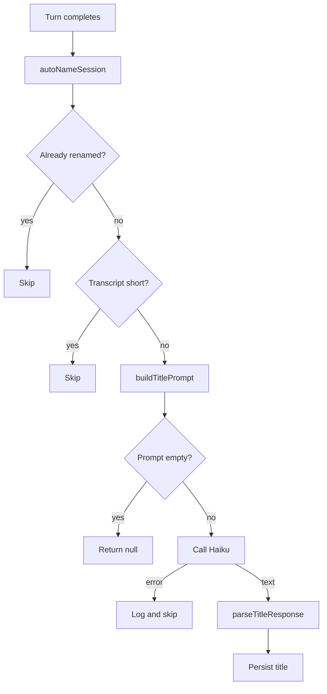

# Title Generator

The title generator produces a short, human-readable session title once a session has enough transcript to summarize. `autoNameSession` in `session-manager.ts` calls it as a fire-and-forget hook after each assistant turn completes, so a failure here never fails the session. A fresh Haiku call replaces the placeholder title — the session's first 80 characters of its prompt — with a real summary.

## Why a fresh Haiku call

Title generation is a cheap classification task that needs neither the session's tools nor its context. `generateSessionTitle` constructs its own `Anthropic` client from `ANTHROPIC_API_KEY`, independent of whichever credentials or model the agent session itself uses. The model defaults to `claude-haiku-4-5-20251001` but reads `TITLE_MODEL` from the environment first, so an operator can swap models without a code change.

## Where it runs

`autoNameSession` fires fire-and-forget from two places in `session-manager.ts`, both right after a running query finishes and the session status flips to `complete`. Callers `.catch()` the promise and log a warning, so a rejected auto-name call never blocks the completion path it rides on.

Before generating anything, the function checks four gates in order:

- the session record exists
- `summary` still equals the placeholder set at creation
- `findAgentSession` locates the JSONL transcript file
- the transcript holds at least 2 messages

The placeholder itself is the prompt's first 80 characters (`INITIAL_SUMMARY_LENGTH`), set at session creation. The summary check distinguishes a manual rename from a session this hook has not auto-named yet; both cases skip.

## Building the prompt from a transcript

`buildTitlePrompt` takes the same `{ type, message }` shape the JSONL log stores, not raw text, so it can reuse the session's own parsed rows. It drops any row whose message has no string `content` and no text blocks — tool calls and tool results carry no naming signal. From what remains, it keeps the first 3 user messages and the single most recent assistant message, truncating each to 500 characters. This window captures the request and the conclusion of a session without spending too much context on a cheap classification call. An empty result means no row survives parsing, and `generateSessionTitle` returns `null` without ever calling the API.

## Cleaning Haiku's response

`parseTitleResponse` turns Haiku's raw text into a title fit to store. It strips a single layer of wrapping quotes, single or double, and strips a leading `Title:` prefix regardless of case. `parseTitleResponse` cuts a title over 60 characters to 57 characters, then appends a `...` suffix. A response that trims to an empty string returns `null`, and `generateSessionTitle` leaves the placeholder summary in place rather than saving an empty title.

## Failure handling

Every failure path returns `null` rather than throwing, at every layer. `generateSessionTitle` catches any Anthropic SDK error — a network failure, a missing API key, a 429 — logs it with `console.error`, and returns `null`. `autoNameSession` wraps the whole flow in its own try/catch and logs through the structured `log.error`. A lookup failure, a missing agent session file, or a DB write failure is equally harmless. Auto-naming is cosmetic: a session stuck on its placeholder title is still fully usable. The code never lets a failure here reach the session itself.

## Testing

The pure functions — `buildTitlePrompt`, `parseTitleResponse`, and the failure path of `generateSessionTitle` — have unit coverage in `title-generator.test.ts`, run under Vitest's node environment. The `generateSessionTitle` test mocks the `@anthropic-ai/sdk` module to force a thrown error, then asserts the function logs and returns `null` instead of propagating it. No test exercises a live Haiku call; the unit tests cover the transcript-window and parsing rules directly, on their pure inputs and outputs.

## See also

- [Inbox](index.md) — package overview and domain map
- [Title Generator spec](../../openspec/specs/title-generator/spec.md) — the contract this page explains
- [Session Manager](session-manager.md) — the caller that guards and fires this hook
