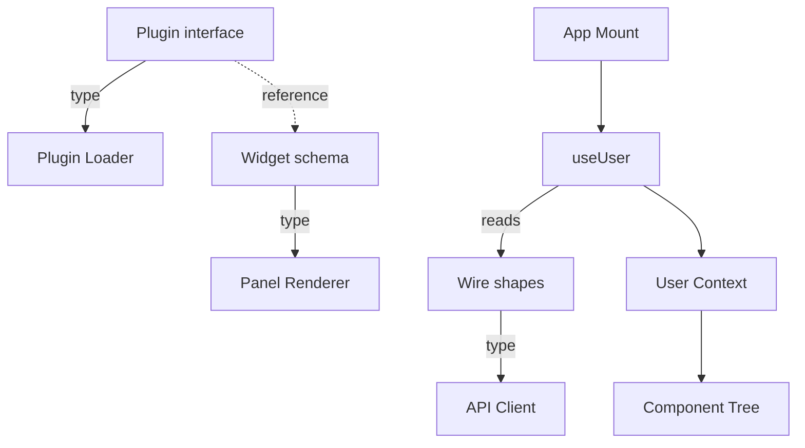

# User and Types

Three files under `src/types/` hold the frontend's wire shapes, the `Plugin` interface, and the panel widget schema. One hook, `useUser`, exposes the signed-in user and active workspace to the whole app. Together they form the type bedrock every other frontend domain imports against.

## Wire shapes

`src/types/index.ts` defines every shape the API client returns: `UserProfile`, `Workspace`, `WorkspaceMember`, `Session`, `Integration`, and the session status and trigger unions. `SessionStatus` is a closed union of six values, so a switch over it never needs a default case. `TriggerSource` stays open with `(string & {})` after its three named values. Plugins emit their own trigger labels for analytics, and a closed union would reject those.

`Session.hasActiveProcess` is optional and set only by the session manager, never persisted to the database. It distinguishes a session that is actively streaming from one that finished but has not yet flipped to `complete`. `InboxContextData` and `InboxResultData` mirror the `<inbox-context>` and `<inbox-result>` XML blocks an agent emits mid-session. `InboxResultData.pluginId` lets the renderer dispatch to a plugin-specific result view when the agent names one.

## Plugin interface

`src/types/plugin.ts` defines the `Plugin` interface every plugin file implements, plus `FieldDef`, `PluginItem`, and `PluginContext`. `PluginItem` is `Record<string, unknown>` with a typed `id`, not a generic `Plugin<TItem>`. A generic item type would force every consuming component to become generic too, for no type-safety gain. The schema-driven UI reads fields by name through `FieldDef[]` instead of by static type.

`FieldDef` combines four concerns in one object: filter UI, list badges, list role, and the detail-widget override. One field declaration on a plugin controls how that field appears everywhere it appears. `PluginContext` carries `userEmail` and `getCredential`, and a plugin method that needs auth threads it through explicitly rather than reading a global.

[Plugin System](plugin-system.md) covers the loader that reads this interface and mounts each plugin's routes. This page owns only the type contract.

## Widget schema

`src/types/panels.ts` defines `WidgetDef`, a union discriminated by `type`: `prose`, `kv-table`, `data-table`, `badge-row`, `action-buttons`, `json-tree`, and more. Every widget reads data through a `field` dot-path or a `fields` array. None embeds raw HTML or a component reference. Keeping the schema JSON-serializable lets a workflow's `inbox-panels.json` file declare a widget tree without shipping React code.

Clicking an `action-buttons` widget calls the source plugin's `mutate(id, action, payload)`, never an arbitrary handler. This keeps every declarative panel's effects declarative too, so a workflow author cannot smuggle imperative logic into a JSON file.

[Plugin System](plugin-system.md) and [Data Table and List Views](data-table-list-views.md) cover where `PanelWidget` renders this tree.

## The useUser context

`useUserProvider` runs once at app mount and populates a React context, not a React Query hook. Almost every component reads the current user or workspace during its initial render. A query hook would trigger a suspense flash before the first fetch resolves. The context makes `user` and `activeWorkspace` synchronously available everywhere instead.

`refresh()` calls `getAuthSession()` and retries on a `TypeError`, the browser's signal for a network failure, up to three times at `1.5s × attempt` intervals. A dev-server restart briefly drops the connection. Without the retry, the whole UI would flash to the signed-out state mid-edit. Any other error, a 4xx or 5xx, breaks the loop immediately and clears the user, because that failure is real.

`switchWorkspace` calls `setActiveWorkspace(id)` on the server, then `queryClient.invalidateQueries()` before `refresh()`. Invalidating every query forces every data hook to refetch under the new workspace, so no panel keeps showing the old workspace's cached data. `useWorkspaceId()` returns `activeWorkspace?.id ?? ""` rather than `undefined`. Two different unauthenticated states once collided under the query key `["sessions", undefined]`.

A `session-expired` window event, dispatched by the [API Client](api-client.md) on any 401, triggers another `refresh()`. When the JWT is gone, `refresh()` sets `user: null`, and `AppContent` swaps the authenticated app for the login page.

## Out of scope

Backend `Session`, `User`, and `Workspace` types belong to their own server-side domains, not this page. The per-message session payload union moved to `@hammies/session-core`, after Studio's byte-equivalent fork proved both apps needed one copy. Auth flow and cookie shape belong to [Auth and Sessions](auth-and-sessions.md). Workspace-switching mechanics on the server belong to the `workspace` spec.

## See also

- [Inbox](index.md) — package overview and domain map
- [User and Types spec](../../openspec/specs/user-and-types/spec.md) — the contract this page explains
- [API Client](api-client.md) — the typed request layer built on these wire shapes
- [Auth and Sessions](auth-and-sessions.md) — issues the cookie `useUser` reads and the `session-expired` event it handles
- [Plugin System](plugin-system.md) — the loader that reads the `Plugin` interface and renders widget trees
- [Data Table and List Views](data-table-list-views.md) — the list UI driven by `FieldDef`
- [`@hammies/session-core` spec](../../../session-core/openspec/specs/session-core/spec.md) — owns the per-message session payload union
