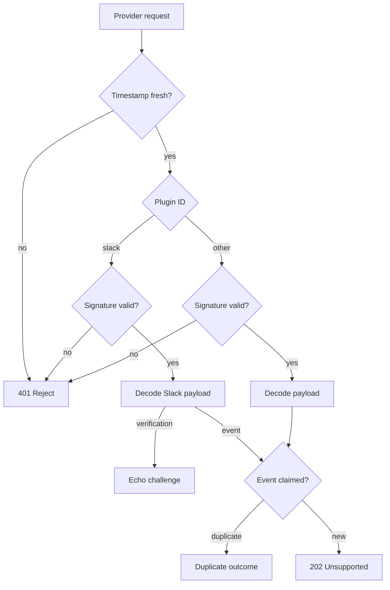

# Webhooks

Inbox exposes one signed ingress route, `POST /api/webhooks/:pluginId`, for provider webhook events. The route verifies a raw-body HMAC signature and a freshness window before any JSON parsing. A verified event with no plugin dispatcher yet returns an explicit 202, not silent success.

One route serves every plugin, so URL shape, replay suppression, and failure semantics stay identical as new providers arrive. Plugins differ only in which header carries the signature and how the signed string is built. The freshness check, duplicate-claim ledger, and unsupported-event fallback are shared code no plugin bypasses.

## Verifying the signature

The route checks the timestamp before the signature. A stale or missing timestamp returns the same 401 as a bad signature, so a caller cannot tell which check failed. Slack signs `v0:${timestamp}:${rawBody}` and sends the hex digest in `X-Slack-Signature`, prefixed `v0=`. Every other plugin ID signs the raw body directly, in `X-Hammies-Signature` alongside `X-Hammies-Event-Id`. Both paths call `verifyWebhookHmac`, which compares digests in constant time. Verification runs on raw request text, before any JSON parsing.

## Suppressing replay

`claimEvent` guards against provider retries with an in-memory `Map`, keyed `${provider}:${eventId}`. Each call first sweeps expired entries, then claims the event for 24 hours. The provider prefix keeps Slack and plugin event IDs from colliding in one map. A duplicate claim returns a `duplicate` outcome instead of dispatching again. The map lives in process memory, so a restart forgets every claim. A resent event after a restart ships through once more.

## Acknowledging unsupported events

A verified event with no registered plugin dispatcher returns 202, not 404 or 500. A 4xx or 5xx status would tell the provider to retry. Retrying would repeat the same handshake for an event no plugin will ever consume. The 202 status and `unsupported-event` outcome tell the provider its request was accepted, even though no plugin acted on it. Slack's `url_verification` challenge skips this path — it returns the echoed challenge before the event reaches the claim step. Per-plugin mutation dispatch remains a later feature, so every other verified event lands on this path today.

## Mounting the route

`server/index.ts` mounts `webhookRoutes` at `/api/webhooks`, and the same prefix is listed in the CSRF middleware's `exemptPaths`. A provider is not a browser and sends no CSRF token, so the exemption is required for delivery to succeed at all. The auth middleware skips this route too. A webhook carries no `inbox_session` cookie, and the signature check already does the authentication a cookie would provide. This mirrors the [health and telemetry routes](health-rate-limit-logging.md), which also run ahead of cookie auth for callers that hold no session.

## See also

- [Inbox](index.md) — package overview and domain map
- [Webhooks spec](../../openspec/specs/webhooks/spec.md) — the contract this page explains
- [Auth and Sessions](auth-and-sessions.md) — the cookie auth this route bypasses
- [Health, Rate Limit, Logging](health-rate-limit-logging.md) — other routes that run ahead of auth
- [Plugin System](plugin-system.md) — where a future per-plugin dispatcher would register
