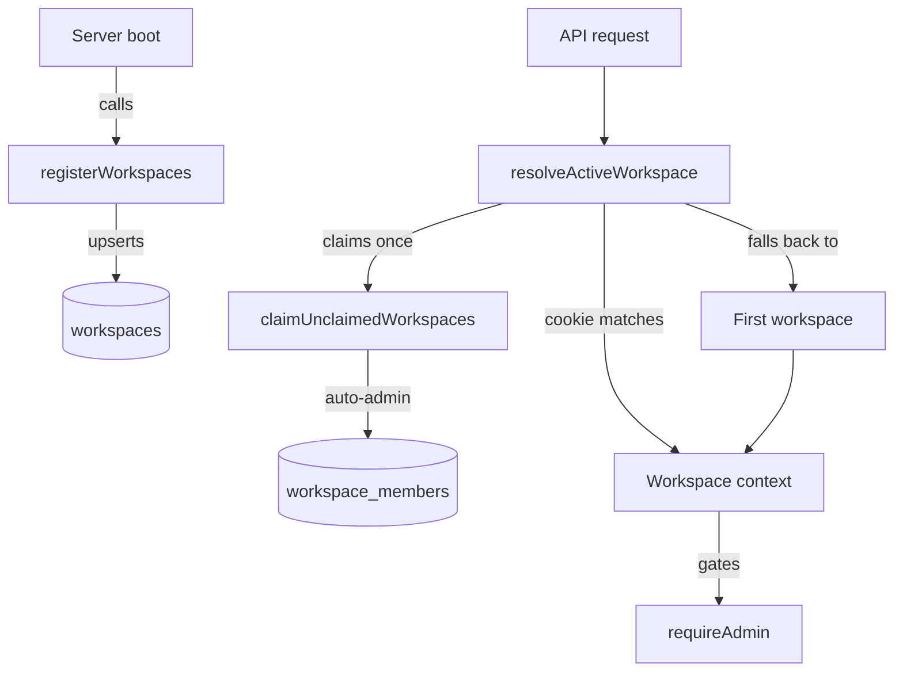

# Workspace

A workspace is a directory the inbox server can act in. It scopes the agent's filesystem, its credentials, and who can see it — one boundary for all three. `registerWorkspaces` mounts the CLI's `--workspace` paths into Postgres at boot, and every authenticated request resolves to exactly one active workspace before a handler runs.

## Registering workspaces at boot

`registerWorkspaces(paths)` runs once per server boot against the `--workspace` CLI args, which default to `../agent`. Each path upserts into `workspaces`, keyed by `id = basename(path)`. Any row whose id falls out of the current path list gets deleted, along with its `workspace_members` rows. This makes the CLI's argument list the live definition of what is mounted, while Postgres stays only the long-lived registry mirroring it.

Basename identity keeps a moved directory's session history, credentials, and membership intact. The tradeoff is that two live checkouts of the same directory share one id — a worktree's `packages/agent` collides with the main checkout's `packages/agent`. `registerWorkspaces` guards this explicitly: it throws before writing anything when an incoming path would repoint a row whose recorded path still exists on disk. See the [Workspace spec](../../openspec/specs/workspace/spec.md) for the full collision and relocation contract.

## Auto-claim and membership

A workspace with no `workspace_members` rows is unclaimed. `ensureWorkspaceAccess` grants the first authenticated user to touch it the `admin` role. Every later member starts as `member`, unless an admin adds them at another role directly.

`claimUnclaimedWorkspaces` runs this check on every request, but an in-process `claimedUsers` set gates it. A user only triggers the claim pass once per process lifetime. `registerWorkspaces` clears that cache whenever the mounted list changes.

`isLastAdmin` blocks the one operation that could orphan a workspace: removing or demoting its only admin. The check excludes the member being changed and counts the rest, since that row may not exist yet when the guard runs.

## Resolving the active workspace per request

The auth middleware calls `resolveActiveWorkspace(email, cookieWorkspaceId)` on every `/api/*` request, after it verifies the session cookie. It reads the `inbox_workspace` cookie first: if that workspace exists and the user is a member, it wins. Otherwise the middleware falls back to the user's first workspace, alphabetical by name. A user with no memberships gets no workspace context, and route handlers that call `c.get("workspace")` must handle `undefined` themselves.

`PUT /api/workspaces/active` sets the `inbox_workspace` cookie for a year but does not check membership at write time. The read-time fallback in `resolveActiveWorkspace` absorbs a cookie pointing at a workspace the user cannot access, instead of returning 403.

## Admin-only routes

`requireAdmin` throws `HTTPException(403)` when the workspace context is unset or its role is not `admin`. Route handlers call it explicitly rather than mounting it as middleware, because list routes like `GET /api/workspaces` need only membership. `requireAdmin` also gates workspace rename, git-status lookup, and every member CRUD route.

## Workspace settings UI

`WorkspaceSettings` renders three panels for the active workspace:

- Git branch and status, read via `getWorkspaceGitInfo`.
- The member list, with inline role toggling per member.
- An add-member combobox scoped to users not yet in the workspace.

Renaming happens inline in the panel header. The mutation optimistically updates the query cache before the server confirms it.

## See also

- [Inbox](index.md)
- [Workspace spec](../../openspec/specs/workspace/spec.md)
- [Auth and Sessions](auth-and-sessions.md)
- [Database](database.md)
- [Credentials Vault](credentials-vault.md)
- [Session Manager](session-manager.md)
